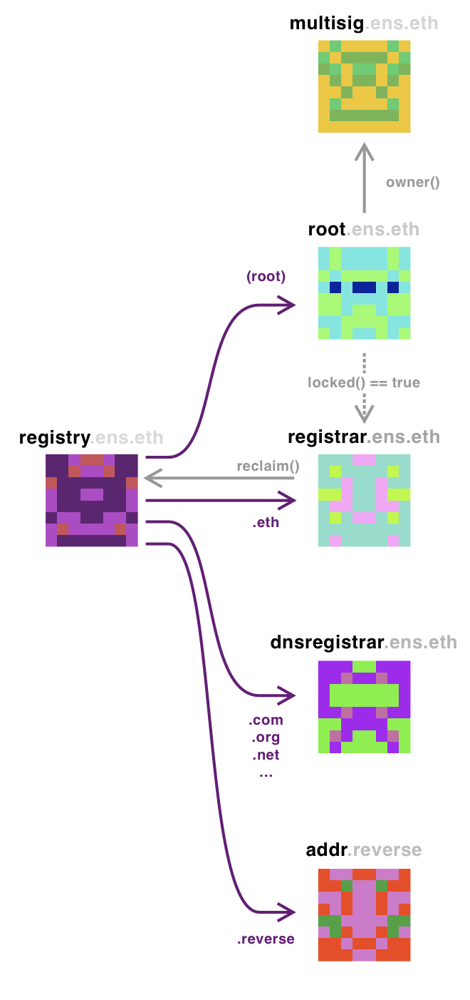

# ENS Contracts Overview

ENS is a system comprised by multiple contracts. This modularity allows functionality to be built (and sometimes removed) over time. While it all rests on the simple, yet unchangeable, ENS registry, other modules have been slowly added, upgraded and shuffled to reflect the evolving ecosystem in which ENS finds itself in.

The heart of the system is the ENS registry, it has been deployed on all ethereum test chains (and uses a script that allows it to be deployed on any other EVM compatible chain) and can be found on all chains at the special address 0x00000000000C2E074eC69A0dFb2997BA6C7d2e1e. It is a relatively simple contract: the owner of the root node can create owners for different subnodes. These owners then can set resolvers for the node or create other subnodes with other owners.

On Ethereum Mainnet, the owner of the root node (which can be found by querying the registry for the node with id 0x0) is the Root Access control contract. Here are the owners of the major nodes:

* **The Root control (root.ens.eth)**: this is a simple access control for the root. It serves as an interface for the ENS registry, except it also allows some names to be locked. Once locked the owner cannot unlocked it. At the time of this writing, only .eth was locked, and since this contract doesn't allow to transfer ownership of the root node itself, it means that the .eth registrar is now forever locked on the main registry. The owner of the root contract is set as the multisig.ens.eth.
* **The Multisig (multisig.ens.eth)** This is a group of 7 keyholders who were initially charged with the responsibility of managing most of ENS aspects. With the launch of the ENS DAO, most of these responsibilites are slowly being transferred away, but as requested by EP1, the root ownership still belongs to them.
* **.ETH Registrar (registrar.ens.eth)** This is an ERC721 compatible contract, and is the address ENS users will likely add to their wallets to see their domains as NFTs. Transferring an NFT will not automatically update the ownership on the Registry, but allows the NFT owner to call the "claim()" function which will update the registry on their behalf. This contract allows its owner (currently set as the DAO) to add and remove controllers, as well as change ownership of the registrar.
* **DNS Registrar (dnsregistrar.ens.eth)** This contract owns mosts TLDs recognized by ICANN and use DNSSec to update these names.
* **Reverse Registrar (addr.reverse)** This reverse registrar allows an account to set their primary name.

The following are the contracts owned, controlled or closely related to the ENS DAO:

* **ENS DAO (wallet.ensdao.eth)**: This is the main contract of the DAO, and the address that holds funds. It's set as owner of the root, token, registrar, controller and the dns registrar. This is an [Open Zepellin Governor contract](https://docs.openzeppelin.com/contracts/4.x/governance) that accepts incoming proposals by Token vote. All proposals have a minium 48 delay.
* **Governor (governor.ensdao.eth)**: This contract will calculate votes and if there is a majority win over quorum, then it will propose a transaction for the DAO.
* **The Token (token.ensdao.eth)**: this is the ERC20 compatible token. It also contains code for the airdrop and vote delegation. This contract allows the owner (the DAO) to mint up to 2% of the total supply once per year.
* **Registrar controller:** Controllers on the registrar have the power to register new names and extend the expiration date for new names. This contract is the one that will connect to an oracle and calculate the current ether price to be able to perform these functions. Controller logic could be anything, but adding a new controller that  constrained who can register new names would violate article I of the constitution.
* **Vesting (tokenlock.ensdao.eth):** at the time of this writing, this contract holds 65% of the token supply and releases slowly to the beneficiaries of core development tokens in the airdrop (including the DAO itself).

