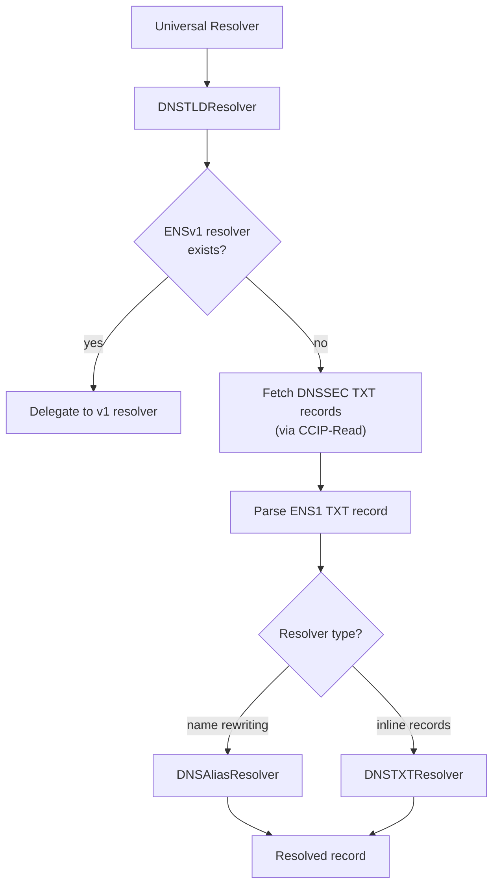

import { FrenCallout } from '../../../components/ensv2/FrenCallout'

# DNS Name Resolution

ENSv2 supports resolving traditional DNS domain names (like `.com`, `.xyz`) through the ENS protocol. This builds on the [DNS on ENS](/learn/dns) functionality from ENSv1, replacing the single `OffchainDNSResolver` ([ENSIP-17](/ensip/17)) with a pipeline of three specialized contracts.

Users don't interact with these contracts directly. The [Universal Resolver V2](/contracts/ensv2/universal-resolver-v2) handles the entire flow transparently. This page explains what happens internally and how to configure DNS records for ENS resolution.

<FrenCallout fren="lili" variant="tip">
The contracts and interfaces described here are **not yet final** and may change prior to mainnet deployment.
</FrenCallout>

## How It Works

When the Universal Resolver encounters a DNS name (e.g., `example.com`), it finds the **DNSTLDResolver** set as the resolver for that TLD on the root registry. The DNSTLDResolver then follows a multi-step resolution strategy:

1. **Check ENSv1**: look for an existing resolver in the ENSv1 registry. If one exists (and it's not the old v1 DNS resolver), delegate to it directly. This preserves backward compatibility.
2. **Query DNSSEC**: initiate a [CCIP-Read](/resolvers/ccip-read) request to fetch DNSSEC-signed TXT records for the domain.
3. **Parse the TXT record**: find the first TXT record starting with `ENS1`, extract the resolver address and context.
4. **Delegate to the parsed resolver**: depending on the resolver address, the request is handled by either the **DNSAliasResolver** (for name rewriting) or the **DNSTXTResolver** (for inline record data).



## TXT Record Formats

To enable ENS resolution for a DNS domain, add a TXT record with the prefix `ENS1`:

```
ENS1 <resolver-address-or-name> <context>
```

The `<resolver-address-or-name>` can be either a hex address (`0x1234...`) or an ENS name that resolves to the resolver contract. The `<context>` depends on which resolver is used.

### Inline Records (DNSTXTResolver)

Set the resolver to the DNSTXTResolver address and encode records directly in the context. Multiple records are separated by spaces:

```
ENS1 dnstxt.ens.eth a[60]=0x1234... t[avatar]=https://example.com/pic.png
```

Supported record formats:

| Prefix            | Record type                                      | Example                 |
| ----------------- | ------------------------------------------------ | ----------------------- |
| `a[60]`           | Ethereum address ([ENSIP-1](/ensip/1))            | `a[60]=0x1234...`       |
| `a[e0]`           | Default EVM address, any chain ([ENSIP-19](/ensip/19)) | `a[e0]=0x1234...`  |
| `a[e<chainId>]`   | EVM chain address by chain ID ([ENSIP-19](/ensip/19))  | `a[e8453]=0x5678...` |
| `a[<coinType>]`   | Non-EVM address by SLIP-44 coin type ([ENSIP-9](/ensip/9)) | `a[0]=0x00...`  |
| `t[key]`          | Text record                                      | `t[avatar]=https://...` |
| `c`               | Content hash ([ENSIP-7](/ensip/7))                | `c=ipfs://...`          |
| `xy`              | Public key (x,y coordinates)                     | `xy=0x...,0x...`        |

This is the simplest approach: all record data lives in the DNS TXT record itself, with no on-chain registration required.

### Alias Resolution (DNSAliasResolver)

Set the resolver to the DNSAliasResolver address and provide a rewrite rule in the context. Two modes are supported:

**Suffix replacement**: rewrite the DNS suffix to an ENS suffix.

```
ENS1 dnsalias.ens.eth com base.eth
```

This causes `sub.example.com` to resolve as `sub.example.base.eth`. The resolver rewrites the suffix, then resolves the rewritten name through the ENSv2 registry hierarchy.

**Full replacement**: replace the entire name.

```
ENS1 dnsalias.ens.eth alice.eth
```

This causes `example.com` (and all subdomains) to resolve as `alice.eth`. Useful when you want a DNS domain to mirror an existing ENS name.

Alias resolution is particularly useful for organizations that want their DNS domains to resolve ENS records without on-chain registration of every subdomain.
