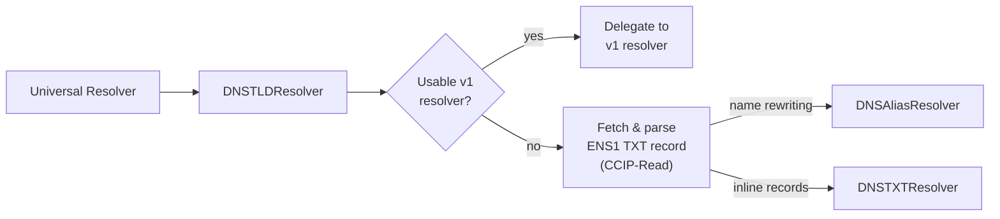

import { FrenCallout } from '../../../components/ensv2/FrenCallout'

# DNS Name Resolution

ENSv2 supports resolving traditional DNS domain names (like `.com`, `.xyz`) through the ENS protocol. This builds on the [DNS on ENS](/learn/dns) functionality from ENSv1, replacing the single `OffchainDNSResolver` ([ENSIP-17](/ensip/17)) with a set of three specialized contracts.

Users don't interact with these contracts directly. The [Universal Resolver V2](/contracts/ensv2/universal-resolver-v2) handles the entire flow transparently. This page explains what happens internally and how to configure DNS records for ENS resolution.

<FrenCallout fren="lili" variant="tip">
The contracts and interfaces described here are **not yet final** and may change prior to mainnet deployment.
</FrenCallout>

## How It Works

<FrenCallout fren="kuzco" variant="warning" title="Watch out!">
ENSv2's DNS resolution fetches DNSSEC proofs off-chain via [CCIP-Read](/resolvers/ccip-read) and verifies them on-chain. The on-chain DNSSEC proof submission used by the v1 [DNS Registrar](/registry/dns) for claiming DNS names remains on v1 infrastructure at launch.
</FrenCallout>

When the Universal Resolver encounters a DNS name (e.g., `example.com`), it finds the **DNSTLDResolver** set as the resolver for that TLD on the root registry. The DNSTLDResolver then follows a multi-step resolution strategy:

1. **Check ENSv1**: look for an existing resolver in the ENSv1 registry. If one exists (and it's not the v1 DNS TLD resolver or the DNSTLDResolver itself), delegate to it directly. This preserves backward compatibility.
2. **Query DNSSEC**: initiate a [CCIP-Read](/resolvers/ccip-read) request to fetch DNSSEC-signed TXT records for the domain.
3. **Parse the TXT record**: find the first TXT record starting with `ENS1` that yields a valid resolver address, and extract the resolver address and context.
4. **Delegate to the parsed resolver**: forward the request to the resolver contract specified in the TXT record. ENS ships two standard resolver implementations: the **DNSAliasResolver** (for name rewriting) and the **DNSTXTResolver** (for inline record data), but any contract implementing `IExtendedDNSResolver` can be used.



## TXT Record Formats

To enable ENS resolution for a DNS domain, add a TXT record with the prefix `ENS1`:

```
ENS1 <resolver-address-or-name> <context>
```

The `<resolver-address-or-name>` can be either a hex address (`0x1234...`) or an ENS name that resolves to the resolver contract. The `<context>` depends on which resolver is used.

### Inline Records (DNSTXTResolver)

Set the resolver to the DNSTXTResolver address and encode records directly in the context. Multiple records are separated by spaces:

```
ENS1 dnstxt.ens.eth a[60]=0x1234... t[avatar]=https://example.com/pic.png
```

Supported record formats:

| Prefix            | Record type                                      | Example                 |
| ----------------- | ------------------------------------------------ | ----------------------- |
| `a[60]`           | Ethereum address ([ENSIP-9](/ensip/9))            | `a[60]=0x1234...`       |
| `a[e0]`           | Default EVM address, any chain ([ENSIP-19](/ensip/19)) | `a[e0]=0x1234...`  |
| `a[e<chainId>]`   | EVM chain address by chain ID ([ENSIP-19](/ensip/19))  | `a[e8453]=0x5678...` |
| `a[<coinType>]`   | Non-EVM address by SLIP-44 coin type ([ENSIP-9](/ensip/9)) | `a[0]=bc1qar0...` |
| `t[key]`          | Text record                                      | `t[avatar]=https://...` |
| `c`               | Content hash ([ENSIP-7](/ensip/7))                | `c=0xe301...`           |
| `d[key]`          | Data record                                      | `d[mykey]=0x1234...`    |
| `xy`              | Public key (x and y concatenated, 64 bytes)      | `xy=0x...`              |

<FrenCallout fren="peanut" variant="note" title="Values with spaces">
Values are separated by spaces. To include spaces in a value, wrap it in single quotes: `t[description]='Hello World'`. Escape single quotes with a backslash: `t[notice]='it\'s ENS'`.
</FrenCallout>

This is the simplest approach: all record data lives in the DNS TXT record itself, with no on-chain registration required.

### Alias Resolution (DNSAliasResolver)

Set the resolver to the DNSAliasResolver address and provide a rewrite rule in the context. Two modes are supported:

**Suffix replacement**: rewrite the DNS suffix to an ENS suffix. For example, setting this TXT record on `example.com`:

```
ENS1 dnsalias.ens.eth com base.eth
```

The context `com base.eth` tells the resolver to strip the `com` suffix and replace it with `base.eth`. So `sub.example.com` resolves as `sub.example.base.eth`, and `example.com` itself resolves as `example.base.eth`. The resolver then looks up the rewritten name through the ENSv2 registry hierarchy.

**Full replacement**: map a DNS domain to a single ENS name. When the context contains no space, the resolver ignores the queried name entirely and resolves the context as an ENS name. For example, setting this TXT record on `example.com`:

```
ENS1 dnsalias.ens.eth alice.eth
```

This makes `example.com` resolve as `alice.eth`.
