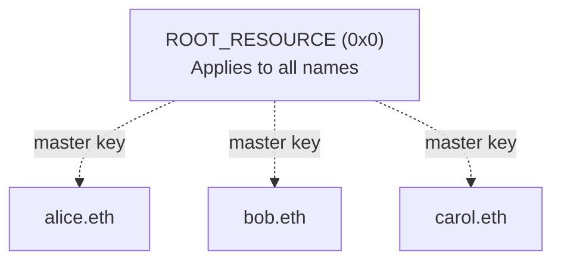
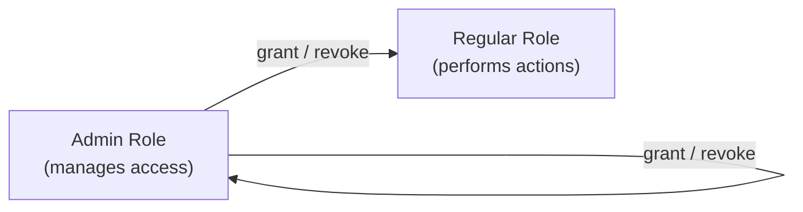

# Enhanced Access Control

Enhanced Access Control (EAC) is the permission system used throughout ENSv2. It controls who is allowed to do what - and on which names.

Think of it like a building where each room has its own set of locks: you can give someone a key to one room, or a master key that opens every room. EAC works the same way, but with ENS names and on-chain permissions.

:::note
The contracts and interfaces described here are **not yet final** and may change prior to mainnet deployment.
:::

## Resources

A **resource** is the thing you're controlling access to. In most ENS contracts, a resource is a name - but it can be any `uint256` identifier that makes sense for the contract.

For example, the ENS registry treats each name as a separate resource. Permissions you grant on `alice.eth` don't affect `bob.eth` - they're independent.

There's also a special resource called **`ROOT_RESOURCE`** (`0x0`) that represents the contract itself. Permissions granted on `ROOT_RESOURCE` apply everywhere - like a master key. If you have a role on `ROOT_RESOURCE`, you automatically have that role on every individual resource too.



## Roles

A **role** represents a specific permission - for example, "can set the resolver" or "can register subnames". Each ENS contract defines the roles that are relevant to it.

Roles are always tied to a resource. Granting someone the "set resolver" role on `alice.eth` doesn't let them set the resolver on `bob.eth`. To give someone a permission across all names, grant the role on `ROOT_RESOURCE` instead.

Up to 15 accounts can hold the same role on the same resource, enabling shared management and delegation.

**How role checks work:** when a contract checks whether an account has a role on a specific name, it looks in two places - the name itself and `ROOT_RESOURCE` - and allows the action if the role is found in either. This is how the master key effect works.

## Admin Roles

Every role has a corresponding **admin role** that controls who can manage it. If you hold the admin role, you can:

- **Grant** the regular role to other accounts
- **Grant** the admin role itself to other accounts
- **Revoke** either role from other accounts



For example, the admin role for "set resolver" controls who is allowed to grant or revoke the "set resolver" permission. Admin roles follow the same resource-scoping - you can be an admin for a specific name or for all names via `ROOT_RESOURCE`.

## Granting and Revoking

Roles are managed through four functions:

- `grantRoles` / `revokeRoles` - manage roles on a specific resource (name)
- `grantRootRoles` / `revokeRootRoles` - manage roles on `ROOT_RESOURCE` (contract-wide)

The caller must hold the admin role for every role being granted or revoked. Admin role holders can also revoke the admin role itself - including from themselves.

Contracts can hook into role changes by overriding `_onRolesGranted` and `_onRolesRevoked` to run custom logic whenever permissions change.

## Bitmap Layout

Under the hood, roles are packed into a single `uint256` bitmap split into two halves. Each role occupies one nybble (4 bits), giving space for up to 32 regular roles and 32 corresponding admin roles:

```
  255         128 127            0
  ┌──────────────┬───────────────┐
  │ Admin Roles  │ Regular Roles │
  └──────────────┴───────────────┘
```

A regular role at nybble index `N` occupies bits `N*4` to `N*4+3`. Its admin counterpart sits at the same position in the upper half (`N*4+128` to `N*4+131`). The same nybble-per-role layout is used for assignee counting - each nybble tracks how many accounts hold that role within a resource (which is why the maximum is 15, the largest value a 4-bit nybble can store).

## Replacing Fuses

EAC replaces the one-way [fuse system](/wrapper/fuses) from the Name Wrapper. Key advantages:

- **Reversible**: roles can be granted and revoked, not just permanently burned
- **Multi-account**: up to 15 accounts can hold the same role per resource, enabling delegation and shared management
- **Granular scoping**: permissions can be set contract-wide or per individual resource, with the two scopes composing automatically
- **Extensible**: each contract defines its own roles - no fixed set of permissions baked into the protocol

## Permissioned Registry Roles

The [Permissioned Registry](/contracts/ensv2/permissioned-registry) defines the following roles for managing name ownership and lifecycle:

| Role | Scope | Purpose |
|------|-------|---------|
| `ROLE_REGISTRAR` | root | Register or reserve names |
| `ROLE_REGISTER_RESERVED` | root | Promote reserved names to registered |
| `ROLE_SET_PARENT` | root | Set parent registry |
| `ROLE_UNREGISTER` | root or name | Unregister names |
| `ROLE_RENEW` | root or name | Extend expiry |
| `ROLE_SET_SUBREGISTRY` | root or name | Set child registry |
| `ROLE_SET_RESOLVER` | root or name | Set resolver |
| `ROLE_CAN_TRANSFER_ADMIN` | root or name (admin only) | Authorize token transfers |
| `ROLE_UPGRADE` | root | Authorize proxy upgrades |

"Root" scope means the role operates on `ROOT_RESOURCE` only. "Root or name" means it can be granted on either scope, and the two compose — a root grant applies to all names.

Admin roles on individual names can only be granted at registration time. They can be revoked afterward but not re-granted. On `ROOT_RESOURCE`, admin roles work normally. This prevents a name owner from escalating their own permissions after registration.

## Permissioned Resolver Roles

The Permissioned Resolver is the per-name resolver used in ENSv2. Each name gets its own resolver instance deployed via a factory, and all permissions are managed through EAC.

| Role | Scope | Purpose |
|------|-------|---------|
| `ROLE_SET_ADDR` | root or name | Set address records (e.g. ETH, BTC addresses) |
| `ROLE_SET_TEXT` | root or name | Set text records (e.g. avatar, email) |
| `ROLE_SET_CONTENTHASH` | root or name | Set contenthash record |
| `ROLE_SET_PUBKEY` | root or name | Set SECP256k1 public key record |
| `ROLE_SET_ABI` | root or name | Set ABI data |
| `ROLE_SET_INTERFACE` | root or name | Set interface implementer record |
| `ROLE_SET_NAME` | root or name | Set reverse name record |
| `ROLE_SET_ALIAS` | root | Set alias targets for name rewriting |
| `ROLE_CLEAR` | root or name | Clear all records for a node (version bump) |
| `ROLE_UPGRADE` | root | Authorize proxy upgrades |

### Fine-Grained Permissions

`ROLE_SET_ADDR` and `ROLE_SET_TEXT` support an additional level of scoping beyond name-level. Permissions can be restricted to a specific coin type or text key using a **part** identifier, creating a two-dimensional permission grid:

|  | Any record | Specific record |
|--|------------|-----------------|
| **Any name** | `resource(0, 0)` | `resource(0, part)` |
| **Specific name** | `resource(namehash, 0)` | `resource(namehash, part)` |

When checking permissions, the resolver looks across all four resource combinations and allows the action if any of them grant the required role.

Because of this part-based scoping, the standard `grantRoles()` function is disabled on the Permissioned Resolver. Instead, three specialized functions are provided:

- **`grantNameRoles(name, roleBitmap, account)`** — grant roles scoped to a name (no part restriction)
- **`grantTextRoles(name, key, account)`** — grant `ROLE_SET_TEXT` for a specific text key on a name
- **`grantAddrRoles(name, coinType, account)`** — grant `ROLE_SET_ADDR` for a specific coin type on a name

For example, you could grant someone permission to set only the `avatar` text record on `alice.eth`, without giving them access to any other records.

### Aliasing

The Permissioned Resolver supports internal name aliasing via `setAlias()` (requires `ROLE_SET_ALIAS`). An alias maps one name to another using longest-match suffix rewriting:

- `setAlias("a.eth", "b.eth")` causes `sub.a.eth` to resolve using records from `sub.b.eth`
- Aliases are resolved recursively (cycles of length 1 apply once; longer cycles result in out-of-gas)
