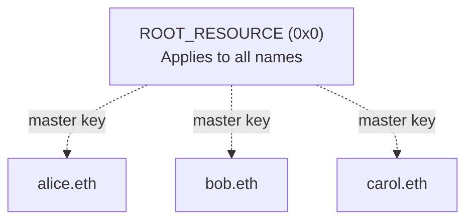
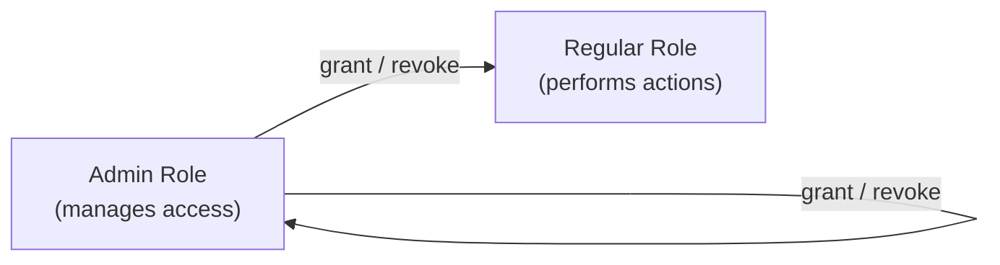

# Enhanced Access Control

Enhanced Access Control (EAC) is the permission system used throughout ENSv2. It controls who is allowed to do what, and on which names. EAC supports up to 2^256 independent resources (e.g., individual names), 64 roles per resource (32 regular + 32 admin), and up to 15 accounts per role.

Think of it like a building where each room has its own set of locks: you can give someone a key to one room, or a master key that opens every room. EAC works the same way, but with ENS names and on-chain permissions.

:::note
The contracts and interfaces described here are **not yet final** and may change prior to mainnet deployment.
:::

## Resources

A **resource** is the thing you're controlling access to. In most ENS contracts, a resource is a name - but it can be any `uint256` identifier that makes sense for the contract.

Each ENSv2 contract defines how its resources are computed. For example, registries derive resources from a name's labelhash, while resolvers derive resources from a namehash and record type. See [How Contracts Use EAC](#how-contracts-use-eac) for the specific schemes.

There's also a special resource called **`ROOT_RESOURCE`** (`0x0`) that represents the contract itself. Permissions granted on `ROOT_RESOURCE` apply everywhere - like a master key. If you have a role on `ROOT_RESOURCE`, you automatically have that role on every individual resource too.



## Roles

A **role** represents a specific permission - for example, "can set the resolver" or "can register subnames". Each ENS contract defines the roles that are relevant to it.

Roles are always tied to a resource. Granting someone the "set resolver" role on `alice.eth` doesn't let them set the resolver on `bob.eth`. To give someone a permission across all names, grant the role on `ROOT_RESOURCE` instead.

Up to 15 accounts can hold the same role on the same resource, enabling shared management and delegation.

**How role checks work:** when a contract checks whether an account has a role on a specific name, it looks in two places - the name itself and `ROOT_RESOURCE` - and allows the action if the role is found in either. This is how the master key effect works.

## Admin Roles

Every role has a corresponding **admin role** that controls who can manage it. If you hold the admin role, you can:

- **Grant** the regular role to other accounts
- **Grant** the admin role itself to other accounts
- **Revoke** either role from other accounts



For example, the admin role for "set resolver" controls who is allowed to grant or revoke the "set resolver" permission. Admin roles follow the same resource-scoping - you can be an admin for a specific name or for all names via `ROOT_RESOURCE`.

## Granting and Revoking

Roles are managed through four functions:

| Grant              | Revoke              | Scope                                |
| ------------------ | ------------------- | ------------------------------------ |
| `grantRoles`       | `revokeRoles`       | Specific resource (name)             |
| `grantRootRoles`   | `revokeRootRoles`   | `ROOT_RESOURCE` (contract-wide)      |

The caller must hold the admin role for every role being granted or revoked. Admin role holders can also revoke the admin role itself, including from themselves.

As a safety guardrail, `grantRoles` and `revokeRoles` reject `ROOT_RESOURCE`. You must use `grantRootRoles` / `revokeRootRoles` explicitly for contract-wide permissions. This prevents accidental global grants.

All four functions return `true` if the account's roles actually changed, or `false` if the roles were already in the desired state.

## Callback Hooks

EAC provides four internal hooks that contracts can override to customize permission behavior:

### Role Change Callbacks

- **`_onRolesGranted(resource, account, oldRoles, newRoles, roleBitmap)`**: called after roles are successfully granted. Receives the account's role bitmap before and after the change, plus the specific roles that were newly added.
- **`_onRolesRevoked(resource, account, oldRoles, newRoles, roleBitmap)`**: called after roles are successfully revoked. Same parameters, with `roleBitmap` containing the roles that were actually removed.

Both are no-ops in the base implementation. The [Permissioned Registry](/contracts/ensv2/permissioned-registry) overrides these to regenerate ERC1155 tokens when roles change, invalidating stale transfer approvals.

### Grant/Revoke Restriction Hooks

- **`_getSettableRoles(resource, account)`**: returns which roles the account is allowed to grant on a given resource. By default, an account can grant any role for which it holds the corresponding admin role. Contracts override this to impose additional restrictions.
- **`_getRevokableRoles(resource, account)`**: returns which roles the account is allowed to revoke on a given resource. Same default behavior as settable roles.

The [Permissioned Registry](/contracts/ensv2/permissioned-registry) overrides both to prevent admin role escalation on individual names after registration and to block all role changes on unregistered or reserved names.

## Bitmap Layout

Under the hood, roles are packed into a single `uint256` bitmap split into two halves. Each role occupies one nybble (4 bits), giving space for up to 32 regular roles and 32 corresponding admin roles:

```
  255         128 127            0
  ┌──────────────┬───────────────┐
  │ Admin Roles  │ Regular Roles │
  └──────────────┴───────────────┘
  63           32 31             0  ← nybble indices
```

Each nybble is a 4-bit slot. A regular role at nybble index `N` occupies bits `4N` to `4N + 3`, so nybble 0 is bits 0–3, nybble 1 is bits 4–7, and so on. Its admin counterpart sits at the same position in the upper half (`4N + 128` to `4N + 131`).

EAC tracks role assignments in two mappings:

- **`_roles[resource][account]`**: stores which roles a given account holds on a given resource. Each nybble is either `0` (no role) or `1` (has role).
- **`_roleCount[resource]`**: stores how many accounts hold each role on a given resource. Each nybble is a count from 0 to 15, using the same nybble-per-role layout. This is why the maximum number of assignees per role is 15: it's the largest value a 4-bit nybble can store.

## Replacing Fuses

EAC replaces the one-way [fuse system](/wrapper/fuses) from the Name Wrapper. The key conceptual shift: in ENSv1, you **burned** permissions to restrict what could be done. In ENSv2, you **revoke** roles instead. Both achieve the same end result, but revoking is reversible if you hold the admin role.

| Feature           | ENSv1 Fuses                    | ENSv2 EAC                                                   |
| ----------------- | ------------------------------ | ----------------------------------------------------------- |
| Revocability      | One-way burn — permanent       | Fully reversible grant/revoke                               |
| Delegation        | Single owner only              | Up to 15 accounts per role per resource                     |
| Scope             | Per-name only                  | Per-name or contract-wide via `ROOT_RESOURCE`               |
| Extensibility     | Fixed set of 16 fuses          | Each contract defines its own roles (up to 32)              |
| Transfer control  | `CANNOT_TRANSFER` fuse         | `ROLE_CAN_TRANSFER_ADMIN` (revoke to make non-transferable) |
| Resolver control  | `CANNOT_SET_RESOLVER` fuse     | `ROLE_SET_RESOLVER` (revoke to lock resolver)               |
| Subdomain control | `CANNOT_CREATE_SUBDOMAIN` fuse | `ROLE_REGISTRAR` (revoke to prevent new subnames)           |

## How Contracts Use EAC

Each ENSv2 contract defines its own roles and its own resource scheme. See the EAC Permissions section on each contract page for details:

- [Permissioned Registry: EAC Integration](/contracts/ensv2/permissioned-registry#eac-integration): 9 roles, labelhash-based resources with version isolation, anyId polymorphism
- [Permissioned Resolver: EAC Integration](/contracts/ensv2/permissioned-resolver#eac-integration): 11 per-record roles, fine-grained scoping down to individual keys or coin types
- [Registry Metadata](/contracts/ensv2/registry-metadata#the-metadata-update-role): each metadata provider runs its own EAC instance with a dedicated update role, separate from the registry's permissions

## Reference

### Write Functions

| Function | Description |
|----------|-------------|
| `grantRoles(resource, roleBitmap, account)` | Grant roles on a specific resource (rejects `ROOT_RESOURCE`) |
| `revokeRoles(resource, roleBitmap, account)` | Revoke roles on a specific resource (rejects `ROOT_RESOURCE`) |
| `grantRootRoles(roleBitmap, account)` | Grant roles on `ROOT_RESOURCE` (contract-wide) |
| `revokeRootRoles(roleBitmap, account)` | Revoke roles on `ROOT_RESOURCE` (contract-wide) |

### View Functions

| Function | Returns |
|----------|---------|
| `roles(resource, account)` | Full role bitmap for account on resource |
| `roleCount(resource)` | Assignee count bitmap (nybble per role) |
| `hasRoles(resource, roleBitmap, account)` | Whether account has all specified roles (checks resource + ROOT) |
| `hasRootRoles(roleBitmap, account)` | Whether account has all specified roles on `ROOT_RESOURCE` |
| `hasAssignees(resource, roleBitmap)` | Whether any accounts hold the specified roles |
| `getAssigneeCount(resource, roleBitmap)` | Per-role assignee counts and mask |
| `ROOT_RESOURCE` | The root resource constant (`0`) |

### Events

| Event | Emitted when |
|-------|-------------|
| `EACRolesChanged(resource, account, oldRoleBitmap, newRoleBitmap)` | Roles granted or revoked for an account on a resource |

## Code Examples

### Checking Roles

```ts [Viem]
import { createPublicClient, http } from 'viem'
import { mainnet } from 'viem/chains'

const client = createPublicClient({
  chain: mainnet,
  transport: http(),
})

// Check if an account has ROLE_SET_RESOLVER on a specific name
const hasRole = await client.readContract({
  address: registryAddress,
  abi: permissionedRegistryAbi,
  functionName: 'hasRoles',
  args: [tokenId, ROLE_SET_RESOLVER, accountAddress],
})
```

### Granting Roles

```ts [Viem]
import { createWalletClient, http } from 'viem'
import { mainnet } from 'viem/chains'

const wallet = createWalletClient({
  chain: mainnet,
  transport: http(),
})

// Grant ROLE_SET_RESOLVER to an operator on a specific name
await wallet.writeContract({
  address: registryAddress,
  abi: permissionedRegistryAbi,
  functionName: 'grantRoles',
  args: [tokenId, ROLE_SET_RESOLVER, operatorAddress],
})

// Grant multiple roles at once using bitwise OR
const roles = ROLE_SET_RESOLVER | ROLE_SET_SUBREGISTRY
await wallet.writeContract({
  address: registryAddress,
  abi: permissionedRegistryAbi,
  functionName: 'grantRoles',
  args: [tokenId, roles, operatorAddress],
})
```

### Revoking Roles

```ts [Viem]
// Revoke ROLE_CAN_TRANSFER_ADMIN from yourself to make a name non-transferable
await wallet.writeContract({
  address: registryAddress,
  abi: permissionedRegistryAbi,
  functionName: 'revokeRoles',
  args: [tokenId, ROLE_CAN_TRANSFER_ADMIN, myAddress],
})
```
