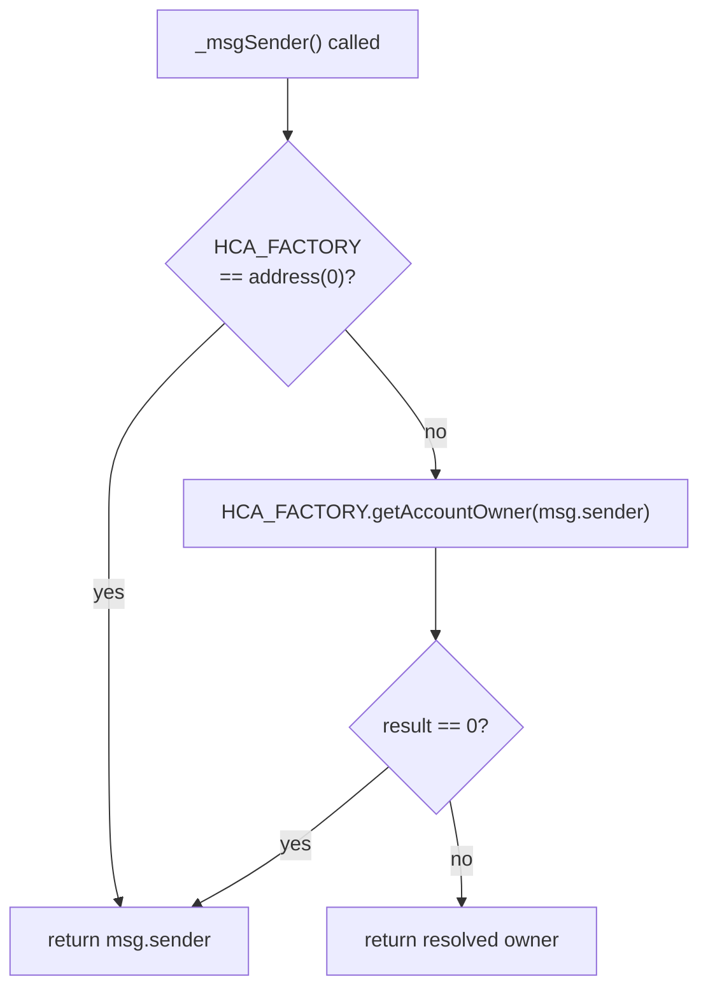

# Hidden Contract Accounts

Hidden Contract Accounts (HCAs) let smart-account proxies act on behalf of their owners while still being attributed to the owner. ENSv2 wires HCA-aware sender resolution into every layer of the stack. When a user controls a name through an HCA proxy, the protocol records the owner as the actor for permission checks, ownership reads, and event indexing.

:::note
The contracts and interfaces described here are **not yet final** and may change prior to mainnet deployment.
:::

## The Problem

Smart-account flows usually involve a per-user proxy contract that signs and submits transactions on the user's behalf. Without intervention, every contract that inspects `msg.sender` would see the proxy address, not the controlling account. For ENS that means role checks would fail, ownership would land on the proxy, and indexers would track the wrong actor.

## Resolution Mechanism

Every HCA-aware contract inherits `HCAEquivalence`, which carries an immutable reference to an `IHCAFactoryBasic`. When `_msgSender()` is called:

1. If the factory address is `address(0)`, return `msg.sender` unchanged.
2. Otherwise call `HCA_FACTORY.getAccountOwner(msg.sender)`.
3. If the result is `address(0)` (the caller is not a registered HCA), return `msg.sender`.
4. Otherwise return the resolved owner.



The factory itself is treated as opaque. The protocol does not care how the owner-account mapping is implemented, only that it can ask.

## Two Context Flavours

OpenZeppelin contracts inherit from one of two `Context` base classes. ENSv2 ships HCA-aware drop-in replacements for both:

- **`HCAContext`** extends `Context`, used by non-upgradeable contracts.
- **`HCAContextUpgradeable`** extends `ContextUpgradeable`, used by UUPS proxies, e.g. `PermissionedResolver`.

Inheriting either makes every downstream `_msgSender()` call HCA-aware, including the role-check modifiers in [Enhanced Access Control](/contracts/ensv2/enhanced-access-control), `Ownable`, and standard ERC-1155 operator/approval logic.

## Where HCA Is Wired

HCA-aware sender resolution is built into every contract that gates actions or records actors:

| Contract                  | Reaches HCA via                                |
| ------------------------- | ---------------------------------------------- |
| `ERC1155Singleton`        | `HCAContext` (registries inherit transitively) |
| `PermissionedRegistry`    | via `ERC1155Singleton`                         |
| `WrapperRegistry`         | via `PermissionedRegistry`                      |
| `PermissionedResolver`    | `HCAContextUpgradeable`                        |
| `ETHRegistrar`            | `HCAEquivalence` directly                      |
| `SimpleRegistryMetadata`  | `HCAEquivalence` directly                      |
| `BaseUriRegistryMetadata` | `HCAEquivalence` directly                      |

The HCA factory address is supplied to each contract at construction time.

## The Factory Interface

```solidity
interface IHCAFactoryBasic {
    function getAccountOwner(address hca) external view returns (address);
}
```

A single read-only method. It returns the owner of `hca` if the address is a registered Hidden Contract Account, or `address(0)` otherwise. The interface selector is `0x442b172c`.

## What HCA Does Not Change

- `tx.origin`: untouched.
- The actual `msg.sender` for low-level calls and any third-party contracts.
- Balances, approvals, or behavior on contracts outside the ENSv2 stack.

HCA is a contract-side opt-in for attribution only. It changes who the protocol _thinks_ is acting; it does not change who the EVM thinks is acting.

## Production Factory

The production HCA factory is deployed externally (currently from Rhinestone's ENS modules) and is audited separately. The protocol is implementation-agnostic: passing `address(0)` for the factory disables HCA entirely, which is what test fixtures and devnet deployments do by default.
