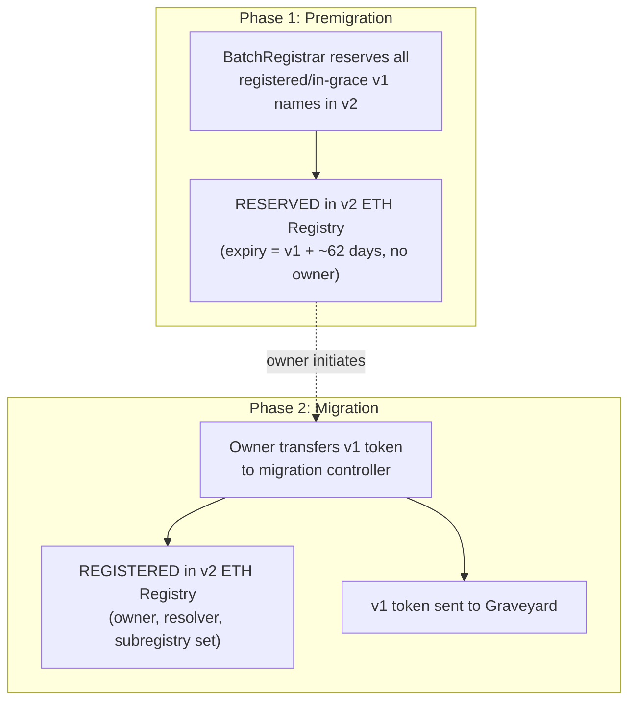

import { FrenCallout } from '../../../components/ensv2/FrenCallout'

# Migration

ENSv2 provides a migration framework for transitioning ENSv1 `.eth` names to the new system. Migration is a two-phase process: **premigration** reserves all existing names in v2 automatically, then **migration** lets owners claim their names by transferring their v1 tokens to a migration controller.

<FrenCallout fren="lili" variant="tip">
The contracts and interfaces described here are **not yet final** and may change prior to mainnet deployment.
</FrenCallout>

<FrenCallout fren="kuzco" variant="warning" title="Watch out!">
Once ENSv2 is live, v1 `.eth` registrations and renewals are disabled. New registrations go through the v2 [ETH Registrar](/contracts/ensv2/eth-registrar). Migrated names are renewed via the ETH Registrar; unmigrated ([RESERVED](#key-definitions)) names are renewed via [`ETHRenewerV1`](#renewals), which syncs the expiry back to v1. Names in v1 will simply expire and can never be re-registered through v1.
</FrenCallout>

## What You Need to Do

### .eth Name Owners

<FrenCallout fren="lili" variant="tip">
If you just own a `.eth` name and aren't a developer, you don't need to understand the technical details below. A frontend migration tool will be available when the time comes that handles everything for you.
</FrenCallout>

Premigration happens automatically. To migrate your name to v2:

1. Transfer your v1 token to the appropriate migration controller:
   - **Unwrapped or unlocked**: `UnlockedMigrationController`
   - **Locked**: `LockedMigrationController`
2. Specify the name's label plus the new v2 owner, resolver, and subregistry in the transfer data (the label must match the transferred token, otherwise migration reverts with `NameDataMismatch`)
3. The v2 owner can be a different address than the v1 owner (e.g., migrating to a smart account)

If your name is in the v1 grace period, use `ETHRenewerV1` to renew it first.

<FrenCallout fren="peanut" variant="note">
Migration is **not required** immediately. Unmigrated names continue to resolve through v1 via `ENSV1Resolver`. However, migrating gives you access to v2 features like [per-record permissions](/contracts/ensv2/permissioned-resolver#eac-integration), [aliasing](/contracts/ensv2/permissioned-resolver#aliasing), and the new resolver.
</FrenCallout>

### Subname Owners

If you own an emancipated subname (3LD+), your parent must migrate first. Once the parent has migrated, transfer your token to the parent's `WrapperRegistry`:

- **Locked subnames** (`CANNOT_UNWRAP` set): fuses are converted to v2 roles, a new WrapperRegistry is deployed as the subregistry
- **Detached subnames** (emancipated without `CANNOT_UNWRAP`): unwrapped to the [Graveyard](#graveyard) and registered with the standard role set (plus renewal roles if `CAN_EXTEND_EXPIRY` was set)

Non-emancipated 3LD+ subnames cannot be migrated through the migration controllers. They must be registered directly in v2 once their parent has a v2 registry.

### What Happens to Records

- **Locked names with `CANNOT_SET_RESOLVER`**: the v1 resolver is preserved. If it's a known `PublicResolver`, it's replaced with `PublicResolverV2` (records may need to be copied separately).
- **All other names**: the v1 resolver is cleared during migration. The v2 resolver is set from the migration transfer data (or can be set up afterwards).

## Overview



### ENSv1 Token Types

Migration supports `.eth` 2LDs and emancipated subnames. The migration path depends on the token type:

| Type | Token Standard | Description |
|------|---------------|-------------|
| **Unwrapped** | BaseRegistrar ERC-721 | 2LD only |
| **Unlocked** | NameWrapper ERC-1155 | Without `CANNOT_UNWRAP` (2LD only) |
| **Locked** | NameWrapper ERC-1155 | Emancipated + `CANNOT_UNWRAP` (2LD and 3LD+) |
| **Detached** | NameWrapper ERC-1155 | Emancipated, without `CANNOT_UNWRAP`, parent is Locked (3LD+ only) |

Both Locked and Detached are subtypes of **Emancipated** (`PARENT_CANNOT_CONTROL` set). The distinction determines the migration path: Locked names preserve their fuse restrictions as v2 roles, while Detached names are unwrapped and registered with the standard role set (see [Detached Names](#detached-names)).

### Key Definitions

- **RESERVED**: a v2 registry slot with an expiry and resolver but no owner. Created during premigration.
- **REGISTERED**: a v2 registry slot with an owner. Created when a user migrates their v1 token.
- **Graveyard**: the contract that receives migrated v1 tokens and can clear stale v1 registry entries so they no longer resolve.

### Time Constants

| Constant | Value | Description |
|----------|-------|-------------|
| `GRACE_PERIOD_V1` | 90 days | Post-expiry window in ENSv1 where the owner can still renew |
| `GRACE_PERIOD_V2` | 28 days | Post-expiry window in ENSv2 where the owner can still renew via the [ETH Registrar](/contracts/ensv2/eth-registrar) |
| `BONUS_PERIOD` | ~62 days | `GRACE_PERIOD_V1 - GRACE_PERIOD_V2` (plus 1 second due to boundary handling). Added to v1 expiry during premigration so that the v2 reservation does not expire before v1's grace period ends |

## Premigration

Before users can migrate, every registered or in-grace v1 name is batch-reserved in the v2 ETH Registry by the `BatchRegistrar`. This happens automatically and does not require any user action.

For each name:
- **Status**: set to `RESERVED`
- **Expiry**: `expiryV1 + BONUS_PERIOD`
- **Resolver**: set to `ENSV1Resolver`, which performs wildcard fallback to the v1 ENS registry
- **Owner**: not set (RESERVED names have no owner)

After premigration, v1 `.eth` registrations and v1 renewals are disabled. Migrated (REGISTERED) names are renewed via the `ETHRegistrar`. Unmigrated (RESERVED) names are renewed via `ETHRenewerV1`, which syncs the expiry back to the v1 BaseRegistrar. Names continue to resolve through v1 during this phase because `ENSV1Resolver` mirrors v1 resolution.

## Migration Paths

Migration is initiated by the name owner transferring their v1 token to the appropriate controller. The controller promotes the pre-existing RESERVED slot to REGISTERED, setting the owner, resolver, subregistry, and role bitmap. The v1 token is forwarded to the Graveyard. Promoted names additionally carry the non-revokable `ROLE_WAS_RESERVED` marker role, which fresh registrations do not have.

The v2 owner specified during migration **does not need to match** the v1 owner. This allows migrating directly to a new wallet or smart account.

### Unwrapped Names

Unwrapped 2LD names (BaseRegistrar ERC-721 tokens) are migrated via the `UnlockedMigrationController`.

1. Transfer the ERC-721 token via `safeTransferFrom` with an encoded data payload specifying: label, new owner, resolver, and subregistry
2. The controller reclaims the token on the BaseRegistrar, transfers v1 registry ownership to the Graveyard, and clears the v1 resolver
3. The ERC-721 token is sent to the Graveyard
4. The name is promoted from RESERVED to REGISTERED in the v2 ETH Registry with the provided parameters
5. The token is granted the same roles as a fresh `ETHRegistrar.register()` ([REGISTRATION_ROLE_BITMAP](/contracts/ensv2/eth-registrar#roles-granted-at-registration))

### Unlocked Wrapped Names

Unlocked 2LD names (NameWrapper ERC-1155 tokens without `CANNOT_UNWRAP`) are also migrated via the `UnlockedMigrationController`.

1. Transfer the ERC-1155 token via `safeTransferFrom` (or batch via `safeBatchTransferFrom`) with an encoded data payload
2. The controller verifies the name is NOT locked (reverts `NameIsLocked` otherwise)
3. The token is unwrapped to the Graveyard and the v1 resolver is cleared
4. The name is promoted from RESERVED to REGISTERED with the provided parameters
5. Token roles are the same as `ETHRegistrar.register()`

<FrenCallout fren="peanut" variant="note">
Unlocked 3LD+ names cannot be migrated through this path. They must be registered directly in v2 once their parent has a v2 registry.
</FrenCallout>

### Locked Names

Locked names (NameWrapper ERC-1155 tokens with `CANNOT_UNWRAP`) have irrevocable restrictions that must be preserved. The migration path depends on the name level:

- **2LD**: transfer to `LockedMigrationController`
- **3LD+**: transfer to the parent name's `WrapperRegistry` (the parent must have migrated first)

The migration flow:

1. Transfer the ERC-1155 token to the appropriate receiver
2. The receiver branches on the token type: locked tokens continue with the steps below, detached tokens follow their own path (see [Detached Names](#detached-names)), and anything else reverts (`NameNotLocked`)
3. If `CANNOT_APPROVE` is burned and `getApproved()` is non-null after transfer, migration reverts (`FrozenTokenApproval`). If `CANNOT_APPROVE` is not burned, any approval is automatically cleared during the transfer, so this cannot trigger.
4. ENSv1 [fuses](/wrapper/fuses) are converted to ENSv2 roles (see [Fuse-to-Role Conversion](#fuse-to-role-conversion))
5. A `WrapperRegistry` is always deployed as the subregistry, replicating the v1 fuse-based access control using v2's [EAC](/contracts/ensv2/enhanced-access-control) system
6. The v1 resolver is cleared and the v2 name gets the resolver from the transfer data, **unless** `CANNOT_SET_RESOLVER` is burned, in which case the transfer-data resolver is ignored and the existing v1 resolver is carried over to v2. If the carried-over resolver is a known `PublicResolver`, it is replaced with `PublicResolverV2`
7. The token is **not unwrapped** but is transferred to the Graveyard as an ERC-1155 token
8. The name is promoted from RESERVED to REGISTERED (for 2LD) or registered directly (for 3LD+) with the converted roles

### Detached Names

Detached names are emancipated children of locked parents that don't have `CANNOT_UNWRAP` set (3LD+ only). They are migrated via the parent's `WrapperRegistry`.

1. Transfer the ERC-1155 token to the parent's WrapperRegistry
2. The token is unwrapped to the Graveyard and the v1 resolver is cleared (the v2 name gets the resolver from the transfer data)
3. The name is registered with the same token roles as `ETHRegistrar.register()`, plus `ROLE_RENEW` and `ROLE_RENEW_ADMIN` if the v1 token had `CAN_EXTEND_EXPIRY` set

## Fuse-to-Role Conversion

When migrating locked names, ENSv1 fuses are converted to ENSv2 roles. The key principle: a burned fuse that restricts an action means the corresponding role is **not granted**.

Admin roles (the `<< 128` shifted counterparts) are only granted when `CANNOT_BURN_FUSES` is **not** set. If fuses are frozen, only regular roles are granted, preventing any further permission changes in v2. The one exception is `ROLE_CAN_TRANSFER_ADMIN`: it has no non-admin counterpart and is granted whenever `CANNOT_TRANSFER` is not burned, frozen or not.

### Token Roles

| ENSv1 Fuse | ENSv2 Role | Granted when fuse is... |
|------------|-----------|------------------------|
| `CAN_EXTEND_EXPIRY` | `ROLE_RENEW` | Set (enabled) |
| `CANNOT_SET_RESOLVER` | `ROLE_SET_RESOLVER` | Not set (not burned) |
| `CANNOT_TRANSFER` | `ROLE_CAN_TRANSFER_ADMIN` | Not set (not burned) |
| `CANNOT_BURN_FUSES` | Admin counterparts of above | Not set (not frozen) |
| `CANNOT_SET_TTL` | N/A | Ignored (no TTL in v2) |

### Subregistry Roles

These roles are granted to the name owner on the WrapperRegistry's [`ROOT_RESOURCE`](/contracts/ensv2/enhanced-access-control#resources), giving them contract-wide authority over the subregistry.

| ENSv1 Fuse | ENSv2 Role | Granted when fuse is... |
|------------|-----------|------------------------|
| `CANNOT_CREATE_SUBDOMAIN` | `ROLE_REGISTRAR` | Not set (not burned) |
| (always) | `ROLE_RENEW` + `ROLE_UPGRADE` + `ROLE_CAN_NAME` | Always granted |
| `CANNOT_BURN_FUSES` | Admin counterparts of all of the above | Not set (not frozen) |

## Graveyard

The `Graveyard` contract receives migrated v1 tokens and provides functionality to clear stale v1 registry entries so they no longer resolve. It has no mechanism to transfer or upgrade the tokens it holds.

During migration, the resolver of the migrated name is cleared (when possible) and, for unwrapped names, v1 registry ownership is transferred to the Graveyard. However, the unemancipated subname namespace under the migrated name is left unchanged. The `clear()` function handles this cleanup separately:

```solidity
// Anyone can call this to clean up v1 registry entries
Graveyard.clear(names)
```

`clear()` recursively walks the v1 namespace hierarchy for each name, clearing resolvers and transferring subnode ownership to the Graveyard. It is permissionless: callers cannot harm names they don't own, because the function only succeeds for names the Graveyard controls or names that have expired past the v1 grace period.

For expired 2LD names that were never migrated, `clear()` re-registers them to the Graveyard via the v1 BaseRegistrar with a near-permanent duration, then clears their resolver. This is used by an off-chain service that periodically calls `clear()` on expired names to prevent stale v1 resolution. Locked names that are not owned by the Graveyard cannot be cleared (reverts `NameNotClearable`).

## ENSv1 Continuity

Not all names will migrate immediately. ENSv2 provides mechanisms to keep unmigrated names functional.

### Renewals

Renewals are handled by two contracts depending on the name's status:

- **`ETHRegistrar`**: renews REGISTERED names (migrated names). Does not sync v1.
- **`ETHRenewerV1`**: renews RESERVED names (unmigrated names). Syncs the expiry back to the v1 BaseRegistrar so both systems stay in lockstep.

**Key invariants:**
- The v2 expiry is always `BONUS_PERIOD` ahead of the v1 expiry
- The `ETHRegistrar` cannot register RESERVED names (it lacks `ROLE_REGISTER_RESERVED`), so unmigrated names are protected until they expire
- `ENSV1Resolver` continues resolving unmigrated names until the v2 reservation expires

### Unmigratable Names

Some names are structurally unable to migrate (see [Restrictions](#restrictions)). These names remain fully functional on v1:

- Resolution continues via `ENSV1Resolver` as long as the v2 reservation is active
- Renewals work via `ETHRenewerV1`, keeping the v1 and v2 expiries in sync
- v1 fuses, resolver, and ownership remain unchanged

The only v2 features unavailable to unmigratable names are per-record permissions, aliasing, and the new resolver. Once the v2 reservation expires and the 28-day v2 grace period has passed, the name becomes available for fresh registration in v2 (during the grace window it can still be renewed via `ETHRenewerV1`). The `Graveyard` can clear the expired v1 namespace.

### What Happens to Unmigrated Names

Names that *could* migrate but don't will eventually expire. Since v1 registrations are disabled, expired names never become available in v1 again. The v2 RESERVED slot also expires. Once expired in v2 and past the 28-day v2 grace period (during which `ETHRenewerV1` can still renew it), the name becomes available for fresh registration via the `ETHRegistrar`. An off-chain service re-registers expired names to the Graveyard, which then clears their v1 resolvers so they no longer produce stale results.

## Scenarios

### 100 days remaining

*A name with 100 days left in v1 is premigrated.*

The RESERVED slot has 162 days left (100 + 62 day bonus). The v1 token expires after 100 days and its grace period ends after 190 days (100 + 90). The v2 reservation expires after 162 days and becomes available for registration after 190 days (162 + 28 day grace). The v2 availability aligns with the end of the v1 grace period.

### Migrates then renews

*A name with 50 days remaining is premigrated, migrated, then renewed for 50 days.*

The RESERVED slot has 112 days (50 + 62). The owner migrates, promoting to REGISTERED. The v1 token goes to the Graveyard with 50 days left. The owner renews via `ETHRegistrar` for 50 days, extending the v2 registration to 162 days (50 + 62 + 50). The v2 grace period begins after 162 days and lasts 28 days.

### In grace period, renews before migrating

*A name expired 61 days ago and has 29 days left in the v1 grace period (i.e., -61 days remaining). The owner cannot migrate because the name is expired in v1.*

The RESERVED slot has 1 day left (-61 + 62 day bonus). The owner renews for 62 days via `ETHRenewerV1` (the minimum needed to make the name active again), which extends both expiries:

- **v1 expiry**: -61 + 62 = 1 day from now. Grace period ends after 91 days (1 + 90).
- **v2 expiry**: 1 + 62 = 63 days from now. Becomes available after 91 days (63 + 28).

The name is active again (no longer in grace), so the token can be transferred and migrated to v2.

## Restrictions

Migration is not possible in the following cases:

- The v1 token is not transferable (owner or approval restrictions)
- Locked names with `CANNOT_TRANSFER` burned
- Locked names with `CANNOT_APPROVE` burned and a non-null `getApproved()` (reverts `FrozenTokenApproval`)
- 3LD+ subnames whose parent has not migrated yet

## Contracts

| Contract | Purpose |
|----------|---------|
| `BatchRegistrar` | Batch-reserves v1 names in v2 during premigration |
| `UnlockedMigrationController` | Migrates unwrapped and unlocked 2LD names |
| `LockedMigrationController` | Migrates locked 2LD names |
| `MigrationHelper` | Batch migration of mixed unwrapped/unlocked/locked tokens using operator approvals |
| `WrapperRegistry` | Migrates locked/detached 3LD+ names; replicates fuse-based access control in v2 |
| `Graveyard` | Receives migrated v1 tokens; clears stale v1 registry entries and resolvers |
| `ETHRenewerV1` | Renews RESERVED (unmigrated) names with v1 BaseRegistrar sync |
| `ENSV1Resolver` | Wildcard fallback resolver for premigrated names |
| `PublicResolverV2` | Replacement for v1 PublicResolver that respects v2 ownership |
