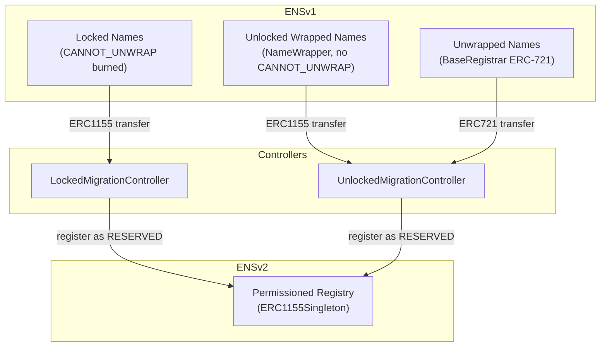

import { FrenCallout } from '../../../components/ensv2/FrenCallout'

# Migration

ENSv2 provides a comprehensive migration framework for transitioning ENSv1 names to the new system. The migration is designed to be safe, preserving existing permissions, and supporting all name types: locked wrapped names, unlocked wrapped names, and unwrapped BaseRegistrar names.

<FrenCallout fren="lili" variant="tip">
The contracts and interfaces described here are **not yet final** and may change prior to mainnet deployment.
</FrenCallout>

## Overview

ENSv1 names can exist in three states, each with its own migration path:

All migration paths result in the name being registered as `RESERVED` in the ENSv2 [Permissioned Registry](/contracts/ensv2/permissioned-registry), preserving the existing expiry. The name is then promoted to `REGISTERED` when the owner claims it.

## Migration Paths

### Locked Names (LockedMigrationController)

Locked names are those with the `CANNOT_UNWRAP` [fuse](/wrapper/fuses) burned in the ENSv1 [Name Wrapper](/wrapper/overview). These names have irrevocable restrictions that must be preserved in ENSv2.

**How it works:**

1. The name owner transfers their wrapped ERC1155 token to the `LockedMigrationController`
2. The controller validates:
   - The name is actually locked (`CANNOT_UNWRAP` is burned)
   - The name data matches the expected node and owner
3. The controller converts ENSv1 fuses to ENSv2 roles (see [Fuse-to-Role Conversion](#fuse-to-role-conversion))
4. If the name has subnames, a `WrapperRegistry` is created for the child registry
5. The name is registered as `RESERVED` in the ENSv2 registry with the converted role bitmap
6. If the name had an ENSv1 resolver, it is preserved

**Key behavior:** locked names that are migrated retain their restriction semantics. A fuse that was burned in ENSv1 maps to a revoked role in ENSv2, maintaining the same guarantees.

### Unlocked and Unwrapped Names (UnlockedMigrationController)

The `UnlockedMigrationController` handles two types of names:

**Unlocked wrapped names** (NameWrapper ERC1155 tokens without `CANNOT_UNWRAP`):

1. The owner transfers their wrapped ERC1155 token to the controller
2. The controller validates the name is NOT locked
3. The controller clears the ENSv1 resolver
4. The name is registered as `RESERVED` in ENSv2

**Unwrapped names** (BaseRegistrar ERC721 tokens):

1. The owner transfers their ERC721 token to the controller via `safeTransferFrom`
2. The controller's `onERC721Received` handler processes the migration
3. The name is registered as `RESERVED` in ENSv2

In both cases, the `UnlockedMigrationController` requires `ROLE_REGISTER_RESERVED` permission on the ETH registry.

## Fuse-to-Role Conversion

When migrating locked names, ENSv1 fuses are converted to ENSv2 roles. The key principle is: **a burned fuse becomes a revoked role**.

### Owner-Controlled Fuses

| ENSv1 Fuse                | ENSv2 Equivalent                 | Notes                                                              |
| ------------------------- | -------------------------------- | ------------------------------------------------------------------ |
| `CANNOT_TRANSFER`         | Revoke `ROLE_CAN_TRANSFER_ADMIN` | Name becomes non-transferable                                      |
| `CANNOT_SET_RESOLVER`     | Revoke `ROLE_SET_RESOLVER`       | Resolver is locked                                                 |
| `CANNOT_UNWRAP`           | N/A                              | No "unwrapping" concept in ENSv2 - names are always ERC1155 tokens |
| `CANNOT_BURN_FUSES`       | Revoke all admin roles           | Prevents further permission changes                                |
| `CANNOT_CREATE_SUBDOMAIN` | Revoke `ROLE_REGISTRAR`          | No new subnames can be created                                     |
| `CANNOT_SET_TTL`          | N/A                              | TTL is not stored in ENSv2 registries                              |

### Parent-Controlled Fuses

| ENSv1 Fuse              | ENSv2 Equivalent                              | Notes                                    |
| ----------------------- | --------------------------------------------- | ---------------------------------------- |
| `PARENT_CANNOT_CONTROL` | Revoke parent's admin roles on the child name | Parent loses ability to modify the child |
| `CAN_EXTEND_EXPIRY`     | Grant `ROLE_RENEW` on the child name          | Child owner can extend their own expiry  |

The conversion is handled by `_subregistryRoleBitmapFromFuses()` and `_tokenRoleBitmapFromFuses()` in the migration contracts.

## WrapperRegistry

The **WrapperRegistry** acts as a bridge between ENSv1's [Name Wrapper](/wrapper/overview) and ENSv2's registry system. It wraps the Name Wrapper as an ENSv2-compatible registry, enabling a gradual migration where:

- Already-migrated names are managed by ENSv2 directly
- Not-yet-migrated children continue to resolve through the ENSv1 Name Wrapper

Key behaviors:

- **Prevents double registration**: migratable children (those still in the Name Wrapper) cannot be registered directly in the WrapperRegistry
- **Resolver passthrough**: `getResolver()` returns the ENSv1 resolver for children that haven't migrated yet
- **Name data access**: `getWrappedName()` and `getWrappedNode()` expose the original wrapped name data

This allows the registry tree to include both migrated and unmigrated names seamlessly.

## Subname Migration

When a parent name is migrated, its subnames don't migrate automatically. Instead:

1. The parent's migration creates a `WrapperRegistry` (for locked names) that acts as the child registry
2. The WrapperRegistry allows ENSv1 subnames to continue resolving normally
3. Each subname can be individually migrated when its owner is ready
4. Once migrated, the subname is managed entirely by ENSv2

This approach ensures:

- No forced migration for subname owners
- Continued resolution during the transition period
- Each owner migrates at their own pace

## What Users Need to Do

### .eth Name Owners

If you own a `.eth` name, you can migrate it to ENSv2 by transferring it to the appropriate migration controller:

- **Wrapped and locked**: transfer your NameWrapper ERC1155 token to the `LockedMigrationController`
- **Wrapped and unlocked**: transfer your NameWrapper ERC1155 token to the `UnlockedMigrationController`
- **Unwrapped**: transfer your BaseRegistrar ERC721 token to the `UnlockedMigrationController`

After migration, your name will appear as `RESERVED` in ENSv2. You can then claim full ownership by promoting it to `REGISTERED`.

:::note
Migration is **not required** immediately. ENSv1 names will continue to function through the WrapperRegistry bridge. However, migrating gives you access to ENSv2 features like per-record permissions, aliasing, and the new resolver.
:::

### Subname Owners

If you own a subname (e.g., `sub.alice.eth`), your migration depends on the parent:

- If the parent has migrated, you can migrate your subname independently
- If the parent has not migrated, your subname continues to work through ENSv1

### What Happens to Records

- **Locked names**: the ENSv1 resolver is preserved during migration. Your records continue to resolve.
- **Unlocked names**: the ENSv1 resolver is cleared during migration. You'll need to set up a new resolver in ENSv2.

## What App Developers Need to Do

For most application developers, ENSv2 migration is transparent. If you use a supported library (viem >= 2.35.0, ethers with ENS patch), resolution handles both v1 and v2 names automatically.

See the [ENSv2 Readiness](/web/ensv2-readiness) guide and the [App Developer Tutorial](/contracts/ensv2/tutorial-app-developers) for details on ensuring your application works with both ENSv1 and ENSv2 names.
