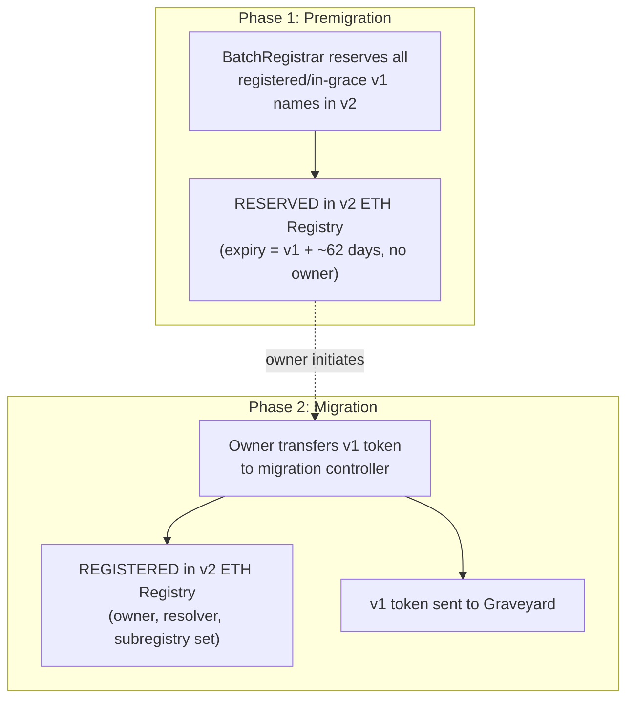

import { FrenCallout } from '../../../components/ensv2/FrenCallout'

# Migration

ENSv2 provides a migration framework for transitioning ENSv1 `.eth` names to the new system. Migration is a two-phase process: **premigration** reserves all existing names in v2 automatically, then **migration** lets owners claim their names by transferring their v1 tokens to a migration controller.

<FrenCallout fren="lili" variant="tip">
The contracts and interfaces described here are **not yet final** and may change prior to mainnet deployment.
</FrenCallout>

<FrenCallout fren="kuzco" variant="warning" title="Watch out!">
This page is under active development. The migration contracts are being finalized and details may change. Check back for updates.
</FrenCallout>

## Overview



### ENSv1 Token Types

Migration supports all `.eth` descendants. The migration path depends on the token type:

| Type | Token Standard | Description |
|------|---------------|-------------|
| **Unwrapped** | BaseRegistrar ERC-721 | 2LD only |
| **Unlocked** | NameWrapper ERC-1155 | Without `CANNOT_UNWRAP` (2LD only) |
| **Locked** | NameWrapper ERC-1155 | With `CANNOT_UNWRAP` (2LD and 3LD+) |
| **Detached** | NameWrapper ERC-1155 | Emancipated (`PARENT_CANNOT_CONTROL`) child of a locked parent, without `CANNOT_UNWRAP` (3LD+ only) |

### Key Definitions

- **RESERVED**: a v2 registry slot with an expiry and resolver but no owner. Created during premigration.
- **REGISTERED**: a v2 registry slot with an owner. Created when a user migrates their v1 token.
- **Graveyard**: the burn address for migrated v1 tokens. Also cleans up stale v1 registry entries.

### Time Constants

| Constant | Value | Description |
|----------|-------|-------------|
| `GRACE_PERIOD_V1` | 90 days | Post-expiry window in ENSv1 where the owner can still renew |
| `GRACE_PERIOD_V2` | 28 days | Post-expiry window in ENSv2 where the owner can still renew via the [ETH Registrar](/contracts/ensv2/eth-registrar) |
| `BONUS_PERIOD` | ~62 days | `GRACE_PERIOD_V1 - GRACE_PERIOD_V2` (plus 1 second due to boundary handling). Added to v1 expiry during premigration so that a name becomes available in v2 no earlier than in v1 |

## Premigration

Before users can migrate, every registered or in-grace v1 name is batch-reserved in the v2 ETH Registry by the `BatchRegistrar`. This happens automatically and does not require any user action.

For each name:
- **Status**: set to `RESERVED`
- **Expiry**: `expiryV1 + BONUS_PERIOD`
- **Resolver**: set to `ENSV1Resolver`, which performs wildcard fallback to the v1 ENS registry
- **Owner**: not set (RESERVED names have no owner)

After premigration, new v1 `.eth` registrations are disabled. Names continue to resolve through v1 during this phase because `ENSV1Resolver` mirrors v1 resolution.

## Migration Paths

Migration is initiated by the name owner transferring their v1 token to the appropriate controller. The controller promotes the pre-existing RESERVED slot to REGISTERED, setting the owner, resolver, subregistry, and role bitmap. The v1 token is forwarded to the Graveyard.

The v2 owner specified during migration **does not need to match** the v1 owner. This allows migrating directly to a new wallet or smart account.

### Unwrapped Names

Unwrapped 2LD names (BaseRegistrar ERC-721 tokens) are migrated via the `UnlockedMigrationController`.

1. Transfer the ERC-721 token via `safeTransferFrom` with an encoded data payload specifying: label, new owner, resolver, and subregistry
2. The controller reclaims the token on the BaseRegistrar and clears the v1 resolver
3. The token is sent to the Graveyard
4. The name is promoted from RESERVED to REGISTERED in the v2 ETH Registry with the provided parameters
5. The token is granted the same roles as a fresh `ETHRegistrar.register()` ([REGISTRATION_ROLE_BITMAP](/contracts/ensv2/eth-registrar#eac-integration))

### Unlocked Wrapped Names

Unlocked 2LD names (NameWrapper ERC-1155 tokens without `CANNOT_UNWRAP`) are also migrated via the `UnlockedMigrationController`.

1. Transfer the ERC-1155 token via `safeTransferFrom` (or batch via `safeBatchTransferFrom`) with an encoded data payload
2. The controller verifies the name is NOT locked (reverts `NameIsLocked` otherwise)
3. The token is unwrapped to the Graveyard and the v1 resolver is cleared
4. The name is promoted from RESERVED to REGISTERED with the provided parameters
5. Token roles are the same as `ETHRegistrar.register()`

:::note
Unlocked 3LD+ names cannot be migrated through this path. They must be registered directly in v2 once their parent has a v2 registry.
:::

### Locked Names

Locked names (NameWrapper ERC-1155 tokens with `CANNOT_UNWRAP`) have irrevocable restrictions that must be preserved. The migration path depends on the name level:

- **2LD**: transfer to `LockedMigrationController`
- **3LD+**: transfer to the parent name's `WrapperRegistry` (the parent must have migrated first)

The migration flow:

1. Transfer the ERC-1155 token to the appropriate receiver
2. The controller verifies the token is emancipated (locked or detached)
3. If `getApproved()` is non-null after transfer, migration reverts (`FrozenTokenApproval`). Note: if `CANNOT_APPROVE` is not set, approval is automatically cleared during transfer, so this only triggers for tokens with `CANNOT_APPROVE` burned and an existing approval.
4. ENSv1 [fuses](/wrapper/fuses) are converted to ENSv2 roles (see [Fuse-to-Role Conversion](#fuse-to-role-conversion))
5. A `WrapperRegistry` is always deployed as the subregistry, replicating the v1 fuse-based access control using v2's [EAC](/contracts/ensv2/enhanced-access-control) system
6. The resolver is cleared, **unless** `CANNOT_SET_RESOLVER` is burned, in which case the existing v1 resolver is preserved. If the preserved resolver is a known `PublicResolver`, it is replaced with `PublicResolverV2`
7. The token is **not unwrapped** and stays in the receiver until expiry (the `LockedMigrationController` for 2LD, or the parent's `WrapperRegistry` for 3LD+)
8. The name is promoted from RESERVED to REGISTERED (for 2LD) or registered directly (for 3LD+) with the converted roles

### Detached Names

Detached names are emancipated children of locked parents that don't have `CANNOT_UNWRAP` set (3LD+ only). They are migrated via the parent's `WrapperRegistry`.

1. Transfer the ERC-1155 token to the parent's WrapperRegistry
2. The token is unwrapped to the Graveyard and the resolver is cleared
3. The name is registered with the same token roles as `ETHRegistrar.register()`

## Fuse-to-Role Conversion

When migrating locked names, ENSv1 fuses are converted to ENSv2 roles. The key principle: a burned fuse that restricts an action means the corresponding role is **not granted**.

Admin roles (the `<< 128` shifted counterparts) are only granted when `CANNOT_BURN_FUSES` is **not** set. If fuses are frozen, only regular roles are granted, preventing any further permission changes in v2.

### Token Roles

| ENSv1 Fuse | ENSv2 Role | Granted when fuse is... |
|------------|-----------|------------------------|
| `CAN_EXTEND_EXPIRY` | `ROLE_RENEW` | Set (enabled) |
| `CANNOT_SET_RESOLVER` | `ROLE_SET_RESOLVER` | Not set (not burned) |
| `CANNOT_TRANSFER` | `ROLE_CAN_TRANSFER_ADMIN` | Not set (not burned) |
| `CANNOT_BURN_FUSES` | Admin counterparts of above | Not set (not frozen) |
| `CANNOT_SET_TTL` | N/A | Ignored (no TTL in v2) |

### Subregistry Roles

These roles are granted to the name owner on the WrapperRegistry's `ROOT_RESOURCE`, giving them contract-wide authority over the subregistry.

| ENSv1 Fuse | ENSv2 Role | Granted when fuse is... |
|------------|-----------|------------------------|
| `CANNOT_CREATE_SUBDOMAIN` | `ROLE_REGISTRAR` | Not set (not burned) |
| `CANNOT_BURN_FUSES` | Admin counterparts of above | Not set (not frozen) |
| (always) | `ROLE_RENEW` + `ROLE_RENEW_ADMIN` | Always granted |

## Graveyard

The `Graveyard` contract is the burn address for migrated v1 tokens. It holds migrated tokens until expiry. The tokens are technically transferable, but the Graveyard has no upgrade or transfer mechanism.

Migration itself only clears the **resolver** of the migrated name (when possible). The remainder of the v1 registry namespace is left unchanged. The Graveyard can separately clean up the unemancipated namespace of any migrated name:

```solidity
// Anyone can call this to clean up v1 registry entries for migrated names
Graveyard.clear(names)
```

The `clear()` function recursively walks the v1 namespace hierarchy for each name, clearing resolvers and subnode records. This prevents stale v1 resolution for names that have been migrated to v2. It handles:
- **Owned names**: clears resolver and subnode records
- **Locked names** (still in NameWrapper): validates ownership by the Graveyard
- **Expired names**: reclaims via the v1 BaseRegistrar, then clears

## ENSv1 Continuity

Not all names will migrate immediately. ENSv2 provides mechanisms to keep unmigrated names functional.

### Renewals

The [ETH Registrar](/contracts/ensv2/eth-registrar) handles all renewals, for both REGISTERED and RESERVED names. When renewing a RESERVED name, the registrar automatically syncs the duration to the v1 BaseRegistrar so both systems stay in lockstep.

The `ETHSyncer` contract handles a separate concern: syncing the NameWrapper expiry with the BaseRegistrar expiry (for cases where the two have drifted out of sync).

```solidity
// Batch-sync NameWrapper expiry with BaseRegistrar
ETHSyncer.syncWrapper(labels)
```

**Key invariants:**
- The v2 expiry is always `BONUS_PERIOD` ahead of the v1 expiry
- The `ETHRegistrar` cannot register RESERVED names (it lacks `ROLE_REGISTER_RESERVED`), so unmigrated names are protected until they expire
- `ENSV1Resolver` continues resolving unmigrated names until the v2 reservation expires

### Unmigratable Names

Some names are structurally unable to migrate (see [Restrictions](#restrictions)). These names remain fully functional on v1:

- Resolution continues via `ENSV1Resolver` as long as the v2 reservation is active
- Renewals work via the `ETHRegistrar`, keeping the v1 and v2 expiries in sync
- v1 fuses, resolver, and ownership remain unchanged

The only v2 features unavailable to unmigratable names are per-record permissions, aliasing, and the new resolver. Once the name expires in both v1 and v2, the `Graveyard` can clear its v1 namespace and the name becomes available for fresh registration in v2.

### What Happens to Unmigrated Names

Names that *could* migrate but don't will eventually expire. Their v1 tokens expire, leaving the v1 registry state frozen (resolver, owner, fuses all unchanged). The v2 RESERVED slot also expires. Once both have expired, the name becomes available for fresh registration in v2 via the `ETHRegistrar`.

## Scenarios

### 100 days remaining

*A name with 100 days left in v1 is premigrated.*

The RESERVED slot has 162 days left (100 + 62 day bonus). ENSv1 expires after 100 days and becomes available after 190 days (100 + 90 day grace). ENSv2 expires after 162 days and becomes available after 190 days (162 + 28 day grace). Both systems make the name available at the same time.

### Migrates then renews

*A name with 50 days remaining is premigrated, migrated, then renewed for 50 days.*

The RESERVED slot has 112 days (50 + 62). The owner migrates, promoting to REGISTERED. The v1 token goes to the Graveyard with 50 days left. The owner renews via `ETHRegistrar` for 50 days, extending the v2 registration to 162 days. ENSv1 becomes available after 140 days (50 + 90), ENSv2 after 190 days (162 + 28).

### In grace period, renews out of grace

*A name has 29 days left in the v1 grace period (i.e., -61 days remaining).*

The RESERVED slot has 1 day left (-61 + 62). The owner uses the `ETHRegistrar` to renew for 62 days. ENSv1 expires after 1 day (-61 + 62) and becomes available after 91 days. ENSv2 expires after 63 days (-61 + 62 + 62) and becomes available after 91 days. The token can now be transferred and migrated.

### NameWrapper expiry out of sync

*The NameWrapper shows an expired name but the BaseRegistrar still has it as registered.*

Use `ETHSyncer.syncWrapper(labels)` to batch-sync the NameWrapper expiry with the BaseRegistrar expiry.

## What Users Need to Do

### .eth Name Owners

<FrenCallout fren="lili" variant="tip">
If you just own a `.eth` name and aren't a developer, you don't need to understand the technical details below. A frontend migration tool will be available when the time comes that handles everything for you.
</FrenCallout>

Premigration happens automatically. To migrate your name to v2:

1. Transfer your v1 token to the appropriate migration controller:
   - **Unwrapped or unlocked**: `UnlockedMigrationController`
   - **Locked**: `LockedMigrationController`
2. Specify the new v2 owner, resolver, and subregistry in the transfer data
3. The v2 owner can be a different address than the v1 owner (e.g., migrating to a smart account)

If your name is in the v1 grace period, use the `ETHRegistrar` to renew it first.

:::note
Migration is **not required** immediately. Unmigrated names continue to resolve through v1 via `ENSV1Resolver`. However, migrating gives you access to v2 features like [per-record permissions](/contracts/ensv2/permissioned-resolver#eac-integration), [aliasing](/contracts/ensv2/permissioned-resolver#aliasing), and the new resolver.
:::

### Subname Owners

If you own a locked subname (3LD+), your parent must migrate first. Once the parent has migrated, transfer your token to the parent's `WrapperRegistry`.

Unlocked 3LD+ subnames cannot be migrated through the migration controllers. They must be registered directly in v2 once their parent has a v2 registry.

### What Happens to Records

- **Locked names with `CANNOT_SET_RESOLVER`**: the v1 resolver is preserved. If it's a known `PublicResolver`, it's replaced with `PublicResolverV2` (records may need to be copied separately).
- **All other names**: the v1 resolver is cleared during migration. Set up a new resolver in v2.

## Restrictions

Migration is not possible in the following cases:

- The v1 token is not transferable (owner or approval restrictions)
- Locked names with `CANNOT_TRANSFER` burned
- Locked names with `CANNOT_APPROVE` burned and a non-null `getApproved()` (reverts `FrozenTokenApproval`)
- 3LD+ subnames whose parent has not migrated yet

## Contracts

| Contract | Purpose |
|----------|---------|
| `BatchRegistrar` | Batch-reserves v1 names in v2 during premigration |
| `UnlockedMigrationController` | Migrates unwrapped and unlocked 2LD names |
| `LockedMigrationController` | Migrates locked 2LD names |
| `WrapperRegistry` | Migrates locked/detached 3LD+ names; replicates fuse-based access control in v2 |
| `Graveyard` | Burn address for migrated tokens; clears unemancipated v1 namespaces |
| `ETHSyncer` | Syncs NameWrapper expiry with BaseRegistrar expiry |
| `ENSV1Resolver` | Wildcard fallback resolver for premigrated names |
| `PublicResolverV2` | Replacement for v1 PublicResolver that respects v2 ownership |
