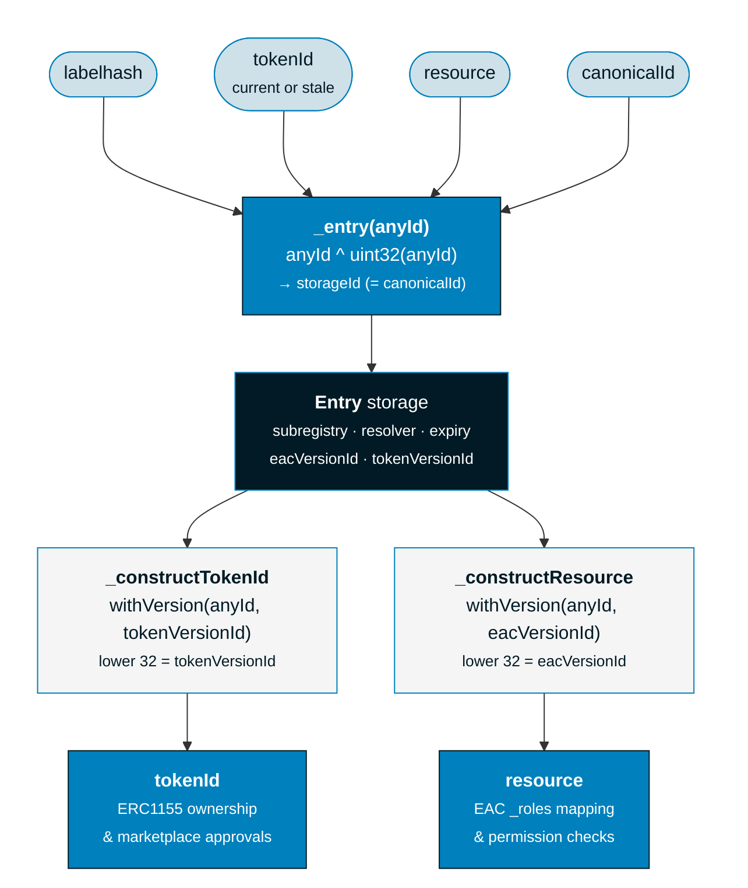

import { Card } from '../../../components/ui/Card'
import { FrenCallout } from '../../../components/ensv2/FrenCallout'
import { IdExplorer } from '../../../components/ensv2/IdExplorer'

# Mutable Token IDs

Names in the [Permissioned Registry](/contracts/ensv2/permissioned-registry) are represented as [ERC1155Singleton](/contracts/ensv2/erc1155-singleton) tokens, where each registered name is a token with exactly one owner. ENSv2's [Enhanced Access Control](/contracts/ensv2/enhanced-access-control) system allows name owners to delegate fine-grained permissions to multiple accounts. This flexibility requires a mechanism to keep permissions in sync with a name's lifecycle, for example invalidating delegated roles when a name changes hands or expires. ENSv2 solves this with **mutable token IDs** that change in response to security-relevant events, providing automatic protection against two attack vectors: stale permissions and transfer griefing.

<FrenCallout fren="lili" variant="tip">
The contracts and interfaces described here are **not yet final** and may change prior to mainnet deployment.
</FrenCallout>

## The Problem

### Stale Permissions

Imagine Alice registers `alice.eth` and grants Bob `ROLE_SET_RESOLVER`. Later, Alice's name expires, and Carol registers `alice.eth`. If permissions were tied to a fixed identifier, Bob's role grant from Alice's registration would carry over - Carol wouldn't know that Bob has resolver permissions on her newly-registered name.

### Transfer Griefing

Imagine Alice owns `alice.eth` with `ROLE_CAN_TRANSFER_ADMIN` and `ROLE_SET_RESOLVER_ADMIN`, and lists it for sale on a marketplace. The marketplace holds an approval to transfer the token. A buyer submits a purchase transaction, which enters the mempool. Alice sees it and frontruns with a `revokeRoles` call that strips `ROLE_SET_RESOLVER_ADMIN` from the name. The buyer's transaction then executes - they receive the name, but it's been silently degraded: they can no longer change the resolver. Without mutable token IDs, the buyer would have no protection against this.

## How Token IDs Work

### Canonical ID

Each name in the registry is internally tracked by its **canonical ID**, a stable 256-bit identifier derived from the name's **labelhash** (`keccak256` of the label string) with the lower 32 bits zeroed out. The canonical ID never changes for a given label, regardless of how many times the name is registered, transferred, or has its permissions modified.

The registry uses the canonical ID as the key to look up the name's storage entry, which contains the name's current state: subregistry, resolver, expiry, and two version counters. From this entry, the registry derives the name's current **token ID** (used for ERC1155 ownership) and its current **resource** (used as the key for [EAC](/contracts/ensv2/enhanced-access-control) permission storage). Both are produced by encoding a version counter into the lower 32 bits of the canonical ID.

### Version Counters

The [Permissioned Registry](/contracts/ensv2/permissioned-registry) maintains two version counters in each name's storage entry:

| Counter          | Incremented when                       | Encoded into | Purpose                                                                      |
| ---------------- | -------------------------------------- | ------------ | ---------------------------------------------------------------------------- |
| `tokenVersionId` | Roles are granted or revoked           | Token ID     | Invalidates marketplace approvals when the name's permission profile changes |
| `eacVersionId`   | Name is unregistered or re-registered  | Resource     | Isolates permissions across different registrations of the same label        |

When a counter increments, the derived ID changes, producing a new token ID or a new resource. Re-registration increments both counters simultaneously.

### ID Types

All three identifier types share the same upper 224 bits (from the labelhash) and differ only in their lower 32 bits:

| ID               | Lower 32 bits    | Used for                                    |
| ---------------- | ---------------- | ------------------------------------------- |
| **Canonical ID** | `0x00000000`     | `_entries` mapping key (name storage)       |
| **Token ID**     | `tokenVersionId` | ERC1155 ownership and marketplace approvals |
| **Resource**     | `eacVersionId`   | EAC `_roles` mapping (permission checks)    |

### ID Explorer

<FrenCallout fren="peanut" variant="tip" title="Interactive Widget">
Explore how these IDs are derived for any label. Slide the version counters to see how the token ID and resource change while the canonical ID stays fixed.
</FrenCallout>

<Card>
  <IdExplorer />
</Card>

### Regeneration

When a version counter increments, the registry performs a **regeneration**: the old token is burned and a new one with the updated token ID is minted to the same owner, atomically in a single transaction. The owner doesn't change - only the ID does. The registry emits a `TokenRegenerated(oldTokenId, newTokenId)` event to signal this.

### How This Solves the Problems

**Stale permissions** are solved by `eacVersionId`. When a name expires and is re-registered, both version counters increment. The new registration gets a fresh [resource](/contracts/ensv2/enhanced-access-control#resources) (because `eacVersionId` changed), and all role grants from the previous registration are effectively orphaned - they're stored under the old resource, which no longer corresponds to any active name.

**Transfer griefing** is solved by `tokenVersionId`. When Alice frontruns with `revokeRoles`, the registry's `_onRolesRevoked` hook fires, triggering regeneration. This increments `tokenVersionId`, burning the old token and minting a new one. The marketplace's `safeTransferFrom` still references the old token ID - but that token no longer exists. The transaction reverts with `ERC1155InsufficientBalance`, protecting the buyer from receiving a degraded name. If the buyer still wants it, they must re-approve using the new token ID, at which point they can inspect the current roles.

Note that legitimate ERC1155 transfers (`safeTransferFrom`) move roles from the old owner to the new owner *without* triggering regeneration. The internal role transfer bypasses the callbacks. This is intentional: a transfer should not invalidate the token ID that the transfer itself is using.

### When Token IDs Change

| Event                          | eacVersionId | tokenVersionId |      Token ID changes?       | Effect                                                      |
| ------------------------------ | :----------: | :------------: | :--------------------------: | ----------------------------------------------------------- |
| First registration             |      -       |       -        |       New token minted       | Both counters start at 0 (storage default)                  |
| Role grant/revoke              |      -       |       +1       |   Yes (regeneration)         | Invalidates marketplace approvals                           |
| Transfer                       |      -       |       -        |              No              | Owner changes, same token ID                                |
| Re-registration (after expiry) |      +1      |       +1       | Yes (old burned, new minted) | Old token burned, all prior role grants invalidated         |
| Unregistration (registered)    |      +1      |       +1       |         Yes (burned)         | Token destroyed, versions incremented for next registration |
| Unregistration (reserved)      |      -       |       -        |             No               | No token exists to burn; counters unchanged                 |
| Renewal                        |      -       |       -        |              No              | Only expiry changes                                         |

## anyId Polymorphism

Because token IDs change, you might not always have the current token ID on hand. To make this easier, most [Permissioned Registry](/contracts/ensv2/permissioned-registry) functions accept a `uint256 anyId` parameter that can be any of:

- A **labelhash** (`keccak256` of the label string)
- A **token ID** (current or even stale)
- A **resource** (EAC resource identifier)
- A **canonical ID**

Internally, the registry applies `anyId ^ uint32(anyId)` to strip the lower 32 bits, resolving any of these to the same canonical ID and therefore the same storage entry. From that entry, the current token ID and resource are reconstructed as needed. This means you can pass whichever identifier you have - the registry figures out the rest.



Functions that accept `anyId` include: `setSubregistry()`, `setResolver()`, `renew()`, `unregister()`, `getExpiry()`, `getStatus()`, `getState()`, `getTokenId()`, `getResource()`, and all EAC role functions.

:::note
anyId polymorphism is specific to the [Permissioned Registry](/contracts/ensv2/permissioned-registry). The [Permissioned Resolver](/contracts/ensv2/permissioned-resolver) uses a [different resource scheme](/contracts/ensv2/enhanced-access-control#resources) based on `keccak256(node, part)` and does not use anyId.
:::

## Implications for Developers

### Don't Cache Token IDs

Token IDs are not stable identifiers. If you need to reference a name, store the **labelhash** instead and use `getTokenId(anyId)` to get the current token ID when needed.

### Use anyId Where Possible

Since most functions accept `anyId`, you can simply pass the labelhash and avoid dealing with token IDs entirely in many cases.

### Marketplace Integrations

If you're building a marketplace or trading contract, be aware that:

1. Approvals tied to a specific token ID will be invalidated when the token ID changes
2. Use `getState(anyId)` to verify the current token ID before executing a trade
3. The `TokenRegenerated(oldTokenId, newTokenId)` event signals when a token ID changes

### Reading Token ID Changes

```ts [Viem]
import { createPublicClient, http } from 'viem'
import { mainnet } from 'viem/chains'

const client = createPublicClient({
  chain: mainnet,
  transport: http(),
})

// Get the current token ID for a name using its labelhash
const state = await client.readContract({
  address: registryAddress,
  abi: permissionedRegistryAbi,
  functionName: 'getState',
  args: [labelhash],
})

// state.tokenId is the current token ID
// state.resource is the current EAC resource
// state.status is AVAILABLE (0), RESERVED (1), or REGISTERED (2)
// state.latestOwner is the current owner
// state.expiry is the expiration timestamp
```
