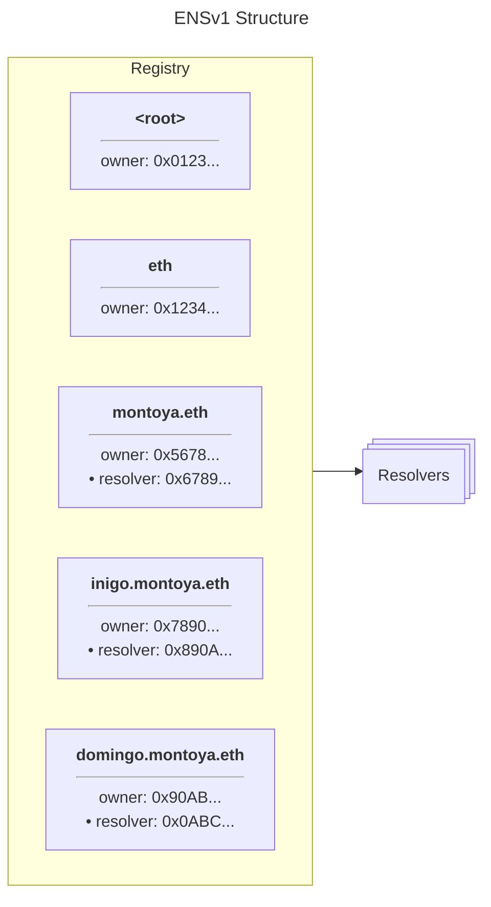
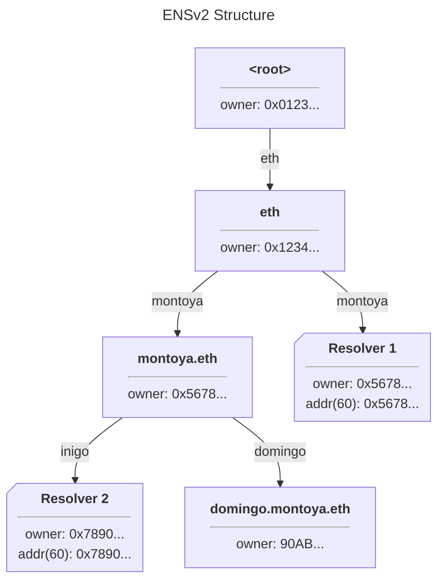
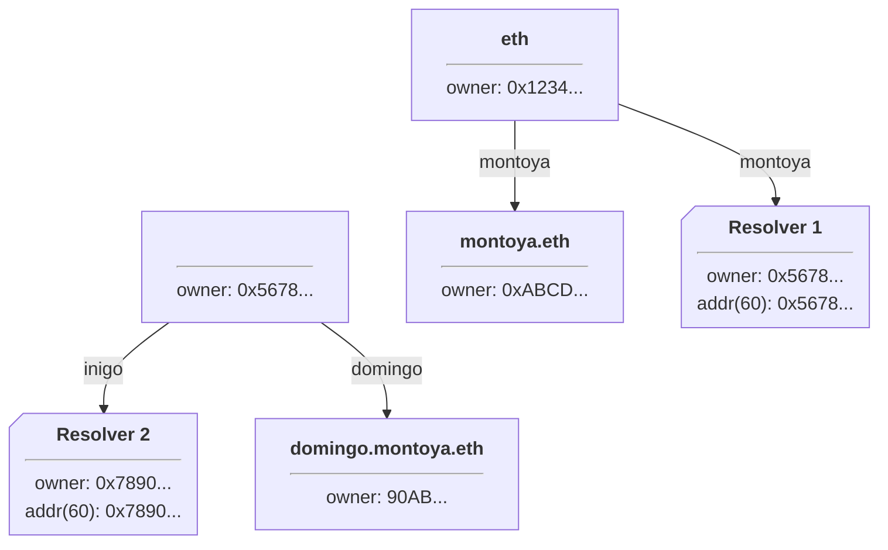
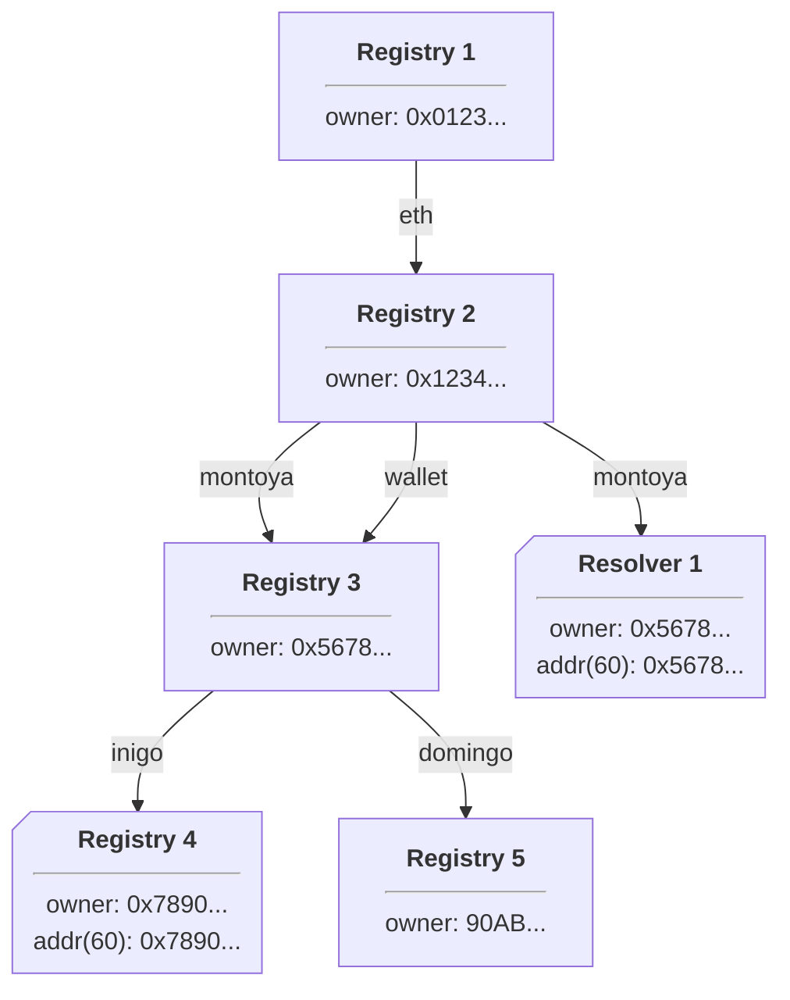

# ENSv2 Smart Contracts Overview

Welcome to the next evolution of the Ethereum Name Service!

ENSv2 introduces a suite of upgraded smart-contracts designed to make the protocol
more scalable, modular and future-proof. This section will outline the high-level
architecture, guiding principles and migration strategy for ENSv2.

:::note
The information on this page is a work-in-progress. Expect updates as the design is finalised and audits are completed.
:::

## What's new in ENSv2?

- **Native L2 Support** – contracts have been designed with [Namechain](https://ens.domains/ensv2) and other Layer 2 deployments
  with cross-chain resolution in mind, building on existing [CCIP-Read support in ENSv1](/resolvers/ccip-read).
- **Hierarchical Registries** – while ENSv1 used a single flat registry for all
  names, ENSv2 allows each name to provide its own registry implementation for
  subnames. This provides name owners and developers with direct control over
  the ownership and transfer rules for names and subnames.
- **Permissions as Standard** - All of the functionality enabled by the [Name Wrapper
  in ENSv1](/wrapper/overview) has been integrated into the core of ENSv2, using a new, highly flexible,
  role-based permissions model.
- **No Grace Period** - The grace period is no longer a part of the ENS protocol, meaning names expire when they say they expire. Upon expiration, names immediately enter into the [temporary premium](/registry/eth#premium--auctions) period. The owner of a recently-expired name doesn't have to pay the premium fee during this period. 
- **Contract Factories** - Rather than relying on large multi-user contracts such as
  the default public resolver, every name gets its own resolver, and every name
  with subnames gets its own registry contract. This is made possible by the low cost of
  L2 transactions, and simplifies the contracts significantly, while offering users
  new functionality such as the possibility of 'aliasing' multiple domains to
  the same records.

## What hasn't changed?

- **Resolvers** - while we have developed new resolver contracts to take advantage
  of the changed environment enabled by ENSv2 and Namechain, the interface used
  by resolvers remains the same, and all existing ENSv1 resolvers will continue
  to work seamlessly in ENSv2.
- **True Ownership** - ENSv2 continues to prioritize trust minimization, enabling
  you to own your name fully, without having to worry about interference from
  centralized third-parties.
- **Truly multi-chain** - Although ENSv2 hosts .eth names on Namechain by default,
  ENS continues to support all L2s. Names can be 'ejected' from Namechain to L1,
  and from there can either be managed directly on L1 or delegated to another L2.

## ENSv2 Registry Architecture

### Overview

ENSv1 used a simple architecture, where a single flat registry maintained a mapping
from all names to their owner and resolver addresses. Hierarchical ownership was enforced
through the use of [namehash](/resolution/names#namehash) to calculate IDs for subnames. This has the advantage of simplicity,
but means that ownership rules are enforced by a single, non-upgradeable contract, and
changes in the status of a parent name do not automatically ripple down to affect
subnames.

In ENSv2, registries are hierarchical: each name can have a resolver and a subregistry:

Here, registries are shown as rectangles, while resolvers are shown as notched rectangles.
Note that the registry for `.eth` has both a subregistry and a resolver defined for `montoya.eth`.
Note also that there's a resolver defined for `inigo.montoya.eth` but no subregistry, while
`domingo.montoya.eth` has a subregistry but no resolver. A name only needs to have a subregistry
defined if it wants the ability to create subnames, and it only needs a resolver defined if it wants to
define records to resolve for that name or its subnames.

Resolution follows a process that conceptually mirrors the process from ENSv1: first, we find the resolver
responsible for the name being resolved, which is the resolver that covers the longest available suffix
of the name. In the example above, `inigo.montoya.eth` is resolved by Resolver 1, while `domingo.montoya.eth`
and any other subdomains of `montoya.eth` that are not present in the tree are resolved by Resolver 2. After
the resolver responsible for a name is found, it is queried for the desired record.

One consequence of this tree structure is that it becomes possible to delete or reassign entire subtrees in a
single operation. For example, suppose `montoya.eth` is transferred to a new owner, who wants to
configure his own set of subdomains; he can simply replace the subregistry responsible for subnames of
`montoya.eth` with his own new subregistry:

All resolvers and subregistries previously associated with `montoya.eth` are thus removed in a single operation!
The new owner will still need to replace the resolver for `montoya.eth` if he wishes to change how the bare
name itself is resolved, however.

This hierarchical structure need not be limited to trees, either; by reusing the same subregistry for more
than one name, entire namespaces can be aliased to each other:

In this example, both `inigo.montoya.eth` and `inigo.wallet.eth` resolve identically, as would any other
subnames with resolvers set. Notably, `domingo.montoya.eth` will resolve using Resolver 1, while
`domingo.wallet.eth` will not resolve at all - there are no resolvers set anywhere in its hierarchy! If we
set a resolver for `domingo` in Registry 3, both names would resolve identially using it, just as they do
for `inigo`.

This example also exposes one other crucial fact about ENSv2: registries have no individual concept of 'their name'.
In earlier diagrams we labelled each registry with a name for convenience, but as these examples demonstrates,
there's no requirement that a registry have exactly one name associated with it - it can have thousands, or none
at all!

### Token Representation and permissions

Although it's not required by the ENSv2 registry interface specification, typically registries are
implemented as ERC1155 token contracts, and standardized tooling is likely to expect as much. Each registry
has an overall owner, who is responsible for the registry itself, as well as owners for individual subnames,
which are represented as tokens. Because of the hierarchical nature of the registry structure as demonstrated
above, merely owning a subname token on a registry does not guarantee anything in isolation: to be meaningful,
the registry must be referenced by a parent registry, and so on up to the root registry. Client authors must
therefore take care in how they represent names to users, to ensure users are not given a false impression
of what they are looking at.

Standardized registries in ENSv2 use a sophisticated permissions model similar to Open Zeppelin's Roles model.
Each name has a set of roles, such as the ability to set the resolver or subregistry for that name. Each role
has a corresponding 'admin role', which allows granting or revoking that role (as well as the admin role itself).
Roles can also be granted for the registry contract as a whole, and an account may exercise the privileges of
a role if it has the role granted for the specific name or on the contract as a whole. Some roles, such as
creating new subnames, are available only as contract-wide roles.

By selectively revoking roles, all the functionality of the [ENSv1 name wrapper](/wrapper/overview) can be replicated - for example,
the owner of wallet.eth can grant a registrar contract the 'registrar' role on the wallet.eth registry,
while revoking their own contract-wide 'set resolver' and 'set subregistry' roles and admin roles on the same
registry. If they then revoke the 'set subregistry' role and admin role for the 'wallet' subname on the 'eth'
registry, they will no longer be able to modify wallet.eth subnames they don't own - giving the same effect as
['emancipating'](/terminology#emancipated) a name in the ENSv1 name wrapper.

When a subname is transferred to a new owner, any roles that were granted to the previous owner are automatically
transferred to the new owner, but roles granted to other accounts remain unmodified - so it is important that
apps facilitating trading of names verify the set of roles granted to external accounts.

{/* ## Contract Packages

ENSv2 is split into the following logical groups:

| Package                                   | Description                                             |
| ----------------------------------------- | ------------------------------------------------------- |
| [Registries](/contracts/ensv2/registries) | Registries govern ownership of names                    |
| [Resolvers](/contracts/ensv2/resolvers)   | Resolvers control how a name is converted to a resource |

## Upgrade timeline

The team is targeting **Q4 2024** for mainnet deployment, subject to audit and
community review. A detailed upgrade guide will be published here soon. */}
