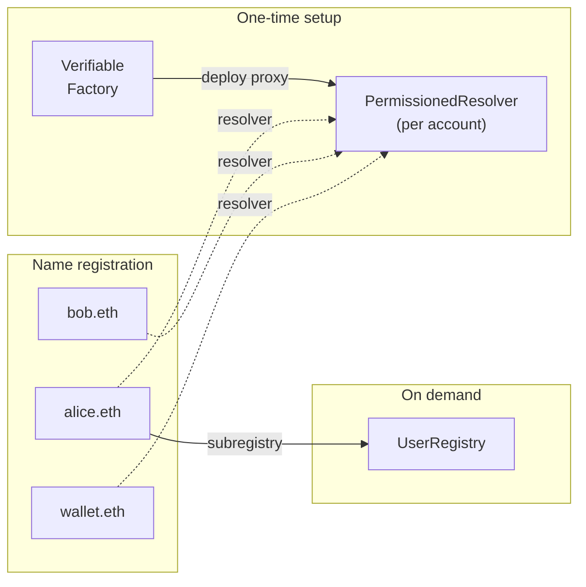

import { FrenCallout } from '../../../components/ensv2/FrenCallout'

# ENSv2 Overview

Welcome to the next evolution of the Ethereum Name Service!

ENSv2 introduces a suite of upgraded smart-contracts designed to make the protocol
more scalable, modular and future-proof. This section will outline the high-level
architecture, guiding principles and migration strategy for ENSv2.

<FrenCallout fren="lili" variant="tip">
The information on this page is a work-in-progress. Expect updates as the design is finalised and audits are completed.
</FrenCallout>

## What's new in ENSv2?

- **Hierarchical Registries** - While ENSv1 used a single flat registry for all
  names, ENSv2 uses a [hierarchical model](/contracts/ensv2/registry-hierarchy) where a full
  name like `sub.alice.eth` is a chain of entries across registries linked by
  subregistry pointers. Name owners can deploy their own subname registry on
  demand. Registries and resolvers are deployed as proxies via the
  [Verifiable Factory](/contracts/ensv2/verifiable-factory).
- **Permissions as Standard** - All of the functionality enabled by the [Name Wrapper
  in ENSv1](/wrapper/overview) has been integrated into the core of ENSv2 via a new role-based
  permission system called [Enhanced Access Control](/contracts/ensv2/enhanced-access-control).
- **Shorter Grace Period** - The grace period has been reduced from 90 days in ENSv1 to 28 days. During this window, the expired name can still be renewed by the owner. After the grace period, names enter a temporary premium period.
- **Per-Account Resolvers** - Rather than sharing a single Public Resolver, every
  account gets its own [Permissioned Resolver](/contracts/ensv2/permissioned-resolver) proxy
  with fine-grained per-record permissions and [record aliasing](/contracts/ensv2/permissioned-resolver#aliasing).

```mermaid
flowchart LR
    subgraph once ["One-time setup"]
        VF["Verifiable\nFactory"]
        PR["PermissionedResolver\n(per account)"]
        VF -->|"deploy proxy"| PR
    end

    subgraph names ["Name registration"]
        N1["alice.eth"]
        N2["bob.eth"]
        N3["wallet.eth"]
    end

    subgraph subnames ["On demand"]
        UR["UserRegistry"]
    end

    N1 & N2 & N3 -.->|"resolver"| PR
    N1 -->|"subregistry"| UR
```

## What hasn't changed?

- **Resolvers** - while we have developed new resolver contracts to take advantage
  of the changed environment enabled by ENSv2, the resolver interface remains the
  same. Custom resolver implementations are fully supported.
- **True Ownership** - ENSv2 continues to prioritize trust minimization, enabling
  you to own your name fully, without having to worry about interference from
  centralized third-parties.
- **Truly multi-chain** - ENS continues to support all L2s.

## Architecture

| Page                                                                | Description                                                                  |
| ------------------------------------------------------------------- | ---------------------------------------------------------------------------- |
| [Registry Hierarchy](/contracts/ensv2/registry-hierarchy)           | Hierarchical registry model, tree structure, resolution, namespace aliasing  |
| [Enhanced Access Control](/contracts/ensv2/enhanced-access-control) | Role-based permission system replacing ENSv1 fuses                           |
| [ERC1155Singleton](/contracts/ensv2/erc1155-singleton)              | Gas-optimized token standard with single ownership per token                 |
| [Mutable Token IDs](/contracts/ensv2/mutable-token-ids)             | Dynamic token IDs that protect against permission leaks and griefing         |
| [Hidden Contract Accounts](/contracts/ensv2/hca)                    | Smart-account attribution for HCA proxy wallets                              |
| [Verifiable Factory](/contracts/ensv2/verifiable-factory)           | Deterministic CREATE2 proxy deployment with on-chain verification            |

## Contracts

| Page                                                            | Description                                                        |
| --------------------------------------------------------------- | ------------------------------------------------------------------ |
| [Permissioned Registry](/contracts/ensv2/permissioned-registry) | Tokenized registry managing name ownership, state, and permissions |
| [Permissioned Resolver](/contracts/ensv2/permissioned-resolver) | Per-account resolver with per-record roles and record aliasing     |
| [ETH Registrar](/contracts/ensv2/eth-registrar)                 | Commit-reveal registration and renewal for .eth names              |
| [Universal Resolver V2](/contracts/ensv2/universal-resolver-v2) | Single entry point for name resolution across the hierarchy        |
| [Registry Metadata](/contracts/ensv2/registry-metadata)         | ERC-1155 metadata providers for registries                         |
| [DNS Name Resolution](/contracts/ensv2/dns-resolvers)           | Resolving DNS domain names through the ENS protocol                |
| [Reverse Resolution](/contracts/ensv2/reverse-resolution)       | Primary names and multi-chain reverse resolution                   |

## Guides

| Page                                                                     | Description                                                            |
| ------------------------------------------------------------------------ | ---------------------------------------------------------------------- |
| [Migration](/contracts/ensv2/migration)                                  | Guide to migrating ENSv1 names (locked, unlocked, unwrapped) to ENSv2 |
| [For App Developers](/contracts/ensv2/tutorial-app-developers)           | What changes for apps that resolve ENS names                           |
| [For Contract Developers](/contracts/ensv2/tutorial-contract-developers) | Hands-on guide for direct smart contract interaction                   |
| [Registry Template](/contracts/ensv2/registry-template)                  | Building custom registries, configuration patterns, emancipation       |
| [Indexing](/contracts/ensv2/indexing)                                     | Events and functions for building indexers and subgraphs               |
| [FAQ](/contracts/ensv2/faq)                                              | Frequently asked questions about ENSv2                                 |

## Deployments (Sepolia)

| Contract | Address |
|----------|---------|
| RootRegistry | `TBD` |
| ETHRegistry | `TBD` |
| ReverseRegistry | `TBD` |
| ETHRegistrar | `TBD` |
| BatchRegistrar | `TBD` |
| StandardRentPriceOracle | `TBD` |
| PermissionedResolverImpl | `TBD` |
| UserRegistryImpl | `TBD` |
| WrapperRegistryImpl | `TBD` |
| VerifiableFactory | `TBD` |
| SimpleRegistryMetadata | `TBD` |
| UniversalResolverV2 | `TBD` |
| HCAFactory | `TBD` |
| LockedMigrationController | `TBD` |
| UnlockedMigrationController | `TBD` |
| DNSAliasResolver | `TBD` |
| DNSTLDResolver | `TBD` |
| DNSTXTResolver | `TBD` |
| ENSV2Resolver | `TBD` |
| ENSV1Resolver | `TBD` |
| ReverseRegistrarHCAAdapter | `TBD` |
| DefaultReverseRegistrarHCAAdapter | `TBD` |
