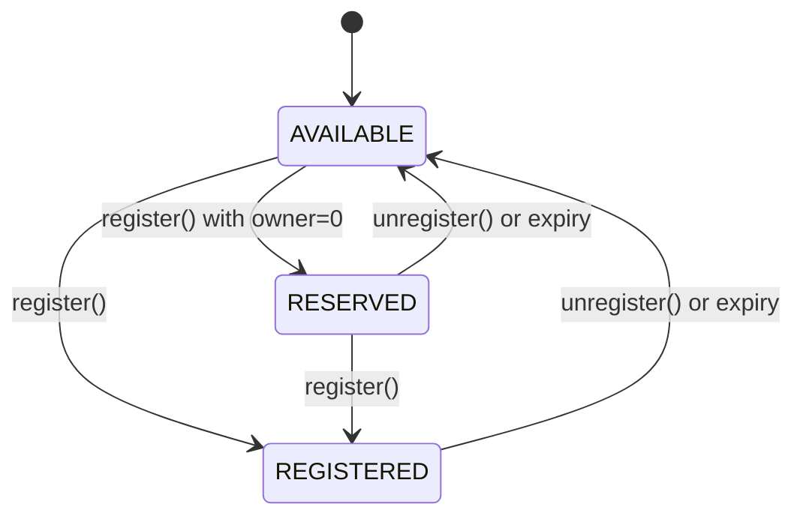

import { Card } from '../../../components/ui/Card'
import { FrenCallout } from '../../../components/ensv2/FrenCallout'
import { RoleBitmapComposer } from '../../../components/ensv2/RoleBitmapComposer'

# Permissioned Registry

The Permissioned Registry is the tokenized registry at the heart of ENSv2 name management. Each registered name becomes an [ERC1155Singleton](/contracts/ensv2/erc1155-singleton) token with exactly one owner, and all permissions are managed through [Enhanced Access Control](/contracts/ensv2/enhanced-access-control).

<FrenCallout fren="lili" variant="tip">
The contracts and interfaces described here are **not yet final** and may change prior to mainnet deployment.
</FrenCallout>

## What Changed from ENSv1

In ENSv1, name management was split across three separate contracts: the ENS Registry (flat mapping of all names), the BaseRegistrar (ERC721 tokens for .eth), and the Name Wrapper (ERC1155 wrapping + fuses). ENSv2 replaces all three with a single unified contract.

| Feature         | ENSv1                                           | ENSv2 Permissioned Registry                                                  |
| --------------- | ----------------------------------------------- | ----------------------------------------------------------------------------- |
| Architecture    | Single flat registry for all names              | [Hierarchical](/contracts/ensv2/registry-hierarchy): each name can have its own registry |
| Token standard  | ERC721 (BaseRegistrar) or ERC1155 (Name Wrapper)| [ERC1155Singleton](/contracts/ensv2/erc1155-singleton) with single ownership  |
| Permissions     | One-way fuse burning (Name Wrapper)             | Reversible role-based [EAC](/contracts/ensv2/enhanced-access-control)         |
| Token IDs       | Fixed (derived from namehash/labelhash)         | [Mutable](/contracts/ensv2/mutable-token-ids): change on role updates and re-registration |
| Subname control | Requires Name Wrapper + fuse configuration      | Built-in via subregistry pointer + per-name roles                            |
| Upgradeability  | Not upgradeable                                 | UUPS proxy pattern (for [UserRegistry](/contracts/ensv2/registry-template#userregistry)) |
| Grace period    | 90-day grace period after expiry                | No grace period; names expire immediately                                    |
| Name states     | Registered or not                               | Three states: AVAILABLE, RESERVED, REGISTERED                                |

## Names

Each name in the registry is identified by its **labelhash** (the `keccak256` hash of the label string). The on-chain data for a name is stored in an `Entry` struct:

| Field | Type | Purpose |
|-------|------|---------|
| `subregistry` | `IRegistry` | Pointer to a child registry for managing subnames |
| `resolver` | `address` | Resolver contract that holds this name's records |
| `expiry` | `uint64` | Timestamp after which the name is considered expired (`block.timestamp >= expiry`) |
| `eacVersionId` | `uint32` | Isolates permissions across registrations (see [Mutable Token IDs](/contracts/ensv2/mutable-token-ids)) |
| `tokenVersionId` | `uint32` | Invalidates marketplace approvals on role changes (see [Mutable Token IDs](/contracts/ensv2/mutable-token-ids)) |

Entries are stored in a mapping keyed by the [canonical ID](/contracts/ensv2/mutable-token-ids#canonical-id), the labelhash with its lower 32 bits zeroed.

## Name Lifecycle

Names exist in one of three states:



- `AVAILABLE`: never registered or expired. Open for registration.
- `RESERVED`: placeholder with no owner and no token. Useful for pre-allocating names before assigning them.
- `REGISTERED`: has an owner, a token, and active permissions.

**State transitions:** each transition requires a specific [EAC role](#roles) with the indicated scope.

| From | To | Required role | [Scope](/contracts/ensv2/enhanced-access-control#resources) |
|------|----|---------------|-------|
| AVAILABLE | REGISTERED | `ROLE_REGISTRAR` | root |
| AVAILABLE | RESERVED | `ROLE_REGISTRAR` | root |
| RESERVED | REGISTERED | `ROLE_REGISTER_RESERVED` | root |
| REGISTERED / RESERVED | AVAILABLE | `ROLE_UNREGISTER` | root or name |

### Registration

`register()` accepts a `label` (string), `owner`, `registry` (subregistry), `resolver`, `roleBitmap` (initial roles granted to the owner), and `expiry`. Labels are validated for size before registration. If `owner` is `address(0)`, the name is reserved instead of registered, and `roleBitmap` must be `0`.

A non-expired registered name cannot be re-registered directly. It must be unregistered first. Similarly, a reserved name cannot be re-reserved; it can only be promoted to registered.

When promoting a `RESERVED` name to `REGISTERED`, if `expiry` is `0` the current expiry is preserved.

Re-registering an expired name that had a previous owner burns the old token and increments both version counters, ensuring stale permissions and token approvals don't carry over.

### Unregistration

`unregister()` sets the name's expiry to `block.timestamp`, making it immediately available. If the name was `REGISTERED` (has an owner), the token is burned and both version counters are incremented.

### Renewal

`renew()` extends a name's expiry but cannot reduce it. Both `REGISTERED` and `RESERVED` names can be renewed. Expired names cannot be renewed; they must be re-registered.

## anyId Polymorphism

Most functions accept an `anyId` parameter that can be a `labelhash`, [token ID](/contracts/ensv2/mutable-token-ids#id-types), or [resource](/contracts/ensv2/enhanced-access-control#resources) interchangeably. Internally, `_entry()` zeroes the version bits to find the canonical storage slot for the name. This means you can pass whichever identifier you have on hand, and the registry resolves it to the same underlying entry.

This applies to `setSubregistry()`, `setResolver()`, `renew()`, `unregister()`, `getExpiry()`, `getStatus()`, `getState()`, `getTokenId()`, `getResource()`, and all EAC role functions (`grantRoles()`, `revokeRoles()`, `roles()`, etc.). See [Mutable Token IDs](/contracts/ensv2/mutable-token-ids#anyid-polymorphism) for the full explanation and diagram.

## Ownership

Each registered name is an [ERC1155Singleton](/contracts/ensv2/erc1155-singleton) token with exactly one owner. The token ID changes when the name is re-registered or when roles change (see [Mutable Token IDs](/contracts/ensv2/mutable-token-ids)).

`ownerOf()` returns `address(0)` for:
- Expired names (ownership is time-bounded)
- Stale token IDs (after versioning changes, old token IDs are no longer valid)

`latestOwnerOf()` returns the owner regardless of expiry or version staleness. This is useful for historical queries or determining who last held a name.

## EAC Integration

All permissions are managed through [Enhanced Access Control](/contracts/ensv2/enhanced-access-control).

### Roles

| Role | Value | Scope | Purpose |
|------|-------|-------|---------|
| `ROLE_REGISTRAR` | `1 << 0` | root | Register or reserve names |
| `ROLE_REGISTER_RESERVED` | `1 << 4` | root | Promote reserved names to registered |
| `ROLE_SET_PARENT` | `1 << 8` | root | Set parent registry |
| `ROLE_UNREGISTER` | `1 << 12` | root or name | Unregister names |
| `ROLE_RENEW` | `1 << 16` | root or name | Extend expiry |
| `ROLE_SET_SUBREGISTRY` | `1 << 20` | root or name | Set child registry |
| `ROLE_SET_RESOLVER` | `1 << 24` | root or name | Set resolver |
| `ROLE_CAN_TRANSFER_ADMIN` | `(1 << 28) << 128` | root or name | Authorize ERC1155 token transfers (admin-only — no regular variant, checked on the token owner not the operator) |
| `ROLE_UPGRADE` | `1 << 124` | root | Authorize proxy upgrades |

Each role has a corresponding admin role at `role << 128` (e.g., `ROLE_SET_RESOLVER_ADMIN = (1 << 24) << 128`), except `ROLE_CAN_TRANSFER_ADMIN` which exists only as an admin role. In TypeScript, use `1n << 24n` for the bigint equivalent.

"Root" scope means the role only works on `ROOT_RESOURCE`. "Root or name" means it can be granted on either scope, and the two compose: a root grant applies to all names.

**Admin role restriction on names:** admin roles on individual names can only be granted at registration time. See [EAC Hook Overrides](#eac-hook-overrides) for how this is enforced.

#### Role Bitmap Composer

<FrenCallout fren="peanut" variant="tip">
Select roles to compose a bitmap value for use with `grantRoles` and `revokeRoles`.
</FrenCallout>

<Card>
  <RoleBitmapComposer contract="registry" />
</Card>

### Granting and Revoking Roles

The registry uses the standard EAC [`grantRoles` and `revokeRoles`](/contracts/ensv2/enhanced-access-control#granting-and-revoking) functions, overridden to accept `anyId`. You can pass a labelhash, token ID, or resource and the registry computes the correct resource internally. No manual resource computation is needed. See [Code Examples](#code-examples) for usage.

:::note
You can only grant roles for which you hold the corresponding admin role. The roles granted at registration time (typically `ROLE_SET_RESOLVER`, `ROLE_SET_SUBREGISTRY`, and `ROLE_CAN_TRANSFER_ADMIN` with their admin counterparts) determine what the name owner can delegate.
:::

### EAC Hook Overrides

The Permissioned Registry overrides several [EAC callback hooks](/contracts/ensv2/enhanced-access-control#callback-hooks) to enforce registry-specific invariants:

**Token regeneration on role changes**: when roles are granted or revoked via `grantRoles()` / `revokeRoles()`, the `_onRolesGranted` and `_onRolesRevoked` hooks trigger a token regeneration (burn + mint with a new token ID). This invalidates any pending ERC1155 transfer approvals tied to the old token ID, preventing an attacker from racing to transfer a token after their roles have been revoked.

**Admin role restriction on names**: `_getSettableRoles` is overridden so that admin roles on individual names can only be assigned at registration time. After registration, only regular (non-admin) roles can be granted on a name. On `ROOT_RESOURCE`, admin roles work normally. This prevents a name owner from escalating their own permissions after registration.

**No role changes on unregistered names**: both `_getSettableRoles` and `_getRevokableRoles` return `0` for names that are `AVAILABLE` or `RESERVED`, blocking all role operations until the name is fully registered.

### Resource Scheme

<FrenCallout fren="bittu" variant="tip" title="Developer tip">
This section explains how [EAC resources](/contracts/ensv2/enhanced-access-control#resources) are computed internally. You don't need this for normal use. `grantRoles` and `revokeRoles` handle resource computation automatically via [anyId polymorphism](/contracts/ensv2/mutable-token-ids#anyid-polymorphism).
</FrenCallout>

The registry derives each EAC resource from the name's labelhash and its current `eacVersionId`, so permissions are scoped per-name and automatically invalidated on re-registration:

```
  255                                    32 31             0
  ┌──────────────────────────────────────┬─────────────────┐
  │       labelhash upper bits           │  eacVersionId   │
  │            (224 bits)                │    (32 bits)    │
  └──────────────────────────────────────┴─────────────────┘
```

Registry resources participate in [anyId polymorphism](/contracts/ensv2/mutable-token-ids#anyid-polymorphism). See [Mutable Token IDs](/contracts/ensv2/mutable-token-ids) for how resources, token IDs, and canonical IDs relate.

## Transfers

Transferring a name's token requires `ROLE_CAN_TRANSFER_ADMIN` as an **admin role on the token owner** (not the operator; operator approval via `ERC1155` is a separate check).

When a token transfers, all roles are atomically moved from the old owner to the new owner: the old owner's roles are revoked first (freeing assignee slots), then granted to the new owner. Roles granted to other accounts on the same name are unaffected. Without `ROLE_CAN_TRANSFER_ADMIN`, the name is effectively non-transferable, similar to the `CANNOT_TRANSFER` fuse in the Name Wrapper.

## Versioning

The registry uses [Mutable Token IDs](/contracts/ensv2/mutable-token-ids) to provide two security guarantees: **permission isolation** (roles from a previous registration don't carry over after re-registration) and **transfer griefing protection** (role changes invalidate pending marketplace approvals by changing the token ID). Expired names retain their storage but all mutating operations check expiry first and revert.

## Emancipation

A registry is **emancipated** when the root-level admin roles for dangerous operations (`ROLE_UNREGISTER`, `ROLE_SET_RESOLVER`, `ROLE_SET_SUBREGISTRY` and their admin counterparts) have been permanently revoked. Since revoking an admin role is irreversible (you need the admin role to grant the admin role), emancipation is a one-way guarantee: once achieved, the registry operator can never regain control over individual names.

The `.eth` registry is emancipated by design: the ETH Registrar holds only `ROLE_REGISTRAR` and `ROLE_RENEW` at root, which don't overlap with the token owner's roles. You can verify emancipation for any registry by calling `getAssigneeCount(ROOT_RESOURCE)` and checking that the dangerous role counts are zero.

See [Registry Template: Configuration Patterns](/contracts/ensv2/registry-template#configuration-patterns) for a full explanation of emancipation, including how it applies across the registry hierarchy.

## Registry Hierarchy

Each name can point to a child registry via its subregistry field. These parent-child relationships form a tree that mirrors the DNS hierarchy:

```
.eth registry  →  nick.eth  →  sub.nick.eth
(parent)          (child)       (grandchild)
```

The registry also stores its own parent via `setParent()` / `getParent()`, which records both the parent registry address and the child label.

`getSubregistry()` and `getResolver()` return `address(0)` for expired names, preventing resolution through lapsed names. See [Registry Hierarchy](/contracts/ensv2/registry-hierarchy) for the full explanation with diagrams, resolution algorithm, and the IRegistry interface.

## Reference

### Write Functions

| Function | Description |
|----------|-------------|
| `register(label, owner, registry, resolver, roleBitmap, expiry)` | Register or reserve a name |
| `unregister(anyId)` | Unregister a name, making it available |
| `renew(anyId, newExpiry)` | Extend a name's expiry |
| `setSubregistry(anyId, registry)` | Set the child registry for a name (pointing two names to the same registry creates a [namespace alias](/contracts/ensv2/registry-hierarchy#namespace-aliasing)) |
| `setResolver(anyId, resolver)` | Set the resolver for a name |
| `setParent(parent, label)` | Set this registry's canonical parent |
| `grantRoles(anyId, roleBitmap, account)` | Grant roles on a name |
| `revokeRoles(anyId, roleBitmap, account)` | Revoke roles on a name |
| `grantRootRoles(roleBitmap, account)` | Grant contract-wide roles |
| `revokeRootRoles(roleBitmap, account)` | Revoke contract-wide roles |

### View Functions

Functions from the [IRegistry](/contracts/ensv2/registry-hierarchy#the-iregistry-interface) interface (`getSubregistry`, `getResolver`, `getParent`) take label strings. All other functions accept `anyId`.

| Function | Returns |
|----------|---------|
| `getState(anyId)` | Complete state: status, expiry, latestOwner, tokenId, resource |
| `getStatus(anyId)` | `AVAILABLE`, `RESERVED`, or `REGISTERED` |
| `getExpiry(anyId)` | Expiry timestamp |
| `getTokenId(anyId)` | Current token ID |
| `getResource(anyId)` | Current EAC resource ID |
| `latestOwnerOf(tokenId)` | Owner regardless of expiry/version |
| `ownerOf(tokenId)` | Owner, or `address(0)` if expired or stale tokenId |
| `getSubregistry(label)` | Child registry address |
| `getResolver(label)` | Resolver address |
| `getParent()` | Parent registry and label |
| `hasRoles(anyId, roleBitmap, account)` | Whether account holds the specified roles |
| `roles(anyId, account)` | Full role bitmap for account on a name |

### Events

| Event | Emitted when |
|-------|-------------|
| `LabelRegistered(tokenId, labelHash, label, owner, expiry, sender)` | Name registered with an owner |
| `LabelReserved(tokenId, labelHash, label, expiry, sender)` | Name reserved (no owner) |
| `LabelUnregistered(tokenId, sender)` | Name unregistered |
| `ExpiryUpdated(tokenId, newExpiry, sender)` | Expiry extended via `renew()` |
| `SubregistryUpdated(tokenId, subregistry, sender)` | Child registry changed |
| `ResolverUpdated(tokenId, resolver, sender)` | Resolver address changed |
| `TokenRegenerated(oldTokenId, newTokenId)` | Token ID changed due to role update |
| `ParentUpdated(parent, label, sender)` | Canonical parent reference changed |

## Code Examples

### Granting and Revoking Roles

```ts [Viem]
import { createWalletClient, http, keccak256, toHex } from 'viem'
import { mainnet } from 'viem/chains'

const wallet = createWalletClient({ chain: mainnet, transport: http() })

const ROLE_SET_RESOLVER = 1n << 24n
const ROLE_SET_SUBREGISTRY = 1n << 20n
const labelhash = BigInt(keccak256(toHex('alice')))

// Grant a single role
await wallet.writeContract({
  address: registryAddress,
  abi: permissionedRegistryAbi,
  functionName: 'grantRoles',
  args: [labelhash, ROLE_SET_RESOLVER, operatorAddress],
})

// Grant multiple roles at once using bitwise OR
await wallet.writeContract({
  address: registryAddress,
  abi: permissionedRegistryAbi,
  functionName: 'grantRoles',
  args: [labelhash, ROLE_SET_RESOLVER | ROLE_SET_SUBREGISTRY, operatorAddress],
})

// Revoke a role — same interface, just pass the labelhash
await wallet.writeContract({
  address: registryAddress,
  abi: permissionedRegistryAbi,
  functionName: 'revokeRoles',
  args: [labelhash, ROLE_SET_RESOLVER, operatorAddress],
})
// ROLE_SET_SUBREGISTRY remains active — only the specified role is revoked
```
