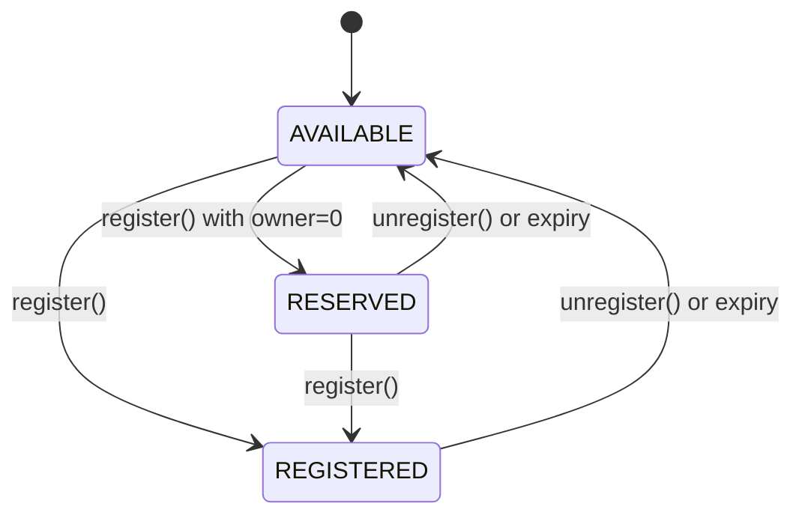

import { Card } from '../../../components/ui/Card'
import { FrenCallout } from '../../../components/ensv2/FrenCallout'
import { RoleBitmapComposer } from '../../../components/ensv2/RoleBitmapComposer'
import { ContractReference } from '../../../components/ensv2/ContractReference'
import { MonoDiagram } from '../../../components/ensv2/MonoDiagram'

# Permissioned Registry

The Permissioned Registry is the tokenized registry at the heart of ENSv2 name management. Each registered name becomes an [ERC1155Singleton](/contracts/ensv2/erc1155-singleton) token with exactly one owner, and all permissions are managed through [Enhanced Access Control](/contracts/ensv2/enhanced-access-control).

<FrenCallout fren="lili" variant="tip">
The contracts and interfaces described here are **not yet final** and may change prior to mainnet deployment.
</FrenCallout>

## What Changed from ENSv1

In ENSv1, name management was split across three separate contracts: the ENS Registry (flat mapping of all names), the BaseRegistrar (ERC721 tokens for .eth), and the Name Wrapper (ERC1155 wrapping + fuses). ENSv2 replaces all three with a single unified contract. The table below summarizes the key differences; each concept is explained in the sections that follow.

| Feature         | ENSv1                                           | ENSv2 Permissioned Registry                                                  |
| --------------- | ----------------------------------------------- | ----------------------------------------------------------------------------- |
| Architecture    | Single flat registry for all names              | [Hierarchical](/contracts/ensv2/registry-hierarchy): each name can have its own registry |
| Token standard  | ERC721 (BaseRegistrar) or ERC1155 (Name Wrapper)| [ERC1155Singleton](/contracts/ensv2/erc1155-singleton) with single ownership  |
| Permissions     | One-way fuse burning (Name Wrapper)             | Reversible role-based [EAC](/contracts/ensv2/enhanced-access-control)         |
| Token IDs       | Fixed (derived from namehash/labelhash)         | [Mutable](/contracts/ensv2/mutable-token-ids): change on role updates and re-registration |
| Subname control | Requires Name Wrapper + fuse configuration      | Built-in via subregistry pointer + per-name roles                            |
| Upgradeability  | Not upgradeable                                 | UUPS proxy pattern (for [UserRegistry](/contracts/ensv2/registry-template#userregistry)) |
| Name states     | Registered or not                               | Three-state lifecycle (see [Name Lifecycle](#name-lifecycle))                |

## Names

Each name in the registry is identified by its **labelhash** (the `keccak256` hash of the label string). The on-chain data for a name is stored in an `Entry` struct:

| Field | Type | Purpose |
|-------|------|---------|
| `subregistry` | `IRegistry` | Pointer to a subregistry for managing subnames |
| `resolver` | `address` | Resolver contract that holds this name's records |
| `expiry` | `uint64` | Timestamp after which the name is considered expired (`block.timestamp >= expiry`) |
| `eacVersionId` | `uint32` | Isolates permissions across registrations (see [Mutable Token IDs](/contracts/ensv2/mutable-token-ids)) |
| `tokenVersionId` | `uint32` | Invalidates marketplace approvals on role changes (see [Mutable Token IDs](/contracts/ensv2/mutable-token-ids)) |

Entries are stored in a mapping keyed by the [canonical ID](/contracts/ensv2/mutable-token-ids#canonical-id), the labelhash with its lower 32 bits zeroed.

## Name Lifecycle

Names exist in one of three states:



- `AVAILABLE`: never registered or expired. Open for registration.
- `RESERVED`: placeholder with no owner and no token. Useful for pre-allocating names before assigning them.
- `REGISTERED`: has an owner, a token, and active permissions.

**State transitions:** each transition requires a specific [EAC role](#roles) with the indicated scope.

| From | To | Required role | [Scope](/contracts/ensv2/enhanced-access-control#resources) |
|------|----|---------------|-------|
| AVAILABLE | REGISTERED | `ROLE_REGISTRAR` | root |
| AVAILABLE | RESERVED | `ROLE_REGISTRAR` | root |
| RESERVED | REGISTERED | `ROLE_REGISTER_RESERVED` | root |
| REGISTERED / RESERVED | AVAILABLE | `ROLE_UNREGISTER` | root or name |

### Registration

`register()` accepts a `label` (string), `owner`, `registry` (subregistry), `resolver`, `roleBitmap` (initial roles granted to the owner), and `expiry`. Labels are validated for size before registration. If `owner` is `address(0)`, the name is reserved instead of registered, and `roleBitmap` must be `0`.

- A non-expired registered name cannot be re-registered; it must be unregistered first.
- A reserved name cannot be re-reserved; it can only be promoted to registered.
- When promoting a `RESERVED` name to `REGISTERED`, if `expiry` is `0` the current expiry is preserved.
- Re-registering an expired name that had a previous owner burns the old token and increments both version counters. This ensures stale permissions and token approvals don't carry over.

### Unregistration

`unregister()` sets the name's expiry to `block.timestamp`, making it immediately available. If the name was `REGISTERED` (has an owner), the token is burned and both version counters are incremented.

### Renewal

`renew()` extends a name's expiry but cannot reduce it. Both `REGISTERED` and `RESERVED` names can be renewed. Expired names cannot be renewed; they must be re-registered.

## anyId Polymorphism

Most functions accept an `anyId` parameter that can be a `labelhash`, [token ID](/contracts/ensv2/mutable-token-ids#id-types), or [resource](/contracts/ensv2/enhanced-access-control#resources) interchangeably. Internally, `_entry()` zeroes the version bits to find the canonical storage slot for the name. This means you can pass whichever identifier you have on hand, and the registry resolves it to the same underlying entry.

See [Mutable Token IDs](/contracts/ensv2/mutable-token-ids#anyid-polymorphism) for the full explanation and diagram.

## Ownership

The token ID for a name changes when it is re-registered or when roles change (see [Mutable Token IDs](/contracts/ensv2/mutable-token-ids)).

`ownerOf()` returns `address(0)` for:
- Expired names (ownership is time-bounded)
- Stale token IDs (after versioning changes, old token IDs are no longer valid)

`latestOwnerOf()` returns the owner regardless of expiry or version staleness. This is useful for historical queries or determining who last held a name.

## EAC Integration

All permissions are managed through [Enhanced Access Control](/contracts/ensv2/enhanced-access-control).

### Roles

| Role | Value | Scope | Purpose |
|------|-------|-------|---------|
| `ROLE_REGISTRAR` | `1 << 0` | root | Register or reserve names |
| `ROLE_REGISTER_RESERVED` | `1 << 4` | root | Promote reserved names to registered |
| `ROLE_SET_PARENT` | `1 << 8` | root | Set parent registry |
| `ROLE_UNREGISTER` | `1 << 12` | root or name | Unregister names |
| `ROLE_RENEW` | `1 << 16` | root or name | Extend expiry |
| `ROLE_SET_SUBREGISTRY` | `1 << 20` | root or name | Set subregistry |
| `ROLE_SET_RESOLVER` | `1 << 24` | root or name | Set resolver |
| `ROLE_CAN_TRANSFER_ADMIN` | `(1 << 28) << 128` | root or name | Authorize ERC1155 token transfers |
| `ROLE_SET_URI` | `1 << 36` | root | Set metadata URI and renderer |
| `ROLE_UPGRADE` | `1 << 124` | root | Authorize proxy upgrades |

Each role has a corresponding admin role at `role << 128` (e.g., `ROLE_SET_RESOLVER_ADMIN = (1 << 24) << 128`), except `ROLE_CAN_TRANSFER_ADMIN` which exists only as an admin role. In TypeScript, use `1n << 24n` for the bigint equivalent.

`ROLE_CAN_TRANSFER_ADMIN` has no regular (non-admin) variant and is checked against the token owner, not the operator. See [Transfers](#transfers) for details.

"Root" scope means the role only works on `ROOT_RESOURCE`. "Root or name" means it can be granted on either scope, and the two compose: a root grant applies to all names.

Admin roles on individual names are restricted to registration time (see [EAC Hook Overrides](#eac-hook-overrides)).

### Role Bitmap Composer

<FrenCallout fren="peanut" variant="tip" title="Interactive Widget">
Select roles to compose a bitmap value for use with `grantRoles` and `revokeRoles`.
</FrenCallout>

<Card>
  <RoleBitmapComposer contract="registry" />
</Card>

### Granting and Revoking Roles

The registry uses the standard EAC [`grantRoles` and `revokeRoles`](/contracts/ensv2/enhanced-access-control#granting-and-revoking) functions with [anyId polymorphism](#anyid-polymorphism). See [Code Examples](#code-examples) for usage.

<FrenCallout fren="peanut" variant="note">
You can only grant roles for which you hold the corresponding admin role. The set of roles granted at registration determines what the owner can delegate; see [Emancipation](#emancipation) for the default bitmap.
</FrenCallout>

### EAC Hook Overrides

The Permissioned Registry overrides several [EAC callback hooks](/contracts/ensv2/enhanced-access-control#callback-hooks) to enforce registry-specific invariants:

**Token regeneration on role changes**: when roles are granted or revoked via `grantRoles()` / `revokeRoles()`, the `_onRolesGranted` and `_onRolesRevoked` hooks trigger a token regeneration (burn + mint with a new token ID). This invalidates any pending ERC1155 transfer approvals tied to the old token ID, preventing an attacker from racing to transfer a token after their roles have been revoked.

**Admin role restriction on names**: `_getSettableRoles` is overridden so that admin roles on individual names can only be assigned at registration time. After registration, only regular (non-admin) roles can be granted on a name, but admin roles can still be revoked (including by the holder revoking their own). On `ROOT_RESOURCE`, admin roles work normally. This prevents a name owner from escalating their own permissions after registration.

### Resource Scheme

<FrenCallout fren="bittu" variant="tip" title="Developer tip">
This section explains how [EAC resources](/contracts/ensv2/enhanced-access-control#resources) are computed internally. You don't need this for normal use. `grantRoles` and `revokeRoles` handle resource computation automatically via [anyId polymorphism](/contracts/ensv2/mutable-token-ids#anyid-polymorphism).
</FrenCallout>

The registry derives each EAC resource from the name's labelhash and its current `eacVersionId`, so permissions are scoped per-name and automatically invalidated on re-registration:

<MonoDiagram content={`255                                   32 31               0\n ┌──────────────────────────────────────┬─────────────────┐\n │       labelhash upper bits           │  eacVersionId   │\n │            (224 bits)                │    (32 bits)    │\n └──────────────────────────────────────┴─────────────────┘`} />

Registry resources participate in [anyId polymorphism](/contracts/ensv2/mutable-token-ids#anyid-polymorphism). See [Mutable Token IDs](/contracts/ensv2/mutable-token-ids) for how resources, token IDs, and canonical IDs relate.

## Transfers

Transferring a name's token requires `ROLE_CAN_TRANSFER_ADMIN` as an admin role on the **current owner** of the token. It does not matter who initiates the transfer; the role is always checked against the owner.

When a token transfers, all roles are atomically moved from the old owner to the new owner: the old owner's roles are revoked first (freeing assignee slots), then granted to the new owner. Roles granted to other accounts on the same name are unaffected. Without `ROLE_CAN_TRANSFER_ADMIN`, the name is effectively non-transferable, similar to the `CANNOT_TRANSFER` fuse in the Name Wrapper.

### Operator Approval

The owner of a name can call `setApprovalForAll(operator, true)` to approve an operator. An approved operator inherits all of the owner's EAC roles on every name the owner holds (via the [`_getRoles` override](/contracts/ensv2/enhanced-access-control#role-resolution-hook)), allowing them to perform any role-gated action (set resolver, set subregistry, transfer, etc.) on the owner's behalf. This is an all-or-nothing delegation: an approved operator can act on every name the owner holds, with the owner's full set of roles. There is no way to scope operator approval to specific names or roles.

## Token Metadata

The registry's `uri(tokenId)` function returns token metadata following the [EIP-1155](https://eips.ethereum.org/EIPS/eip-1155) standard. It supports two modes:

- **Static URI:** a single string returned for all tokens. Clients substitute `{id}` with the hex token ID per the [EIP-1155 metadata spec](https://eips.ethereum.org/EIPS/eip-1155#metadata). Suitable when an off-chain service resolves per-token data from the URL template.
- **Dynamic renderer:** an `IRegistryURIRenderer` contract that generates metadata per token. The registry calls `renderURI(registry, tokenId)`, passing itself so the renderer can query on-chain state (owner, expiry, records) to compose SVGs or JSON.

The renderer takes precedence: if set, the static URI is ignored. If neither is set, `uri()` returns an empty string.

`setURI(uri_, renderer)` sets both atomically and requires `ROLE_SET_URI` on `ROOT_RESOURCE`.

### Building a Custom Renderer

Implement `IRegistryURIRenderer`:

```solidity
interface IRegistryURIRenderer {
    function renderURI(IRegistry registry, uint256 tokenId)
        external view returns (string memory);
}
```

The registry passes itself as the first argument, so the renderer can call `getExpiry()`, `latestOwnerOf()`, etc. to build metadata from on-chain state.

## Parent Pointer

Each name's `subregistry` field creates a forward pointer from parent to child. The registry also stores a backward pointer to its own parent via `setParent()` / `getParent()`, creating a two-way link at every level:

<Card className="flex items-center justify-center gap-4 py-6">
  <div className="border-grey-light flex items-center gap-2 rounded-lg border bg-white px-4 py-2 dark:bg-black">
    <div className="text-center">
      <div className="font-semibold">.eth</div>
      <div className="text-grey text-xs">parent</div>
    </div>
  </div>
  <div className="text-blue font-bold">⇄</div>
  <div className="border-grey-light flex items-center gap-2 rounded-lg border bg-white px-4 py-2 dark:bg-black">
    <div className="text-center">
      <div className="font-semibold">nick.eth</div>
      <div className="text-grey text-xs">child</div>
    </div>
  </div>
  <div className="text-blue font-bold">⇄</div>
  <div className="border-grey-light flex items-center gap-2 rounded-lg border bg-white px-4 py-2 dark:bg-black">
    <div className="text-center">
      <div className="font-semibold">sub.nick.eth</div>
      <div className="text-grey text-xs">grandchild</div>
    </div>
  </div>
</Card>

The backward pointer records both the parent registry's address and the label this registry is known by in the parent. For example, the `sub.nick.eth` registry would set its parent pointer as:

```solidity
setParent(<nick.eth registry>, "sub")
```

The Universal Resolver's [`findCanonicalName()`](/contracts/ensv2/universal-resolver-v2#findcanonicalname) uses these backward pointers to walk up the tree, verifying at each step that `parent.getSubregistry(label)` points back to the current registry, and reconstructing the full name along the way.

Once this pointer is set, the registry has committed to its position in the hierarchy:

<FrenCallout fren="earl" variant="note" title="Definition – Canonical Parent">
The **canonical parent** of a registry is the parent registry set by calling `setParent(parent, label)`. It identifies where this registry sits in the hierarchy: as `label` under `parent`.
</FrenCallout>

However, as long as `ROLE_SET_PARENT` is still held on `ROOT_RESOURCE`, the pointer can be changed, effectively remounting the registry at a different position (e.g. moving from `nick.eth` to `nick.xyz`). To prevent this, the owner revokes `ROLE_SET_PARENT` and `ROLE_SET_PARENT_ADMIN` on `ROOT_RESOURCE`:

```solidity
revokeRootRoles(ROLE_SET_PARENT | ROLE_SET_PARENT_ADMIN, owner)
```

<FrenCallout fren="earl" variant="note" title="Definition – Locked Canonical Parent">
A registry has a **locked canonical parent** when it has a canonical parent and no account holds `ROLE_SET_PARENT` or `ROLE_SET_PARENT_ADMIN` on `ROOT_RESOURCE`, making the pointer permanent.
</FrenCallout>

## Emancipation

<FrenCallout fren="earl" variant="note" title="Definition – Emancipation">
A registry is **emancipated** when it is a [verified](/contracts/ensv2/verifiable-factory#on-chain-verification) registry implementation and no account holds dangerous roles on `ROOT_RESOURCE`. Custom registry implementations cannot be emancipated by definition, because their code has not been verified.
</FrenCallout>

Emancipation is a property of a registry, but its purpose is protecting names. This section covers how a registry is emancipated, how to verify it on-chain, and how emancipation composes across the hierarchy to fully protect individual names.

Certain roles on `ROOT_RESOURCE` can override individual name owners. For example, `ROLE_SET_RESOLVER` on ROOT can change the resolver on every name, `ROLE_UNREGISTER` can delete any name, and `ROLE_UPGRADE` can replace the registry implementation entirely. These are examples of **dangerous roles**: roles that can override individual name owners' permissions. A registry is emancipated when none of them have any assignees on `ROOT_RESOURCE`.

Non-dangerous roles like `ROLE_REGISTRAR` and `ROLE_RENEW` can safely remain on `ROOT_RESOURCE` (the registrar needs them to function). This is how the `.eth` registry works: the [ETH Registrar](/contracts/ensv2/eth-registrar) holds `ROLE_REGISTRAR` and `ROLE_RENEW` on `ROOT_RESOURCE`, while each name owner holds the roles defined by [`REGISTRATION_ROLE_BITMAP`](/contracts/ensv2/eth-registrar#roles-granted-at-registration). Once all dangerous roles are revoked, the separation is irreversible (you need the admin role to grant the admin role).

### Verifying Emancipation

Call [`roleCount(ROOT_RESOURCE)`](/contracts/ensv2/enhanced-access-control#bitmap-layout) on the registry to inspect the assignee counts. For emancipation, two categories of roles must have zero assignees on `ROOT_RESOURCE`:

**Roles that directly endanger name owners** (any account holding these on `ROOT_RESOURCE` can act on any name):

| Role | Danger |
|------|--------|
| `ROLE_SET_RESOLVER` | Holder can change any name's resolver |
| `ROLE_SET_SUBREGISTRY` | Holder can change any name's subregistry |
| `ROLE_UNREGISTER` | Holder can delete any name |

**Roles that enable escalation or bypass access control:**

| Role | Danger |
|------|--------|
| `ROLE_SET_RESOLVER_ADMIN` | Can grant `ROLE_SET_RESOLVER` |
| `ROLE_SET_SUBREGISTRY_ADMIN` | Can grant `ROLE_SET_SUBREGISTRY` |
| `ROLE_UNREGISTER_ADMIN` | Can grant `ROLE_UNREGISTER` |
| `ROLE_CAN_TRANSFER_ADMIN` | Can grant or revoke transfer rights on any name |
| `ROLE_UPGRADE` | Can replace the registry implementation via UUPS proxy |
| `ROLE_UPGRADE_ADMIN` | Can grant `ROLE_UPGRADE` |

`ROLE_REGISTRAR` and `ROLE_RENEW` on `ROOT_RESOURCE` are expected (the registrar needs them to function). They don't endanger existing registered names: `ROLE_REGISTRAR` can only register available names, and `ROLE_RENEW` only extends expiry (`CannotReduceExpiry`). Their admin counterparts (`ROLE_REGISTRAR_ADMIN`, `ROLE_RENEW_ADMIN`) are also excluded: granting someone the ability to register or renew does not endanger existing name owners.

### Emancipation Across the Hierarchy

Emancipation at one level is not sufficient if a higher level can still interfere. If the `.eth` registry is emancipated but the root registry is not, an account with `ROLE_SET_SUBREGISTRY` on the root registry's `ROOT_RESOURCE` could swap the `.eth` subregistry pointer. True emancipation requires the entire chain from root down to be secured:

- **Root registry**: governed by ENS governance (trusted by design)
- **.eth registry**: emancipated (only `ROLE_REGISTRAR` + `ROLE_RENEW` granted on `ROOT_RESOURCE`)
- **2LD registries** (e.g., alice.eth): depends on the 2LD owner's configuration

For a subname like `sub.alice.eth` to be fully emancipated, the `alice.eth` owner must emancipate their registry (revoke the dangerous roles on `ROOT_RESOURCE`).

## Reference

### Write Functions

<ContractReference functions={[
  {
    name: 'register',
    description: 'Register or reserve a name. Pass owner as address(0) to reserve without an owner.',
    params: [
      { name: 'label', type: 'string', description: 'The label to register (e.g. "alice" for alice.eth)' },
      { name: 'owner', type: 'address', description: 'Owner address, or address(0) to reserve' },
      { name: 'registry', type: 'IRegistry', description: 'Subregistry to set, or address(0)' },
      { name: 'resolver', type: 'address', description: 'Resolver to set, or address(0)' },
      { name: 'roleBitmap', type: 'uint256', description: 'Initial roles to grant the owner' },
      { name: 'expiry', type: 'uint64', description: 'Expiry timestamp in seconds' },
    ],
    returns: [
      { name: 'tokenId', type: 'uint256', description: 'The token ID of the registered name' },
    ],
  },
  {
    name: 'unregister',
    description: 'Unregister a name, making it available. Requires ROLE_UNREGISTER.',
    params: [
      { name: 'anyId', type: 'uint256', description: 'Labelhash, token ID, or resource of the name' },
    ],
  },
  {
    name: 'renew',
    description: 'Extend a name\'s expiry. Cannot reduce the current expiry. Requires ROLE_RENEW.',
    params: [
      { name: 'anyId', type: 'uint256', description: 'Labelhash, token ID, or resource of the name' },
      { name: 'newExpiry', type: 'uint64', description: 'New expiry timestamp (must be >= current)' },
    ],
  },
  {
    name: 'setSubregistry',
    description: 'Set the subregistry for a name. Pointing two names to the same registry creates a namespace alias.',
    params: [
      { name: 'anyId', type: 'uint256', description: 'Labelhash, token ID, or resource of the name' },
      { name: 'registry', type: 'IRegistry', description: 'Subregistry address' },
    ],
  },
  {
    name: 'setResolver',
    description: 'Set the resolver for a name. Requires ROLE_SET_RESOLVER.',
    params: [
      { name: 'anyId', type: 'uint256', description: 'Labelhash, token ID, or resource of the name' },
      { name: 'resolver', type: 'address', description: 'Resolver address' },
    ],
  },
  {
    name: 'setParent',
    description: 'Set this registry\'s canonical parent. Requires ROLE_SET_PARENT on ROOT_RESOURCE.',
    params: [
      { name: 'parent', type: 'IRegistry', description: 'Parent registry address' },
      { name: 'label', type: 'string', description: 'This registry\'s label within the parent' },
    ],
  },
  {
    name: 'setURI',
    description: 'Set the metadata URI and optional renderer. Requires ROLE_SET_URI on ROOT_RESOURCE.',
    params: [
      { name: 'uri_', type: 'string', description: 'Static metadata URI' },
      { name: 'renderer', type: 'IRegistryURIRenderer', description: 'Renderer contract, or address(0) for static URI only' },
    ],
  },
  {
    name: 'grantRoles',
    description: 'Grant roles on a name. Triggers token regeneration.',
    params: [
      { name: 'anyId', type: 'uint256', description: 'Labelhash, token ID, or resource of the name' },
      { name: 'roleBitmap', type: 'uint256', description: 'Bitmap of roles to grant' },
      { name: 'account', type: 'address', description: 'Account to grant roles to' },
    ],
    returns: [
      { name: 'success', type: 'bool', description: 'Whether the roles were updated' },
    ],
  },
  {
    name: 'revokeRoles',
    description: 'Revoke roles on a name. Triggers token regeneration.',
    params: [
      { name: 'anyId', type: 'uint256', description: 'Labelhash, token ID, or resource of the name' },
      { name: 'roleBitmap', type: 'uint256', description: 'Bitmap of roles to revoke' },
      { name: 'account', type: 'address', description: 'Account to revoke roles from' },
    ],
    returns: [
      { name: 'success', type: 'bool', description: 'Whether the roles were updated' },
    ],
  },
  {
    name: 'grantRootRoles',
    description: 'Grant contract-wide roles on ROOT_RESOURCE.',
    params: [
      { name: 'roleBitmap', type: 'uint256', description: 'Bitmap of roles to grant' },
      { name: 'account', type: 'address', description: 'Account to grant roles to' },
    ],
    returns: [
      { name: 'success', type: 'bool', description: 'Whether the roles were updated' },
    ],
  },
  {
    name: 'revokeRootRoles',
    description: 'Revoke contract-wide roles on ROOT_RESOURCE.',
    params: [
      { name: 'roleBitmap', type: 'uint256', description: 'Bitmap of roles to revoke' },
      { name: 'account', type: 'address', description: 'Account to revoke roles from' },
    ],
    returns: [
      { name: 'success', type: 'bool', description: 'Whether the roles were updated' },
    ],
  },
]} />

### View Functions

<ContractReference functions={[
  {
    name: 'getState',
    description: 'Complete state for a name: status, expiry, latestOwner, tokenId, resource.',
    params: [
      { name: 'anyId', type: 'uint256', description: 'Labelhash, token ID, or resource' },
    ],
    returns: [
      { name: 'state', type: 'State', description: 'Struct with status, expiry, latestOwner, tokenId, resource' },
    ],
  },
  {
    name: 'getStatus',
    description: 'Get the registration status of a name.',
    params: [
      { name: 'anyId', type: 'uint256', description: 'Labelhash, token ID, or resource' },
    ],
    returns: [
      { name: 'status', type: 'Status', description: 'AVAILABLE, RESERVED, or REGISTERED' },
    ],
  },
  {
    name: 'getExpiry',
    description: 'Get the expiry timestamp of a name.',
    params: [
      { name: 'anyId', type: 'uint256', description: 'Labelhash, token ID, or resource' },
    ],
    returns: [
      { name: 'expiry', type: 'uint64', description: 'Expiry timestamp in seconds' },
    ],
  },
  {
    name: 'getTokenId',
    description: 'Get the current token ID of a name.',
    params: [
      { name: 'anyId', type: 'uint256', description: 'Labelhash, token ID, or resource' },
    ],
    returns: [
      { name: 'tokenId', type: 'uint256', description: 'Current ERC1155 token ID' },
    ],
  },
  {
    name: 'getResource',
    description: 'Get the current EAC resource ID of a name.',
    params: [
      { name: 'anyId', type: 'uint256', description: 'Labelhash, token ID, or resource' },
    ],
    returns: [
      { name: 'resource', type: 'uint256', description: 'Current EAC resource ID' },
    ],
  },
  {
    name: 'latestOwnerOf',
    description: 'Get the owner of a token regardless of expiry or version validity.',
    params: [
      { name: 'tokenId', type: 'uint256', description: 'The token ID to query' },
    ],
    returns: [
      { name: 'owner', type: 'address', description: 'Owner address' },
    ],
  },
  {
    name: 'ownerOf',
    description: 'Get the owner of a token, or address(0) if expired or stale token ID.',
    params: [
      { name: 'tokenId', type: 'uint256', description: 'The token ID to query' },
    ],
    returns: [
      { name: 'owner', type: 'address', description: 'Owner address, or address(0)' },
    ],
  },
  {
    name: 'getSubregistry',
    description: 'Get the subregistry for a label. Returns address(0) if expired.',
    params: [
      { name: 'label', type: 'string', description: 'The label to query' },
    ],
    returns: [
      { name: 'registry', type: 'IRegistry', description: 'Subregistry address' },
    ],
  },
  {
    name: 'getResolver',
    description: 'Get the resolver for a label. Returns address(0) if expired.',
    params: [
      { name: 'label', type: 'string', description: 'The label to query' },
    ],
    returns: [
      { name: 'resolver', type: 'address', description: 'Resolver address' },
    ],
  },
  {
    name: 'getParent',
    description: 'Get this registry\'s canonical parent registry and label.',
    returns: [
      { name: 'parent', type: 'IRegistry', description: 'Parent registry address' },
      { name: 'label', type: 'string', description: 'This registry\'s label within the parent' },
    ],
  },
  {
    name: 'hasRoles',
    description: 'Check whether an account holds the specified roles on a name.',
    params: [
      { name: 'anyId', type: 'uint256', description: 'Labelhash, token ID, or resource' },
      { name: 'roleBitmap', type: 'uint256', description: 'Bitmap of roles to check' },
      { name: 'account', type: 'address', description: 'Account to check' },
    ],
    returns: [
      { name: 'result', type: 'bool', description: 'True if account holds all specified roles' },
    ],
  },
  {
    name: 'roles',
    description: 'Get the full role bitmap for an account on a name.',
    params: [
      { name: 'anyId', type: 'uint256', description: 'Labelhash, token ID, or resource' },
      { name: 'account', type: 'address', description: 'Account to query' },
    ],
    returns: [
      { name: 'roleBitmap', type: 'uint256', description: 'Full role bitmap' },
    ],
  },
  {
    name: 'roleCount',
    description: 'Get the packed assignee counts for all 64 roles on a name. Each nybble (4 bits) holds the count of accounts holding that role.',
    params: [
      { name: 'anyId', type: 'uint256', description: 'Labelhash, token ID, or resource' },
    ],
    returns: [
      { name: 'counts', type: 'uint256', description: 'Packed assignee counts (nybble per role)' },
    ],
  },
  {
    name: 'hasAssignees',
    description: 'Check whether any accounts hold the specified roles on a name.',
    params: [
      { name: 'anyId', type: 'uint256', description: 'Labelhash, token ID, or resource' },
      { name: 'roleBitmap', type: 'uint256', description: 'Bitmap of roles to check' },
    ],
    returns: [
      { name: 'result', type: 'bool', description: 'True if any account holds the roles' },
    ],
  },
  {
    name: 'getAssigneeCount',
    description: 'Get per-role assignee counts for the specified roles on a name.',
    params: [
      { name: 'anyId', type: 'uint256', description: 'Labelhash, token ID, or resource' },
      { name: 'roleBitmap', type: 'uint256', description: 'Bitmap of roles to count' },
    ],
    returns: [
      { name: 'counts', type: 'uint256', description: 'Packed per-role assignee counts' },
      { name: 'mask', type: 'uint256', description: 'Mask indicating which nybbles are relevant' },
    ],
  },
  {
    name: 'hasRootRoles',
    description: 'Check whether an account holds all specified roles on ROOT_RESOURCE only (does not check token-level roles).',
    params: [
      { name: 'roleBitmap', type: 'uint256', description: 'Bitmap of roles to check' },
      { name: 'account', type: 'address', description: 'Account to check' },
    ],
    returns: [
      { name: 'result', type: 'bool', description: 'True if account holds all specified roles on ROOT' },
    ],
  },
  {
    name: 'uri',
    description: 'ERC1155 metadata URI. Delegates to the renderer if set, otherwise returns the static URI.',
    params: [
      { name: 'tokenId', type: 'uint256', description: 'Token ID' },
    ],
    returns: [
      { name: '', type: 'string', description: 'Metadata URI' },
    ],
  },
  {
    name: 'findOwner',
    description: 'Get the current owner of a name by label. Returns address(0) if expired.',
    params: [
      { name: 'label', type: 'string', description: 'The label to query' },
    ],
    returns: [
      { name: 'owner', type: 'address', description: 'Owner address, or address(0)' },
    ],
  },
  {
    name: 'findExpiry',
    description: 'Get the expiry timestamp of a name by label.',
    params: [
      { name: 'label', type: 'string', description: 'The label to query' },
    ],
    returns: [
      { name: 'expiry', type: 'uint64', description: 'Expiry timestamp in seconds' },
    ],
  },
  {
    name: 'findTokenId',
    description: 'Get the current token ID of a name by label.',
    params: [
      { name: 'label', type: 'string', description: 'The label to query' },
    ],
    returns: [
      { name: 'tokenId', type: 'uint256', description: 'Current ERC1155 token ID' },
    ],
  },
]} />

### Events

<ContractReference functions={[
  {
    name: 'RegistryCreated',
    description: 'Emitted once in the constructor when the registry is deployed.',
    params: [],
  },
  {
    name: 'LabelRegistered',
    description: 'Name registered with an owner.',
    params: [
      { name: 'tokenId', type: 'uint256', indexed: true, description: 'Token ID of the registered name' },
      { name: 'labelHash', type: 'bytes32', indexed: true, description: 'Hash of the registered label' },
      { name: 'label', type: 'string', description: 'The registered label' },
      { name: 'owner', type: 'address', description: 'Owner of the name' },
      { name: 'expiry', type: 'uint64', description: 'Expiry timestamp' },
      { name: 'sender', type: 'address', indexed: true, description: 'Caller that triggered the registration' },
    ],
  },
  {
    name: 'TokenResource',
    description: 'Associates a token ID with its EAC resource ID. Emitted during registration.',
    params: [
      { name: 'tokenId', type: 'uint256', indexed: true, description: 'Token ID of the name' },
      { name: 'resource', type: 'uint256', indexed: true, description: 'EAC resource ID for role checks' },
    ],
  },
  {
    name: 'LabelReserved',
    description: 'Name reserved without an owner.',
    params: [
      { name: 'tokenId', type: 'uint256', indexed: true, description: 'Token ID of the reserved name' },
      { name: 'labelHash', type: 'bytes32', indexed: true, description: 'Hash of the reserved label' },
      { name: 'label', type: 'string', description: 'The reserved label' },
      { name: 'expiry', type: 'uint64', description: 'Expiry timestamp' },
      { name: 'sender', type: 'address', indexed: true, description: 'Caller that triggered the reservation' },
    ],
  },
  {
    name: 'LabelUnregistered',
    description: 'Name unregistered.',
    params: [
      { name: 'tokenId', type: 'uint256', indexed: true, description: 'Token ID of the unregistered name' },
      { name: 'sender', type: 'address', indexed: true, description: 'Caller that triggered unregistration' },
    ],
  },
  {
    name: 'ExpiryUpdated',
    description: 'Expiry extended via renew().',
    params: [
      { name: 'tokenId', type: 'uint256', indexed: true, description: 'Token ID of the name' },
      { name: 'newExpiry', type: 'uint64', indexed: true, description: 'New expiry timestamp' },
      { name: 'sender', type: 'address', indexed: true, description: 'Caller that triggered the renewal' },
    ],
  },
  {
    name: 'SubregistryUpdated',
    description: 'Subregistry changed.',
    params: [
      { name: 'tokenId', type: 'uint256', indexed: true, description: 'Token ID of the name' },
      { name: 'subregistry', type: 'IRegistry', indexed: true, description: 'New subregistry address' },
      { name: 'sender', type: 'address', indexed: true, description: 'Caller that made the change' },
    ],
  },
  {
    name: 'ResolverUpdated',
    description: 'Resolver address changed.',
    params: [
      { name: 'tokenId', type: 'uint256', indexed: true, description: 'Token ID of the name' },
      { name: 'resolver', type: 'address', indexed: true, description: 'New resolver address' },
      { name: 'sender', type: 'address', indexed: true, description: 'Caller that made the change' },
    ],
  },
  {
    name: 'TokenRegenerated',
    description: 'Token ID changed due to role update.',
    params: [
      { name: 'oldTokenId', type: 'uint256', indexed: true, description: 'Previous token ID' },
      { name: 'newTokenId', type: 'uint256', indexed: true, description: 'New token ID' },
    ],
  },
  {
    name: 'ParentUpdated',
    description: 'Canonical parent reference changed.',
    params: [
      { name: 'parent', type: 'IRegistry', indexed: true, description: 'New parent registry' },
      { name: 'label', type: 'string', description: 'Label within the parent' },
      { name: 'sender', type: 'address', indexed: true, description: 'Caller that made the change' },
    ],
  },
  {
    name: 'URIUpdated',
    description: 'Emitted when metadata URI or renderer is changed.',
    params: [
      { name: 'uri', type: 'string', description: 'New metadata URI' },
      { name: 'renderer', type: 'address', description: 'New renderer address (or address(0))' },
      { name: 'sender', type: 'address', indexed: true, description: 'Account that called setURI' },
    ],
  },
]} />

## Code Examples

### Granting and Revoking Roles

```ts [Viem]
import { createWalletClient, http, keccak256, toHex } from 'viem'
import { mainnet } from 'viem/chains'

const wallet = createWalletClient({ chain: mainnet, transport: http() })

const ROLE_SET_RESOLVER = 1n << 24n
const ROLE_SET_SUBREGISTRY = 1n << 20n
const labelhash = BigInt(keccak256(toHex('alice')))

// Grant a single role
await wallet.writeContract({
  address: registryAddress,
  abi: permissionedRegistryAbi,
  functionName: 'grantRoles',
  args: [labelhash, ROLE_SET_RESOLVER, operatorAddress],
})

// Grant multiple roles at once using bitwise OR
await wallet.writeContract({
  address: registryAddress,
  abi: permissionedRegistryAbi,
  functionName: 'grantRoles',
  args: [labelhash, ROLE_SET_RESOLVER | ROLE_SET_SUBREGISTRY, operatorAddress],
})

// Revoke a role — same interface, just pass the labelhash
await wallet.writeContract({
  address: registryAddress,
  abi: permissionedRegistryAbi,
  functionName: 'revokeRoles',
  args: [labelhash, ROLE_SET_RESOLVER, operatorAddress],
})
// ROLE_SET_SUBREGISTRY remains active — only the specified role is revoked
```
