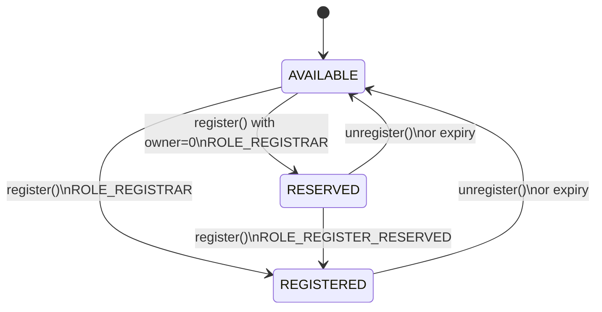

# Permissioned Registry

The Permissioned Registry is the tokenized registry at the heart of ENSv2 name management. Each registered name becomes an ERC1155 token with exactly one owner, and all permissions are managed through [Enhanced Access Control](/contracts/ensv2/enhanced-access-control).

:::note
The contracts and interfaces described here are **not yet final** and may change prior to mainnet deployment.
:::

## Names

Each name in the registry is identified by its **labelhash** (the `keccak256` hash of the label string) and stores:

- **Subregistry**: pointer to a child registry (for managing subnames)
- **Resolver**: address of the resolver contract
- **Expiry**: timestamp after which the name is considered expired (`block.timestamp >= expiry`)
- **Version counters**: two internal counters used for permission isolation and token identity (see [Versioning](#versioning))

## Name Lifecycle

Names exist in one of three states:



- **AVAILABLE**: never registered or expired. Open for registration.
- **RESERVED**: placeholder with no owner and no token. Useful for pre-allocating names before assigning them.
- **REGISTERED**: has an owner, a token, and active permissions.

**State transitions:**

| From | To | Required role | Scope |
|------|----|---------------|-------|
| AVAILABLE | REGISTERED | `ROLE_REGISTRAR` | root |
| AVAILABLE | RESERVED | `ROLE_REGISTRAR` | root |
| RESERVED | REGISTERED | `ROLE_REGISTER_RESERVED` | root |
| REGISTERED / RESERVED | AVAILABLE | `ROLE_UNREGISTER` | root or name |

### Registration

`register()` accepts a `label` (string), `owner`, `registry` (subregistry), `resolver`, `roleBitmap` (initial roles granted to the owner), and `expiry`. If `owner` is `address(0)`, the name is reserved instead of registered, and `roleBitmap` must be `0`.

When promoting a RESERVED name to REGISTERED, if `expiry` is `0` the current expiry is preserved.

Re-registering an expired name that had a previous owner burns the old token and increments both version counters, ensuring stale permissions and token approvals don't carry over.

### Unregistration

`unregister()` sets the name's expiry to `block.timestamp`, making it immediately available. If the name was REGISTERED (has an owner), the token is burned and both version counters are incremented.

### Renewal

`renew()` extends a name's expiry but cannot reduce it. Both REGISTERED and RESERVED names can be renewed. Expired names cannot be renewed — they must be re-registered.

## anyId Polymorphism

Most functions accept an `anyId` parameter that can be a **labelhash**, **tokenId**, or **resource** interchangeably. Internally, `_entry()` zeroes the version bits to find the canonical storage slot for the name. This means you can pass whichever identifier you have on hand — the registry resolves it to the same underlying entry.

This applies to `setSubregistry()`, `setResolver()`, `renew()`, `unregister()`, `getExpiry()`, `getStatus()`, `getState()`, `getTokenId()`, `getResource()`, and all EAC role functions (`grantRoles()`, `revokeRoles()`, `roles()`, etc.).

## Ownership

Each registered name is an ERC1155 token with exactly one owner (singleton, not fungible). The token ID encodes both the labelhash and a version counter, so it changes when the name is re-registered or roles change (see [Versioning](#versioning)).

`ownerOf()` returns `address(0)` for:
- Expired names — ownership is time-bounded
- Stale token IDs — after a version bump, old token IDs are no longer valid

`latestOwnerOf()` returns the owner regardless of expiry or version staleness — useful for historical queries or determining who last held a name.

## Roles

All roles use [Enhanced Access Control](/contracts/ensv2/enhanced-access-control) mechanics for role-based access control.

| Role | Scope | Purpose |
|------|-------|---------|
| `ROLE_REGISTRAR` | root | Register or reserve names |
| `ROLE_REGISTER_RESERVED` | root | Promote reserved names to registered |
| `ROLE_SET_PARENT` | root | Set parent registry |
| `ROLE_UNREGISTER` | root or name | Unregister names |
| `ROLE_RENEW` | root or name | Extend expiry |
| `ROLE_SET_SUBREGISTRY` | root or name | Set child registry |
| `ROLE_SET_RESOLVER` | root or name | Set resolver |
| `ROLE_CAN_TRANSFER_ADMIN` | root or name (admin only) | Authorize token transfers |
| `ROLE_UPGRADE` | root | Authorize proxy upgrades |

"Root" scope means the role only works on `ROOT_RESOURCE`. "Root or name" means it can be granted on either scope, and the two compose — a root grant applies to all names.

**Admin role restriction on names:** admin roles on individual names can only be granted at registration time. They can be revoked afterward but not re-granted. On `ROOT_RESOURCE`, admin roles work normally. This prevents a name owner from escalating their own permissions after registration.

## Transfers

Transferring a name's token requires `ROLE_CAN_TRANSFER_ADMIN` as an **admin role on the token owner** (not the operator — operator approval via ERC1155 is a separate check).

When a token transfers, all roles automatically move from the old owner to the new owner. Without `ROLE_CAN_TRANSFER_ADMIN`, the name is effectively non-transferable — similar to the `CANNOT_TRANSFER` fuse in the Name Wrapper.

## Versioning

Each name maintains two independent version counters:

**`eacVersionId`** — incremented on unregistration and re-registration. Creates a fresh permission scope so that roles from a previous registration don't carry over to a new owner.

**`tokenVersionId`** — incremented on unregistration, re-registration, **and** whenever roles change. Creates a new token ID each time. Role changes trigger a burn+mint cycle (`_regenerateToken`), emitting `TokenRegenerated(oldTokenId, newTokenId)` — the owner stays the same but gets a new token ID.

Why does `tokenVersionId` change on role changes? It prevents an attack where someone approves a token transfer, then has their roles revoked — the old token ID becomes invalid, so the pending transfer fails. Without this, a revoked operator could race to transfer the token before the revocation settles.

Expired names automatically receive a fresh resource scope (computed as `eacVersionId + 1`), so stale permissions from a lapsed registration can't be used even before the name is re-registered.

## Registry Hierarchy

Each name can point to a child registry via its subregistry field. These parent-child relationships form a tree that mirrors the DNS hierarchy:

```
.eth registry  →  nick.eth  →  sub.nick.eth
(parent)          (child)       (grandchild)
```

The registry also stores its own parent via `setParent()` / `getParent()`, which records both the parent registry address and the child label.

`getSubregistry()` and `getResolver()` return `address(0)` for expired names, preventing resolution through lapsed names.

## View Functions

| Function | Returns |
|----------|---------|
| `getState(anyId)` | Complete state: status, expiry, latest owner, tokenId, resource |
| `getStatus(anyId)` | `AVAILABLE`, `RESERVED`, or `REGISTERED` |
| `getExpiry(anyId)` | Expiry timestamp |
| `getTokenId(anyId)` | Current token ID for the name |
| `getResource(anyId)` | Current EAC resource ID for the name |
| `latestOwnerOf(tokenId)` | Owner regardless of expiry/version (useful for historical queries) |
