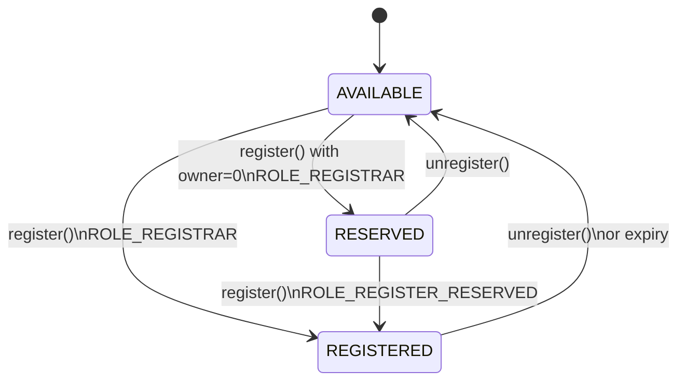

# Permissioned Registry

The Permissioned Registry is the tokenized registry at the heart of ENSv2 name management. Each registered name becomes an ERC1155 token with exactly one owner, and all permissions are managed through [Enhanced Access Control](/contracts/ensv2/enhanced-access-control).

Think of it as a ledger where each entry is both a record (name data) and a deed (ownership token). The ledger tracks who owns each name, what they're allowed to do with it, and when it expires.

:::note
The contracts and interfaces described here are **not yet final** and may change prior to mainnet deployment.
:::

## Names

Each name in the registry is identified by its **labelhash** (the keccak256 hash of the label string) and stores:

- **Subregistry**: pointer to a child registry (for managing subnames)
- **Resolver**: address of the resolver contract
- **Expiry**: timestamp after which the name is considered expired (`block.timestamp >= expiry`)
- **Version counters**: two internal counters used for permission isolation and token identity (see [Versioning](#versioning))

## Name Lifecycle

Names exist in one of three states:



- **AVAILABLE**: never registered or expired. Open for registration.
- **RESERVED**: placeholder with no owner and no token. Useful for pre-allocating names before assigning them.
- **REGISTERED**: has an owner, a token, and active permissions.

**State transitions:**

| From | To | Required role | Scope |
|------|----|---------------|-------|
| AVAILABLE | REGISTERED | `ROLE_REGISTRAR` | root |
| AVAILABLE | RESERVED | `ROLE_REGISTRAR` | root |
| RESERVED | REGISTERED | `ROLE_REGISTER_RESERVED` | root |
| REGISTERED / RESERVED | AVAILABLE | `ROLE_UNREGISTER` | root or name |

Re-registering an expired name that had a previous owner burns the old token and resets both version counters, ensuring stale permissions and token approvals don't carry over.

**Renewal:** `renew()` extends a name's expiry but cannot reduce it. Expired names cannot be renewed — they must be re-registered.

## Ownership

Each registered name is an ERC1155 token with exactly one owner (singleton, not fungible). The token ID encodes both the labelhash and a version counter, so it changes when the name is re-registered or roles change (see [Versioning](#versioning)).

`ownerOf()` returns `address(0)` for:
- Expired names — ownership is time-bounded
- Stale token IDs — after a version bump, old token IDs are no longer valid

## Roles

All roles use [Enhanced Access Control](/contracts/ensv2/enhanced-access-control) mechanics — see that page for how granting, revoking, admin roles, and resource scoping work.

| Role | Scope | Purpose |
|------|-------|---------|
| `ROLE_REGISTRAR` | root | Register or reserve names |
| `ROLE_REGISTER_RESERVED` | root | Promote reserved names to registered |
| `ROLE_SET_PARENT` | root | Set parent registry |
| `ROLE_UNREGISTER` | root or name | Unregister names |
| `ROLE_RENEW` | root or name | Extend expiry |
| `ROLE_SET_SUBREGISTRY` | root or name | Set child registry |
| `ROLE_SET_RESOLVER` | root or name | Set resolver |
| `ROLE_CAN_TRANSFER` | name (admin only) | Authorize token transfers |
| `ROLE_UPGRADE` | root | Authorize proxy upgrades |

"Root" scope means the role only works on `ROOT_RESOURCE`. "Root or name" means it can be granted on either scope, and the two compose — a root grant applies to all names.

**Admin role restriction on names:** admin roles on individual names can only be granted at registration time. They can be revoked afterward but not re-granted. On `ROOT_RESOURCE`, admin roles work normally. This prevents a name owner from escalating their own permissions after registration.

## Transfers

Transferring a name's token requires `ROLE_CAN_TRANSFER` as an **admin role on the token owner** (not the operator — operator approval via ERC1155 is a separate check).

When a token transfers, all roles automatically move from the old owner to the new owner. Without `ROLE_CAN_TRANSFER`, the name is effectively non-transferable — similar to the `CANNOT_TRANSFER` fuse in the Name Wrapper.

## Versioning

Each name maintains two independent version counters:

**`eacVersionId`** — bumped on re-registration. Creates a fresh permission scope so that roles from a previous registration don't carry over to a new owner.

**`tokenVersionId`** — bumped on re-registration **and** whenever roles change. Creates a new token ID each time.

Why does `tokenVersionId` change on role changes? It prevents an attack where someone approves a token transfer, then has their roles revoked — the old token ID becomes invalid, so the pending transfer fails. Without this, a revoked operator could race to transfer the token before the revocation settles.

Expired names automatically receive a fresh resource scope (computed as `eacVersionId + 1`), so stale permissions from a lapsed registration can't be used even before the name is re-registered.

## Registry Hierarchy

Each name can point to a child registry via its subregistry field. These parent-child relationships form a tree that mirrors the DNS hierarchy:

```
.eth registry  →  nick.eth  →  sub.nick.eth
(parent)          (child)       (grandchild)
```

`getSubregistry()` and `getResolver()` return `address(0)` for expired names, preventing resolution through lapsed names.

Three registry variants share this design:
- **PermissionedRegistry**: the base implementation
- **UserRegistry**: upgradeable variant for user subdomains
- **WrapperRegistry**: upgradeable variant for ENSv1 migration
