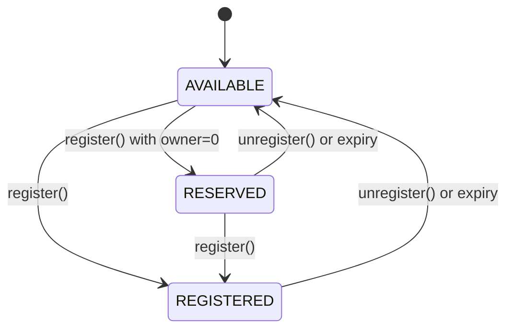

# Permissioned Registry

The Permissioned Registry is the tokenized registry at the heart of ENSv2 name management. Each registered name becomes an `ERC1155` token with exactly one owner, and all permissions are managed through [Enhanced Access Control](/contracts/ensv2/enhanced-access-control).

:::note
The contracts and interfaces described here are **not yet final** and may change prior to mainnet deployment.
:::

## Names

Each name in the registry is identified by its **labelhash** (the `keccak256` hash of the label string) and stores:

- **Subregistry**: pointer to a child registry (for managing subnames)
- **Resolver**: address of the resolver contract
- **Expiry**: timestamp after which the name is considered expired (`block.timestamp >= expiry`)
- **Versioning**: internal counters that isolate permissions between registrations and prevent stale token approvals (see [Versioning](#versioning))

## Name Lifecycle

Names exist in one of three states:



- `AVAILABLE`: never registered or expired. Open for registration.
- `RESERVED`: placeholder with no owner and no token. Useful for pre-allocating names before assigning them.
- `REGISTERED`: has an owner, a token, and active permissions.

**State transitions:**

| From                  | To         | Required role            | [Scope](/contracts/ensv2/enhanced-access-control#resources) |
| --------------------- | ---------- | ------------------------ | ----------------------------------------------------------- |
| AVAILABLE             | REGISTERED | `ROLE_REGISTRAR`         | root                                                        |
| AVAILABLE             | RESERVED   | `ROLE_REGISTRAR`         | root                                                        |
| RESERVED              | REGISTERED | `ROLE_REGISTER_RESERVED` | root                                                        |
| REGISTERED / RESERVED | AVAILABLE  | `ROLE_UNREGISTER`        | root or name                                                |

### Registration

`register()` accepts a `label` (string), `owner`, `registry` (subregistry), `resolver`, `roleBitmap` (initial roles granted to the owner), and `expiry`. Labels are validated for size before registration. If `owner` is `address(0)`, the name is reserved instead of registered, and `roleBitmap` must be `0`.

A non-expired registered name cannot be re-registered directly — it must be unregistered first. Similarly, a reserved name cannot be re-reserved; it can only be promoted to registered.

When promoting a `RESERVED` name to `REGISTERED`, if `expiry` is `0` the current expiry is preserved.

Re-registering an expired name that had a previous owner burns the old token and increments both version counters, ensuring stale permissions and token approvals don't carry over.

### Unregistration

`unregister()` sets the name's expiry to `block.timestamp`, making it immediately available. If the name was `REGISTERED` (has an owner), the token is burned and both version counters are incremented.

### Renewal

`renew()` extends a name's expiry but cannot reduce it. Both `REGISTERED` and `RESERVED` names can be renewed. Expired names cannot be renewed — they must be re-registered.

## anyId Polymorphism

Most functions accept an `anyId` parameter that can be a `labelhash`, `tokenId`, or `resource` interchangeably. Internally, `_entry()` zeroes the version bits to find the canonical storage slot for the name. This means you can pass whichever identifier you have on hand — the registry resolves it to the same underlying entry.

This applies to `setSubregistry()`, `setResolver()`, `renew()`, `unregister()`, `getExpiry()`, `getStatus()`, `getState()`, `getTokenId()`, `getResource()`, and all EAC role functions (`grantRoles()`, `revokeRoles()`, `roles()`, etc.).

## Ownership

Each registered name is an `ERC1155` token with exactly one owner (singleton, not fungible). The token ID changes when the name is re-registered or when roles change (see [Versioning](#versioning)).

`ownerOf()` returns `address(0)` for:

- Expired names — ownership is time-bounded
- Stale token IDs — after versioning changes, old token IDs are no longer valid

`latestOwnerOf()` returns the owner regardless of expiry or version staleness — useful for historical queries or determining who last held a name.

Operator approvals and transfer checks resolve the caller through [Hidden Contract Accounts](/contracts/ensv2/hca), so smart-account proxies are attributed to their owner.

## Token Metadata

The registry exposes ERC-1155 `uri(tokenId)` by delegating to a swappable [Registry Metadata](/contracts/ensv2/registry-metadata) provider set at construction. The provider decides the URI format — per-token URIs, a single shared base URI, or any custom strategy.

## Roles

All roles use [Enhanced Access Control](/contracts/ensv2/enhanced-access-control) mechanics for role-based access control.

| Role                      | Scope                     | Purpose                              |
| ------------------------- | ------------------------- | ------------------------------------ |
| `ROLE_REGISTRAR`          | root                      | Register or reserve names            |
| `ROLE_REGISTER_RESERVED`  | root                      | Promote reserved names to registered |
| `ROLE_SET_PARENT`         | root                      | Set parent registry                  |
| `ROLE_UNREGISTER`         | root or name              | Unregister names                     |
| `ROLE_RENEW`              | root or name              | Extend expiry                        |
| `ROLE_SET_SUBREGISTRY`    | root or name              | Set child registry                   |
| `ROLE_SET_RESOLVER`       | root or name              | Set resolver                         |
| `ROLE_CAN_TRANSFER_ADMIN` | root or name (admin only) | Authorize token transfers            |
| `ROLE_UPGRADE`            | root                      | Authorize proxy upgrades             |

"Root" scope means the role only works on `ROOT_RESOURCE`. "Root or name" means it can be granted on either scope, and the two compose — a root grant applies to all names.

**Admin role restriction on names:** admin roles on individual names can only be granted at registration time. They can be revoked afterward but not re-granted. On `ROOT_RESOURCE`, admin roles work normally. This prevents a name owner from escalating their own permissions after registration.

## Transfers

Transferring a name's token requires `ROLE_CAN_TRANSFER_ADMIN` as an **admin role on the token owner** (not the operator — operator approval via `ERC1155` is a separate check).

When a token transfers, all roles are atomically moved from the old owner to the new owner — the old owner's roles are revoked first (freeing assignee slots), then granted to the new owner. Roles granted to other accounts on the same name are unaffected. Without `ROLE_CAN_TRANSFER_ADMIN`, the name is effectively non-transferable — similar to the `CANNOT_TRANSFER` fuse in the Name Wrapper.

## Versioning

The registry uses internal versioning to provide two security guarantees:

**Permission isolation across registrations** — when a name is unregistered and later re-registered, all roles from the previous registration are invalidated. The new owner starts with a clean permission scope, preventing any stale grants from carrying over.

**Preventing transfer griefing** — when roles are granted or revoked via `grantRoles()` / `revokeRoles()`, the token ID changes (the owner stays the same but receives a new token via a burn+mint cycle). This invalidates any pending `ERC1155` transfer approvals tied to the old token ID, preventing an attack where someone approves a transfer and then has their roles revoked — without this, the approved party could race to transfer the token before the revocation takes effect. During normal transfers, roles move to the new owner without changing the token ID.

**Expiry enforcement** — expired names retain their permissions, but all mutating operations check expiry first and revert if the name has lapsed, preventing stale permissions from being exercised. On re-registration, version counters increment to create a fresh scope that invalidates any prior grants.

## EAC Hook Overrides

The Permissioned Registry overrides several [EAC callback hooks](/contracts/ensv2/enhanced-access-control#callback-hooks) to enforce registry-specific invariants:

**Token regeneration on role changes** — when roles are granted or revoked via `grantRoles()` / `revokeRoles()`, the `_onRolesGranted` and `_onRolesRevoked` hooks trigger a token regeneration (burn + mint with a new token ID). This invalidates any pending ERC1155 transfer approvals tied to the old token ID, preventing an attacker from racing to transfer a token after their roles have been revoked.

**Admin role restriction on names** — `_getSettableRoles` is overridden so that admin roles on individual names can only be assigned at registration time. After registration, only regular (non-admin) roles can be granted on a name. On `ROOT_RESOURCE`, admin roles work normally. This prevents a name owner from escalating their own permissions after registration.

**No role changes on unregistered names** — both `_getSettableRoles` and `_getRevokableRoles` return `0` for names that are `AVAILABLE` or `RESERVED`, blocking all role operations until the name is fully registered.

## Registry Hierarchy

Each name can point to a child registry via its subregistry field. These parent-child relationships form a tree that mirrors the DNS hierarchy:

```
.eth registry  →  nick.eth  →  sub.nick.eth
(parent)          (child)       (grandchild)
```

The registry also stores its own parent via `setParent()` / `getParent()`, which records both the parent registry address and the child label.

`getSubregistry()` and `getResolver()` return `address(0)` for expired names, preventing resolution through lapsed names.

## View Functions

| Function                 | Returns                                                            |
| ------------------------ | ------------------------------------------------------------------ |
| `getState(anyId)`        | Complete state: status, expiry, latest owner, tokenId, resource    |
| `getStatus(anyId)`       | `AVAILABLE`, `RESERVED`, or `REGISTERED`                           |
| `getExpiry(anyId)`       | Expiry timestamp                                                   |
| `getTokenId(anyId)`      | Current token ID for the name                                      |
| `getResource(anyId)`     | Current EAC resource ID for the name                               |
| `latestOwnerOf(tokenId)` | Owner regardless of expiry/version (useful for historical queries) |
