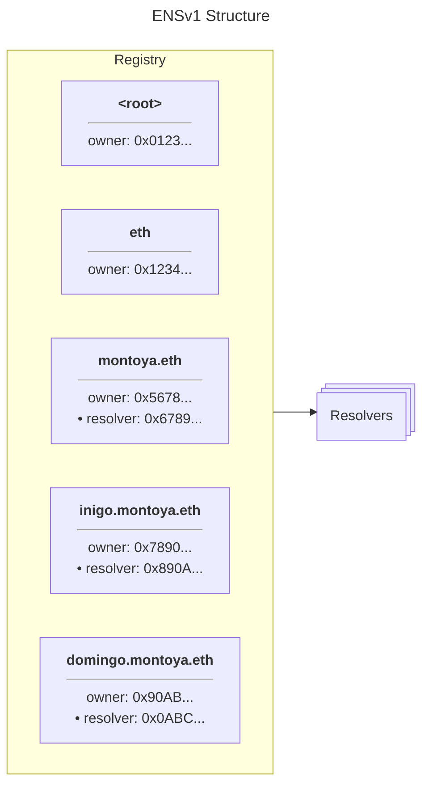
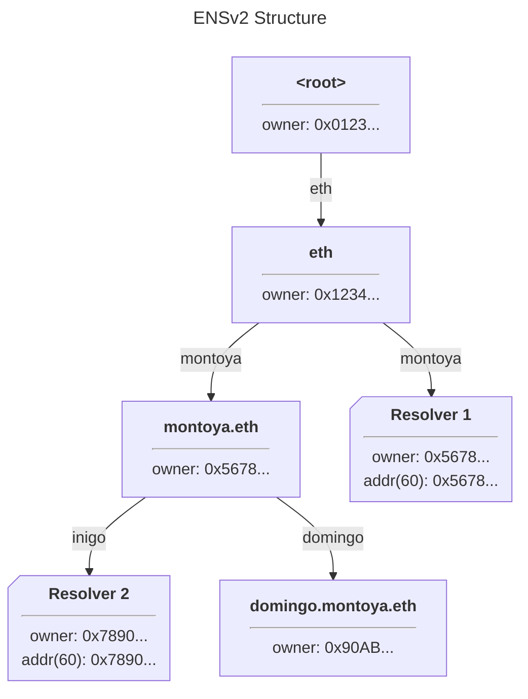
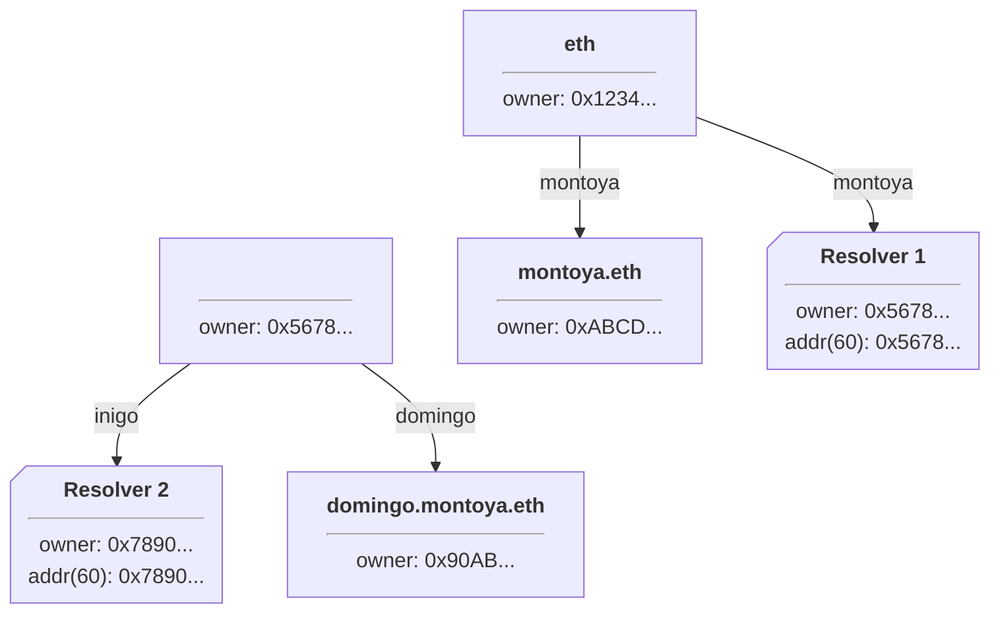
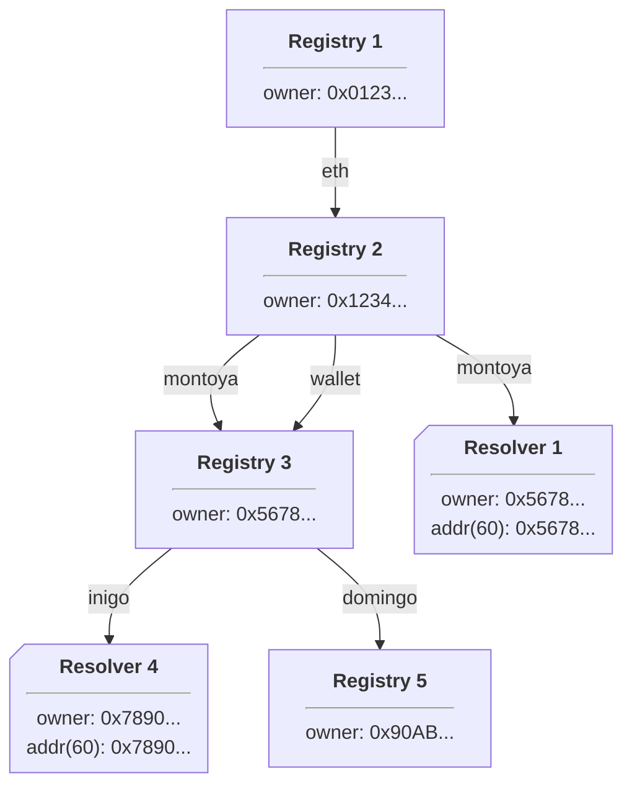

import { FrenCallout } from '../../../components/ensv2/FrenCallout'

# Registry Hierarchy

ENSv2 replaces ENSv1's single flat registry with a hierarchical model where each name can have its own registry for managing subnames. This page explains the tree structure, how resolution works within it, and the implications for name ownership.

<FrenCallout fren="lili" variant="tip">
The contracts and interfaces described here are **not yet final** and may change prior to mainnet deployment.
</FrenCallout>

## From Flat to Hierarchical

ENSv1 used a simple architecture, where a single flat registry maintained a mapping
from all names to their owner and resolver addresses. Hierarchical ownership was enforced
through the use of [namehash](/resolution/names#namehash) to calculate IDs for subnames. This has the advantage of simplicity,
but means that ownership rules are enforced by a single, non-upgradeable contract, and
changes in the status of a parent name do not automatically ripple down to affect
subnames.



In ENSv2, registries are hierarchical: each name can have a resolver and a subregistry:



Here, registries are shown as rectangles, while resolvers are shown as notched rectangles.
Note that the registry for `.eth` has both a subregistry and a resolver defined for `montoya.eth`.
Note also that there's a resolver defined for `inigo.montoya.eth` but no subregistry, while
`domingo.montoya.eth` has a subregistry but no resolver. A name only needs to have a subregistry
defined if it wants the ability to create subnames, and it only needs a resolver defined if it wants to
define records to resolve for that name or its subnames.

## Names as Chains of Entries

A full name like `inigo.montoya.eth` does not exist as a single on-chain object. Instead, it's a chain of entries across registries: `inigo` is an entry in the `montoya.eth` registry, `montoya` is an entry in the `.eth` registry, and these are linked by the `subregistry` field on each entry. This means that on-chain, a "name" always refers to a single label within a specific registry. The full name is reconstructed by walking up the registry hierarchy.

## The IRegistry Interface

Every registry in the hierarchy, whether it's the root registry, a TLD registry like `.eth`, or a user's subname registry, must implement the `IRegistry` interface:

```solidity
interface IRegistry is IRegistryEvents {
    /// Returns the child registry for a label, or address(0) if none exists.
    function getSubregistry(string calldata label) external view returns (IRegistry);

    /// Returns the resolver for a label, or address(0) if none exists.
    function getResolver(string calldata label) external view returns (address);

    /// Returns this registry's parent and the label it's registered under.
    function getParent() external view returns (IRegistry parent, string memory label);
}
```

These three functions are what enable the hierarchical model:

- **`getSubregistry(label)`**: links a name to its child registry. This is how the tree is traversed downward during resolution.
- **`getResolver(label)`**: links a name to its resolver contract. This is how records are found during resolution.
- **`getParent()`**: links a registry back to its parent. This is how the [Universal Resolver V2](/contracts/ensv2/universal-resolver-v2) verifies canonical registry chains.

`IRegistry` is deliberately minimal. It says nothing about tokens, permissions, or name lifecycle. The [Permissioned Registry](/contracts/ensv2/permissioned-registry) is the standard implementation that adds [ERC1155Singleton](/contracts/ensv2/erc1155-singleton) tokenization, [Enhanced Access Control](/contracts/ensv2/enhanced-access-control), expiry management, and [mutable token IDs](/contracts/ensv2/mutable-token-ids). But a custom registry could implement `IRegistry` with entirely different ownership and access models.

### IRegistryEvents

`IRegistry` inherits `IRegistryEvents`, which defines the events any registry is expected to emit:

| Event | Emitted when |
|-------|-------------|
| `LabelRegistered` | A name is registered with an owner |
| `LabelReserved` | A name is reserved (no owner) |
| `LabelUnregistered` | A name is unregistered |
| `ExpiryUpdated` | Expiry extended via `renew()` |
| `SubregistryUpdated` | Child registry pointer changed |
| `ResolverUpdated` | Resolver address changed |
| `TokenRegenerated` | Token ID changed due to role update |
| `ParentUpdated` | Canonical parent reference changed |

## Resolution

Resolution works by walking down the registry tree from root, querying `getResolver()` and `getSubregistry()` at each level. The deepest resolver found along the path wins (longest-suffix match). If a name has no resolver of its own, it inherits the resolver of its closest ancestor that does.

See [Resolution: findResolver](/contracts/ensv2/universal-resolver-v2#resolution-findresolver) on the Universal Resolver V2 page for the full algorithm and step-by-step examples with diagrams.

## Subtree Operations

One consequence of this tree structure is that it becomes possible to delete or reassign entire subtrees in a
single operation. For example, suppose `montoya.eth` is transferred to a new owner, who wants to
configure his own set of subdomains; he can simply replace the subregistry responsible for subnames of
`montoya.eth` with his own new subregistry:



All resolvers and subregistries previously associated with `montoya.eth` are thus removed in a single operation!
The new owner will still need to replace the resolver for `montoya.eth` if he wishes to change how the bare
name itself is resolved, however.

## Namespace Aliasing

This hierarchical structure need not be limited to trees, either; by reusing the same subregistry for more
than one name, entire namespaces can be aliased to each other:



In this example, both `inigo.montoya.eth` and `inigo.wallet.eth` resolve identically, as would any other
subnames with resolvers set. Notably, `domingo.montoya.eth` will resolve using Resolver 1, while
`domingo.wallet.eth` will not resolve at all - there are no resolvers set anywhere in its hierarchy! If we
set a resolver for `domingo` in Registry 3, both names would resolve identically using it, just as they do
for `inigo`.

This example also exposes one other crucial fact about ENSv2: registries have no individual concept of 'their name'.
In earlier diagrams we labelled each registry with a name for convenience, but as these examples demonstrate,
there's no requirement that a registry have exactly one name associated with it - it can have thousands, or none
at all!

## Token Representation and Permissions

Registries in ENSv2 are typically implemented as [ERC1155Singleton](/contracts/ensv2/erc1155-singleton) token contracts, where each subname is an NFT with exactly one owner. Because of the hierarchical structure, merely owning a subname token does not guarantee anything in isolation: the registry must be referenced by a parent registry, and so on up to the root. Client authors must take care in how they represent names to users. The [Universal Resolver V2](/contracts/ensv2/universal-resolver-v2) provides `findCanonicalRegistry()` to verify a registry's position in the hierarchy.

Permissions are managed through [Enhanced Access Control](/contracts/ensv2/enhanced-access-control), a role-based system where each name has its own set of grantable and revokable roles. By selectively revoking roles, all the functionality of the [ENSv1 Name Wrapper](/wrapper/overview) can be replicated. See the [Permissioned Registry](/contracts/ensv2/permissioned-registry) page for the full role table, transfer behavior, and code examples.
