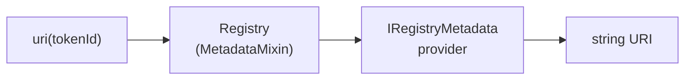

# Registry Metadata

Registries in ENSv2 delegate ERC-1155 metadata to a swappable provider. The registry holds ownership state; the provider decides what `uri()` returns. This separates presentation concerns (image, name, description for marketplaces and indexers) from ownership logic, and lets a single registry serve many metadata strategies.

:::note
The contracts and interfaces described here are **not yet final** and may change prior to mainnet deployment.
:::

## How the Pieces Fit

Three contracts cooperate to produce a token URI:

- **`IRegistryMetadata`**: the provider interface, with a single `tokenUri(uint256) → string` method. Interface selector `0x1675f455`.
- **`MetadataMixin`**: base mixin holding an immutable `METADATA_PROVIDER` address. Its internal `_tokenURI(tokenId)` forwards to the provider, or returns an empty string if the provider is `address(0)`.
- **Registry contract**: inherits `MetadataMixin` and overrides ERC-1155 `uri(tokenId)` to return `_tokenURI(tokenId)`.



The provider is set once at registry construction and is immutable thereafter. To change the URI strategy you upgrade or replace the registry, or build a provider that itself looks up data from another contract.

## Stock Implementations

Two providers ship with the protocol. Both inherit [Enhanced Access Control](/contracts/ensv2/enhanced-access-control) and gate updates with a single role.

### `SimpleRegistryMetadata`

Stores a distinct URI per token in a `mapping(uint256 => string)`.

```solidity
function setTokenUri(uint256 tokenId, string calldata uri) external;
function tokenUri(uint256 tokenId) external view returns (string memory);
```

`setTokenUri` is gated by `_ROLE_UPDATE_METADATA` (bit 0) on the `ROOT_RESOURCE`. Use this when each name needs its own metadata payload, for example per-name SVG art or off-chain JSON URIs.

### `BaseUriRegistryMetadata`

Returns a single shared base URI for every token; the `tokenId` argument is ignored.

```solidity
function setTokenBaseUri(string calldata uri) external;
function tokenUri(uint256 /* tokenId */) external view returns (string memory);
```

Same role and scope as above. Use this when a single template URI (e.g. `https://example.com/metadata/{id}.json` resolved by the indexer) is enough.

## The Metadata Update Role

Each metadata contract runs its own EAC instance, separate from the registry's. The role bit is local: granting `_ROLE_UPDATE_METADATA` on a metadata contract does not give the holder any role on the registry, and vice versa. At deployment, all roles on the metadata contract are granted to the deployer.

| Role                          | Bit | Scope     | Purpose                         |
| ----------------------------- | --- | --------- | ------------------------------- |
| `_ROLE_UPDATE_METADATA`       | 0   | root only | Update token URI(s)             |
| `_ROLE_UPDATE_METADATA_ADMIN` | 128 | root only | Grant or revoke the update role |

## Building a Custom Provider

Implement `IRegistryMetadata` and pass the address to the registry constructor:

```solidity
contract MyMetadata is IRegistryMetadata {
    function tokenUri(uint256 tokenId) external view returns (string memory) {
        // compose SVG, fetch from another contract, derive from on-chain state, etc.
    }
}
```

Common patterns:

- Deterministic SVG composition from on-chain state (no off-chain dependency).
- URL templates parameterised by token ID and resolved by an indexer.
- A registry of registries: a single provider that routes by token ID range.

## Where the URI Ends Up

The provider's output is returned via the registry's standard ERC-1155 `uri()`. Indexers, marketplaces, and the ENS metadata service pick it up from there. Wallets that ignore subname tokens may not query it at all; that is a client concern, not a registry concern.
