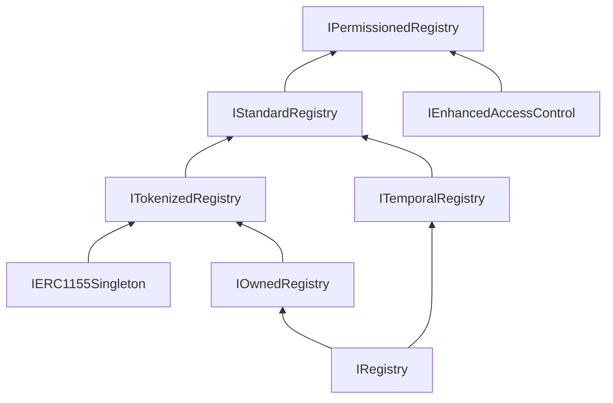

import { FrenCallout } from '../../../components/ensv2/FrenCallout'

# Registry Template

In ENSv1, different parts of the namespace used different registry contracts: the root ENS Registry, the Name Wrapper, and dedicated subname registrars were all separate, incompatible implementations. ENSv2 unifies this with a single extensible base: **PermissionedRegistry**.

<FrenCallout fren="lili" variant="tip">
The contracts and interfaces described here are **not yet final** and may change prior to mainnet deployment.
</FrenCallout>

## One Registry to Rule Them All

[PermissionedRegistry](/contracts/ensv2/permissioned-registry) is not just the contract that manages `.eth` names. It's the template that every registry in the ENSv2 hierarchy is built from. Whether it's the root `.eth` registry, a project running a subdomain service, or a DAO managing community names, they all use the same base contract.

This means every registry in the tree shares the same:

- **[ERC1155Singleton](/contracts/ensv2/erc1155-singleton)** token model: each name is an NFT with a single owner
- **[Enhanced Access Control](/contracts/ensv2/enhanced-access-control)** permission system: roles, admin roles, resource scoping
- **[Mutable Token IDs](/contracts/ensv2/mutable-token-ids)**: version counters that protect against stale permissions and transfer griefing
- **[anyId polymorphism](/contracts/ensv2/mutable-token-ids#anyid-polymorphism)**: accept labelhash, tokenId, or resource interchangeably
- **Name lifecycle**: the same AVAILABLE → REGISTERED state machine (with optional reservation)

## Customizing via Inheritance

To create a custom registry, you inherit from `PermissionedRegistry` and override the behaviors you need. The base contract is designed with virtual functions at the key extension points.

ENSv2 ships two derived registries:

- **UserRegistry**: for user-owned subdomain registries (described below)
- **WrapperRegistry**: a migration-specific variant that receives locked Name Wrapper tokens from ENSv1 (see [Migration](/contracts/ensv2/migration))

### UserRegistry

A UUPS-upgradeable proxy designed for user-owned subdomain registries. It adds:

- Proxy-based deployment via [`VerifiableFactory`](/contracts/ensv2/verifiable-factory) (cheap per-name deployments)
- An `initialize()` function that grants initial roles to the `rootAccount`
- Upgrade authorization gated by `ROLE_UPGRADE`

```solidity
contract UserRegistry is Initializable, PermissionedRegistry, UUPSUpgradeable, IProxyAuthorization {
    // ... constructor, supportsInterface, _authorizeUpgrade omitted

    function initialize(address rootAccount, uint256 roleBitmap) public initializer {
        if (rootAccount == address(0)) {
            revert InvalidOwner();
        }
        emit RegistryCreated();
        _grantRoles(ROOT_RESOURCE, roleBitmap, rootAccount, false);
    }
}
```

This is the registry that gets deployed when someone creates subnames under their name. Each child namespace gets its own `UserRegistry` proxy instance.

## Registry Interface Hierarchy

Registry functionality is split across layered interfaces. Each layer adds a capability, and PermissionedRegistry implements all of them. A custom registry can implement only the layers it needs.



| Interface | Extends | Adds |
|-----------|---------|------|
| `IRegistry` | `IRegistryEvents` | `getSubregistry`, `getResolver`, `getParent` |
| `IOwnedRegistry` | `IRegistry` | `findOwner` |
| `ITemporalRegistry` | `IRegistry` | `findExpiry` |
| `ITokenizedRegistry` | `IOwnedRegistry`, `IERC1155Singleton` | `findTokenId` |
| `IStandardRegistry` | `ITemporalRegistry`, `ITokenizedRegistry` | `register`, `renew`, `unregister`, `setSubregistry`, `setResolver`, `setParent`, `getExpiry` |
| `IPermissionedRegistry` | `IStandardRegistry`, `IEnhancedAccessControl` | `latestOwnerOf`, `getState`, `getStatus`, `getResource`, `getTokenId` |

`IRegistry` is the minimum for participating in ENS resolution: the [Universal Resolver V2](/contracts/ensv2/universal-resolver-v2) only needs `getSubregistry`, `getResolver`, and `getParent` to walk the hierarchy. The intermediate interfaces are opt-in capability layers that URv2 detects via [ERC-165](https://eips.ethereum.org/EIPS/eip-165) (for example, [`findOwner`](/contracts/ensv2/universal-resolver-v2#findowner) checks for `IOwnedRegistry` before calling it). Most custom registries should extend PermissionedRegistry directly for the full feature set.

### Which Interface to Target

| Goal | Interface | What you get |
|------|-----------|-------------|
| Resolution only (no ownership or tokens) | `IRegistry` | Participates in the hierarchy, URv2 can resolve through it |
| Resolution + ownership queries | `IOwnedRegistry` | URv2's `findOwner` works |
| Full ENS-compatible registry | `IStandardRegistry` | Tokens, expiry, lifecycle, compatible with ENSjs and indexers |
| Full registry + permissions | Extend `PermissionedRegistry` | Everything above, plus EAC roles out of the box |

PermissionedRegistry registers all of these interfaces via ERC-165 (`supportsInterface`), so external contracts can detect exactly which capabilities a given registry supports at runtime.

## Configuration Patterns

While every registry uses the same base contract, the way roles are configured determines the trust model. The two main patterns are:

### Fully Controlled (Managed)

The registry operator keeps operational roles on `ROOT_RESOURCE` and configures each name's token roles at registration via the `roleBitmap` parameter of `register()`. This gives the operator flexibility to decide exactly how much control each name owner gets.

For example, a company managing `xyzcompany.eth` subnames for its members could:

**Operator roles on `ROOT_RESOURCE`:**
- `ROLE_REGISTRAR`: register new member names
- `ROLE_UNREGISTER`: remove members who leave
- `ROLE_RENEW`: extend member name expiry
- `ROLE_SET_RESOLVER`: set or override resolvers for any member
- `ROLE_SET_SUBREGISTRY`: override or set subregistry for any member

**Member token roles (set per name at registration):**
- Give `ROLE_SET_RESOLVER` if members should control their own records
- Withhold `ROLE_CAN_TRANSFER_ADMIN` if members shouldn't transfer their name (admin-only role; there is no non-admin `ROLE_CAN_TRANSFER`)
- Withhold `ROLE_SET_SUBREGISTRY` if members shouldn't create sub-subnames

Since the roles on `ROOT_RESOURCE` overlap with member token roles (e.g. the operator also holds `ROLE_SET_RESOLVER`), the operator retains the ability to override individual members. This is intentional for managed setups where the operator needs administrative access.

### Emancipated (ETH-like)

An emancipated registry separates operator and owner roles so that no `ROOT_RESOURCE` role can interfere with individual name owners. This is how the `.eth` registry works: the registrar holds only `ROLE_REGISTRAR` and `ROLE_RENEW`, while name owners hold `ROLE_SET_RESOLVER`, `ROLE_SET_SUBREGISTRY`, and `ROLE_CAN_TRANSFER_ADMIN` on their own tokens.

See [Permissioned Registry: Emancipation](/contracts/ensv2/permissioned-registry#emancipation) for the full definition, verification steps, and how emancipation works across the hierarchy.

## Building Your Own Registry

To build a custom registry for your project, extend `PermissionedRegistry` and override what you need. Common customization points include:

| Override | Purpose | Example |
| -------- | ------- | ------- |
| `register()` | Custom registration logic | Add allowlists, custom pricing, or validation |
| `getResolver()` / `getSubregistry()` | Custom resolution behavior | Fallback to external data sources |
| `_authorizeUpgrade()` (requires `UUPSUpgradeable`) | Upgrade control | Gate upgrades behind a multisig or governance |

All of the inherited infrastructure (EAC roles, ERC1155 tokens, anyId polymorphism, the name lifecycle state machine) works out of the box. You only override the parts you want to change.
