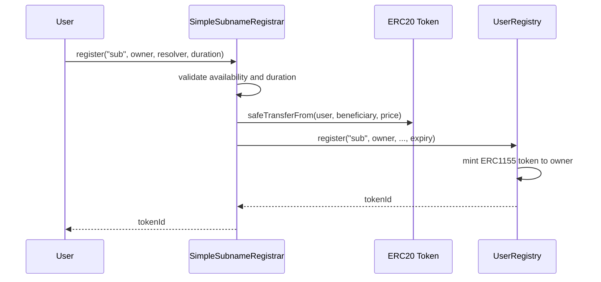

import { FrenCallout } from '../../../components/ensv2/FrenCallout'

# For Contract Developers

This guide walks through building a simplified subname registrar: a minimal smart contract that lets users register and renew subnames under a parent name you own. It demonstrates the core pattern that all ENSv2 registrars follow, including the production [ETH Registrar](/contracts/ensv2/eth-registrar).

The registrar built here is based on the ETH Registrar, but heavily simplified: commit-reveal, oracle-based pricing, grace periods, and referral tracking are stripped away, leaving the essentials of availability checks, flat-fee ERC20 payments, registration, and renewal.

By the end you will know how a registrar interfaces with an ENSv2 registry at the contract level, how the two are connected and authorized, how to interact with them through a client library like viem, and how to index the events they emit.

<FrenCallout fren="lili" variant="tip">
The contracts and interfaces described here are **not yet final** and may change prior to mainnet deployment.
</FrenCallout>

<FrenCallout fren="bittu" variant="tip" title="Prerequisites">
You should understand the basics of the [Permissioned Registry](/contracts/ensv2/permissioned-registry) (where names are stored and permissions are enforced), [Enhanced Access Control](/contracts/ensv2/enhanced-access-control) (the role-based permission system), and the [Verifiable Factory](/contracts/ensv2/verifiable-factory) (how per-name registries are deployed).
</FrenCallout>

## Architecture

In ENSv2, registries and registrars have distinct responsibilities. The **registry** (a [Permissioned Registry](/contracts/ensv2/permissioned-registry) or [UserRegistry](/contracts/ensv2/registry-template#userregistry)) stores names, manages ERC1155 tokens, and enforces permissions. Since each registry is its own contract, the subnames it manages form their own NFT collection, distinct from `.eth` names and from every other subname project. The **registrar** is a separate contract that sits in front of the registry and handles business logic: pricing, payment collection, availability checks, and any registration constraints.

The registrar calls `registry.register()` to create names and `registry.renew()` to extend them. For this to work, the registry owner must grant the registrar two roles on `ROOT_RESOURCE` (the registry-wide resource, whose roles apply to every name in the registry; see [Enhanced Access Control](/contracts/ensv2/enhanced-access-control)):

| Role | Value | Purpose |
|------|-------|---------|
| `ROLE_REGISTRAR` | `1 << 0` | Authorizes calling `register()` on the registry |
| `ROLE_RENEW` | `1 << 16` | Authorizes calling `renew()` on the registry |

The registrar itself does not store names or manage tokens. It is a thin gatekeeper that validates inputs, collects payment, and delegates to the registry.



## Project Setup

This tutorial uses [Foundry](https://getfoundry.sh/). Install the ENSv2 contracts directly from their GitHub repository:

```bash
forge init simple-subname-registrar && cd simple-subname-registrar
forge install ensdomains/contracts-v2
```

The repository brings its own OpenZeppelin checkout along as a git submodule, so no separate OpenZeppelin install is needed. Add both remappings to `foundry.toml` so the import paths used below resolve:

```toml
remappings = [
    "@ensdomains/contracts-v2/=lib/contracts-v2/contracts/src/",
    "@openzeppelin/contracts/=lib/contracts-v2/contracts/lib/openzeppelin-contracts/contracts/",
]
```

You will build the contract in `src/SimpleSubnameRegistrar.sol`. Run `forge build` after each section to check your progress.

## Building the Contract

### Imports and Role Bitmap

Start the file with the pragma and imports:

```solidity
// SPDX-License-Identifier: MIT
pragma solidity ^0.8.20;

import {SafeERC20, IERC20} from "@openzeppelin/contracts/token/ERC20/utils/SafeERC20.sol";
import {IPermissionedRegistry} from "@ensdomains/contracts-v2/registry/interfaces/IPermissionedRegistry.sol";
import {IRegistry} from "@ensdomains/contracts-v2/registry/interfaces/IRegistry.sol";
import {RegistryRolesLib} from "@ensdomains/contracts-v2/registry/libraries/RegistryRolesLib.sol";
```

Next, define `REGISTRATION_ROLE_BITMAP` as a file-level constant, between the imports and the contract declaration. It determines what permissions each name owner receives at registration. We use the same bitmap as the [ETH Registrar](/contracts/ensv2/eth-registrar#roles-granted-at-registration):

```solidity
uint256 constant REGISTRATION_ROLE_BITMAP =
    RegistryRolesLib.ROLE_SET_SUBREGISTRY
    | RegistryRolesLib.ROLE_SET_SUBREGISTRY_ADMIN
    | RegistryRolesLib.ROLE_SET_RESOLVER
    | RegistryRolesLib.ROLE_SET_RESOLVER_ADMIN
    | RegistryRolesLib.ROLE_CAN_TRANSFER_ADMIN;
```

This grants name owners the ability to change their resolver, set up a child registry for sub-subnames, and transfer their name. The `_ADMIN` variants of the two setter roles let owners delegate those permissions to other accounts. `ROLE_CAN_TRANSFER_ADMIN` works differently: it is the transfer permission itself, an admin-only role with no non-admin counterpart. See [EAC roles](/contracts/ensv2/enhanced-access-control) for full details.

<FrenCallout fren="earl" variant="note" title="Definition – Role Bitmap">
A role bitmap is a 256-bit integer where each role occupies one 4-bit slot (nybble); see [Bitmap Layout](/contracts/ensv2/enhanced-access-control#bitmap-layout). When `register()` is called on the registry, the bitmap determines which [EAC](/contracts/ensv2/enhanced-access-control) roles the new owner receives on their name's resource. Different registrars can use different bitmaps to create different trust models.
</FrenCallout>

### Contract Shell

The contract stores its configuration as immutable values set at deployment. All five parameters are fixed for the lifetime of the registrar: which registry it manages, which token it accepts, where payments go, the annual price, and the minimum registration duration.

```solidity
contract SimpleSubnameRegistrar {
    using SafeERC20 for IERC20;

    error NameNotAvailable(string label);
    error NameNotRegistered(string label);
    error InvalidOwner();
    error DurationTooShort(uint64 duration, uint64 minimum);

    event NameRegistered(
        uint256 indexed tokenId, string label, address owner,
        uint64 duration, uint256 price
    );
    event NameRenewed(
        uint256 indexed tokenId, string label,
        uint64 duration, uint64 newExpiry, uint256 price
    );

    IPermissionedRegistry public immutable REGISTRY;
    IERC20 public immutable PAYMENT_TOKEN;
    address public immutable BENEFICIARY;
    uint256 public immutable PRICE;
    uint64 public immutable MIN_DURATION;

    constructor(
        IPermissionedRegistry registry,
        IERC20 paymentToken,
        address beneficiary,
        uint256 price,
        uint64 minDuration
    ) {
        REGISTRY = registry;
        PAYMENT_TOKEN = paymentToken;
        BENEFICIARY = beneficiary;
        PRICE = price;
        MIN_DURATION = minDuration;
    }
```

`PRICE` is denominated in the payment token's smallest unit (e.g., for USDC with 6 decimals, a price of `5_000_000` means $5/year). `MIN_DURATION` is in seconds.

All functions in the following sections go inside this contract body.

### Checking Availability

To check whether a label is available for registration, query the registry's `getState()` function. It returns a [State struct](/contracts/ensv2/permissioned-registry#querying-name-state) containing the name's status, expiry, latest owner (`latestOwner`), token ID, and resource. A name is available if its status is `AVAILABLE` (either never registered or expired).

The `getState()` function accepts an [anyId](/contracts/ensv2/mutable-token-ids#anyid-polymorphism): a labelhash, token ID, or resource. For a fresh lookup by label, use the labelhash (`keccak256(bytes(label))`).

```solidity
    function isAvailable(string calldata label) public view returns (bool) {
        IPermissionedRegistry.State memory state =
            REGISTRY.getState(uint256(keccak256(bytes(label))));
        return state.status == IPermissionedRegistry.Status.AVAILABLE;
    }

    function getPrice(uint64 duration) public view returns (uint256) {
        return PRICE * duration / 365 days;
    }
```

`getPrice()` pro-rates the annual price by duration. For example, if `PRICE` is 5 USDC and `duration` is six months (15768000 seconds), the cost is ~2.5 USDC. Integer division truncates toward zero, so pick `PRICE` and `MIN_DURATION` such that the minimum charge (`PRICE * MIN_DURATION / 365 days`) stays well above zero; otherwise short registrations become free.

### Registering Names

The `register()` function validates inputs, collects payment, and delegates to `REGISTRY.register()`. The registry handles all token minting and role assignment internally.

```solidity
    function register(
        string calldata label,
        address owner,
        address resolver,
        uint64 duration
    ) external returns (uint256 tokenId) {
        if (!isAvailable(label)) revert NameNotAvailable(label);
        if (owner == address(0)) revert InvalidOwner();
        if (duration < MIN_DURATION) revert DurationTooShort(duration, MIN_DURATION);

        uint256 price = getPrice(duration);
        PAYMENT_TOKEN.safeTransferFrom(msg.sender, BENEFICIARY, price);

        tokenId = REGISTRY.register(
            label,
            owner,
            IRegistry(address(0)),
            resolver,
            REGISTRATION_ROLE_BITMAP,
            uint64(block.timestamp) + duration
        );

        emit NameRegistered(tokenId, label, owner, duration, price);
    }
```

A few things to note about the `REGISTRY.register()` call:

- `label` is the subname label only (e.g., `"sub"` for `sub.nick.eth`), not the full name
- `IRegistry(address(0))` means no child registry is set; the owner can set one later via `setSubregistry()` if they want sub-subnames
- `resolver` is the address of a [Permissioned Resolver](/contracts/ensv2/permissioned-resolver) proxy (or any contract implementing the resolver interface), typically [deployed per account via the Verifiable Factory](/contracts/ensv2/verifiable-factory#deploying-a-resolver-proxy); the owner can change it later with `setResolver()` since they hold `ROLE_SET_RESOLVER`
- `expiry` is an **absolute Unix timestamp**, not a duration
- The returned `tokenId` is the [ERC1155Singleton](/contracts/ensv2/erc1155-singleton) token minted to the owner

<FrenCallout fren="bittu" variant="tip" title="Developer tip">
Unlike the ETH Registrar, this contract does not use commit-reveal. Commit-reveal prevents front-running by hiding registration parameters until after the commitment is recorded. For subnames this is typically unnecessary: the parent name owner controls the registry and can [reserve names](/contracts/ensv2/permissioned-registry#name-lifecycle) if needed.
</FrenCallout>

### Renewing Names

Renewal extends a name's expiry without changing ownership or permissions. Anyone can renew any name (not just the owner), which matches the ETH Registrar's behavior.

```solidity
    function renew(string calldata label, uint64 duration) external {
        if (duration < MIN_DURATION) revert DurationTooShort(duration, MIN_DURATION);

        uint256 labelId = uint256(keccak256(bytes(label)));
        IPermissionedRegistry.State memory state = REGISTRY.getState(labelId);

        if (state.status != IPermissionedRegistry.Status.REGISTERED) {
            revert NameNotRegistered(label);
        }

        uint256 price = getPrice(duration);
        PAYMENT_TOKEN.safeTransferFrom(msg.sender, BENEFICIARY, price);

        uint64 newExpiry = state.expiry + duration;
        REGISTRY.renew(labelId, newExpiry);

        emit NameRenewed(state.tokenId, label, duration, newExpiry, price);
    }
}
```

The registry's `renew()` function accepts an [anyId](/contracts/ensv2/mutable-token-ids#anyid-polymorphism) (here we pass the labelhash) and an absolute `newExpiry` timestamp. The registry enforces that `newExpiry >= oldExpiry`, so the expiry can only increase.

The closing brace after `renew()` completes the contract. The full file is below; `forge build` should compile it cleanly.

<details>
<summary>View the complete SimpleSubnameRegistrar.sol</summary>

```solidity
// SPDX-License-Identifier: MIT
pragma solidity ^0.8.20;

import {SafeERC20, IERC20} from "@openzeppelin/contracts/token/ERC20/utils/SafeERC20.sol";
import {IPermissionedRegistry} from "@ensdomains/contracts-v2/registry/interfaces/IPermissionedRegistry.sol";
import {IRegistry} from "@ensdomains/contracts-v2/registry/interfaces/IRegistry.sol";
import {RegistryRolesLib} from "@ensdomains/contracts-v2/registry/libraries/RegistryRolesLib.sol";

uint256 constant REGISTRATION_ROLE_BITMAP =
    RegistryRolesLib.ROLE_SET_SUBREGISTRY
    | RegistryRolesLib.ROLE_SET_SUBREGISTRY_ADMIN
    | RegistryRolesLib.ROLE_SET_RESOLVER
    | RegistryRolesLib.ROLE_SET_RESOLVER_ADMIN
    | RegistryRolesLib.ROLE_CAN_TRANSFER_ADMIN;

contract SimpleSubnameRegistrar {
    using SafeERC20 for IERC20;

    error NameNotAvailable(string label);
    error NameNotRegistered(string label);
    error InvalidOwner();
    error DurationTooShort(uint64 duration, uint64 minimum);

    event NameRegistered(
        uint256 indexed tokenId, string label, address owner,
        uint64 duration, uint256 price
    );
    event NameRenewed(
        uint256 indexed tokenId, string label,
        uint64 duration, uint64 newExpiry, uint256 price
    );

    IPermissionedRegistry public immutable REGISTRY;
    IERC20 public immutable PAYMENT_TOKEN;
    address public immutable BENEFICIARY;
    uint256 public immutable PRICE;
    uint64 public immutable MIN_DURATION;

    constructor(
        IPermissionedRegistry registry,
        IERC20 paymentToken,
        address beneficiary,
        uint256 price,
        uint64 minDuration
    ) {
        REGISTRY = registry;
        PAYMENT_TOKEN = paymentToken;
        BENEFICIARY = beneficiary;
        PRICE = price;
        MIN_DURATION = minDuration;
    }

    function isAvailable(string calldata label) public view returns (bool) {
        IPermissionedRegistry.State memory state =
            REGISTRY.getState(uint256(keccak256(bytes(label))));
        return state.status == IPermissionedRegistry.Status.AVAILABLE;
    }

    function getPrice(uint64 duration) public view returns (uint256) {
        return PRICE * duration / 365 days;
    }

    function register(
        string calldata label,
        address owner,
        address resolver,
        uint64 duration
    ) external returns (uint256 tokenId) {
        if (!isAvailable(label)) revert NameNotAvailable(label);
        if (owner == address(0)) revert InvalidOwner();
        if (duration < MIN_DURATION) revert DurationTooShort(duration, MIN_DURATION);

        uint256 price = getPrice(duration);
        PAYMENT_TOKEN.safeTransferFrom(msg.sender, BENEFICIARY, price);

        tokenId = REGISTRY.register(
            label,
            owner,
            IRegistry(address(0)),
            resolver,
            REGISTRATION_ROLE_BITMAP,
            uint64(block.timestamp) + duration
        );

        emit NameRegistered(tokenId, label, owner, duration, price);
    }

    function renew(string calldata label, uint64 duration) external {
        if (duration < MIN_DURATION) revert DurationTooShort(duration, MIN_DURATION);

        uint256 labelId = uint256(keccak256(bytes(label)));
        IPermissionedRegistry.State memory state = REGISTRY.getState(labelId);

        if (state.status != IPermissionedRegistry.Status.REGISTERED) {
            revert NameNotRegistered(label);
        }

        uint256 price = getPrice(duration);
        PAYMENT_TOKEN.safeTransferFrom(msg.sender, BENEFICIARY, price);

        uint64 newExpiry = state.expiry + duration;
        REGISTRY.renew(labelId, newExpiry);

        emit NameRenewed(state.tokenId, label, duration, newExpiry, price);
    }
}
```

</details>

<FrenCallout fren="kuzco" variant="warning" title="Watch out!">
This contract is provided for educational purposes only, not as a production-grade implementation. It is intentionally minimal and unaudited; review, test, and harden it before using it for anything real.
</FrenCallout>

## Deploying and Authorizing

### Set Up the UserRegistry

The registrar needs a registry to register into. If your parent name does not have one yet, two setup steps are required: deploy a UserRegistry proxy via the [Verifiable Factory](/contracts/ensv2/verifiable-factory), then point your parent name at it with `setSubregistry()` on the parent registry.

The second step is what connects the new registry to the ENS hierarchy. The [Universal Resolver](/contracts/ensv2/universal-resolver-v2) finds subnames by walking `getSubregistry()` calls down from the root, so until your parent name points at the UserRegistry, names registered in it mint tokens but never resolve.

The `wallet` object in the TypeScript snippets on this page is a viem wallet client; its setup is shown in [Client Integration](#client-integration) below.

```typescript
// 1. Deploy the UserRegistry proxy
const initData = encodeFunctionData({
  abi: userRegistryAbi,
  functionName: 'initialize',
  args: [ownerAddress, roleBitmap],
})
const deployHash = await wallet.writeContract({
  address: verifiableFactoryAddress,
  abi: verifiableFactoryAbi,
  functionName: 'deployProxy',
  args: [userRegistryImplAddress, salt, initData],
})
// Read the proxy address from the ProxyDeployed event in the receipt

// 2. Point the parent name at it
// (here: nick.eth, so this runs on the .eth registry)
await wallet.writeContract({
  address: ethRegistryAddress,
  abi: permissionedRegistryAbi,
  functionName: 'setSubregistry',
  args: [BigInt(keccak256(toHex('nick'))), userRegistryAddress],
})
```

You hold `ROLE_SET_SUBREGISTRY` on your name from registration, so the second call needs no extra setup. For the first call, choose the `roleBitmap` carefully: granting a role later via `grantRootRoles()` requires holding that role's `_ADMIN` variant, so the bitmap passed to `initialize()` must include at least `ROLE_REGISTRAR_ADMIN` and `ROLE_RENEW_ADMIN` for the authorization step below to succeed.

### Deploy the Registrar

The registrar is a plain contract (not a proxy), so deployment is straightforward. You need:

- The address of your UserRegistry (from the previous step)
- An ERC20 payment token address
- A beneficiary address for receiving payments
- The annual price in the token's smallest unit
- A minimum registration duration in seconds

```solidity
SimpleSubnameRegistrar registrar = new SimpleSubnameRegistrar(
    IPermissionedRegistry(userRegistryAddress),
    IERC20(usdcAddress),
    beneficiaryAddress,
    5_000_000,      // 5 USDC per year (6 decimals)
    30 days          // minimum 30-day registration
);
```

### Grant Roles to the Registrar

After deployment, the registry owner must grant the registrar `ROLE_REGISTRAR` and `ROLE_RENEW` on `ROOT_RESOURCE`. Without these roles, calls to `registry.register()` and `registry.renew()` will revert.

In Solidity:

```solidity
registry.grantRootRoles(
    RegistryRolesLib.ROLE_REGISTRAR | RegistryRolesLib.ROLE_RENEW,
    address(registrar)
);
```

Or via viem:

```typescript
const ROLE_REGISTRAR = 1n << 0n
const ROLE_RENEW = 1n << 16n

await wallet.writeContract({
  address: userRegistryAddress,
  abi: [{
    name: 'grantRootRoles',
    type: 'function',
    stateMutability: 'nonpayable',
    inputs: [
      { name: 'roleBitmap', type: 'uint256' },
      { name: 'account', type: 'address' },
    ],
    outputs: [{ name: '', type: 'bool' }],
  }],
  functionName: 'grantRootRoles',
  args: [ROLE_REGISTRAR | ROLE_RENEW, registrarAddress],
})
```

<FrenCallout fren="kuzco" variant="warning" title="Watch out!">
`ROLE_REGISTRAR` authorizes the registrar to register **any** name under your registry, and `ROLE_RENEW` lets it extend **any** name's expiry. Only grant these roles to contracts you trust and have audited.
</FrenCallout>

Trust works in both directions: the roles that remain on `ROOT_RESOURCE` define how much subname owners must trust *you*. See [Configuration Patterns](/contracts/ensv2/registry-template#configuration-patterns) for the managed versus emancipated trade-off, and [Emancipation](/contracts/ensv2/permissioned-registry#emancipation) for how owners can verify your registry's setup.

## Client Integration

Once the registrar is deployed and authorized, users interact with it via standard `writeContract` calls. Here is a complete example using viem. ENSv2 is currently deployed on Sepolia, so the clients target that chain; in a browser app you would create the wallet client with `custom(window.ethereum)` instead of a private key account.

```typescript
import { createPublicClient, createWalletClient, http } from 'viem'
import { privateKeyToAccount } from 'viem/accounts'
import { sepolia } from 'viem/chains'

const registrarAddress = '0x...'   // your deployed SimpleSubnameRegistrar
const paymentTokenAddress = '0x...' // ERC20 payment token (e.g., USDC)

const account = privateKeyToAccount(process.env.PRIVATE_KEY as `0x${string}`)
const client = createPublicClient({ chain: sepolia, transport: http() })
const wallet = createWalletClient({ account, chain: sepolia, transport: http() })

const simpleRegistrarAbi = [
  {
    name: 'isAvailable', type: 'function', stateMutability: 'view',
    inputs: [{ name: 'label', type: 'string' }],
    outputs: [{ name: '', type: 'bool' }],
  },
  {
    name: 'getPrice', type: 'function', stateMutability: 'view',
    inputs: [{ name: 'duration', type: 'uint64' }],
    outputs: [{ name: '', type: 'uint256' }],
  },
  {
    name: 'register', type: 'function', stateMutability: 'nonpayable',
    inputs: [
      { name: 'label', type: 'string' },
      { name: 'owner', type: 'address' },
      { name: 'resolver', type: 'address' },
      { name: 'duration', type: 'uint64' },
    ],
    outputs: [{ name: 'tokenId', type: 'uint256' }],
  },
  {
    name: 'renew', type: 'function', stateMutability: 'nonpayable',
    inputs: [
      { name: 'label', type: 'string' },
      { name: 'duration', type: 'uint64' },
    ],
    outputs: [],
  },
] as const
```

### Check Availability and Price

```typescript
const available = await client.readContract({
  address: registrarAddress,
  abi: simpleRegistrarAbi,
  functionName: 'isAvailable',
  args: ['sub'],
})

const oneYear = BigInt(365 * 24 * 60 * 60)
const price = await client.readContract({
  address: registrarAddress,
  abi: simpleRegistrarAbi,
  functionName: 'getPrice',
  args: [oneYear],
})
```

### Register a Subname

Before calling `register()`, the caller must approve the registrar to spend the payment token:

```typescript
import { erc20Abi } from 'viem'

// Approve the registrar to spend the payment token
await wallet.writeContract({
  address: paymentTokenAddress,
  abi: erc20Abi,
  functionName: 'approve',
  args: [registrarAddress, price],
})

// Register sub.nick.eth
const hash = await wallet.writeContract({
  address: registrarAddress,
  abi: simpleRegistrarAbi,
  functionName: 'register',
  args: ['sub', ownerAddress, resolverAddress, oneYear],
})
```

To confirm the registration worked, check availability again; it should now return `false`:

```typescript
const stillAvailable = await client.readContract({
  address: registrarAddress,
  abi: simpleRegistrarAbi,
  functionName: 'isAvailable',
  args: ['sub'],
})
console.log(stillAvailable) // false
```

Once the owner sets records on the resolver, the name resolves like any other ENS name (e.g., via viem's `getEnsAddress`).

### Renew a Subname

```typescript
// Approve payment for renewal
await wallet.writeContract({
  address: paymentTokenAddress,
  abi: erc20Abi,
  functionName: 'approve',
  args: [registrarAddress, price],
})

// Extend sub.nick.eth by one year
await wallet.writeContract({
  address: registrarAddress,
  abi: simpleRegistrarAbi,
  functionName: 'renew',
  args: ['sub', oneYear],
})
```

## Events and Indexing

A single `register()` call triggers events from **two contracts**: the registrar and the underlying registry. If you are building an indexer, you need to listen to both.

**From the registrar:**

| Event | Fields |
|-------|--------|
| `NameRegistered` | `tokenId`, `label`, `owner`, `duration`, `price` |
| `NameRenewed` | `tokenId`, `label`, `duration`, `newExpiry`, `price` |

**From the registry** (emitted inside `REGISTRY.register()`):

| Event | Purpose |
|-------|---------|
| `LabelRegistered` | Records the label, owner, expiry, and sender |
| `TokenResource` | Associates the ERC1155 token ID with the EAC resource |
| `TransferSingle` | ERC1155 mint (from `address(0)` to owner) |
| `ResolverUpdated` | Records the resolver address (if not `address(0)`) |

Renewals follow the same pattern: `renew()` emits the registrar's `NameRenewed` and the registry's `ExpiryUpdated`. Indexing only the registrar's events would miss renewals performed by other `ROLE_RENEW` holders directly on the registry.

<FrenCallout fren="kuzco" variant="warning" title="Watch out!">
Both custom events index the token ID, but token IDs in ENSv2 are **mutable**: they change whenever roles are granted or revoked on a name, and on re-registration after expiry. Key your index on the labelhash and follow `TokenRegenerated` events to track ID changes. See [Mutable Token IDs](/contracts/ensv2/mutable-token-ids#dont-cache-token-ids).
</FrenCallout>

For the full event reference, parameter details, and indexing patterns, see [Indexing ENSv2](/contracts/ensv2/indexing).

## Troubleshooting

| Symptom | Likely cause |
|---------|--------------|
| `register()` or `renew()` reverts with `EACUnauthorizedAccountRoles` | The registrar was not granted `ROLE_REGISTRAR` (or `ROLE_RENEW`) on the registry's `ROOT_RESOURCE` |
| `grantRootRoles()` reverts with `EACCannotGrantRoles` | The caller does not hold the `_ADMIN` variants of the roles being granted; check the `roleBitmap` passed to the UserRegistry's `initialize()` |
| `register()` reverts with an ERC20 allowance error | The caller did not `approve()` the registrar for the payment token, or approved less than `getPrice(duration)` |
| Registration succeeds but the name does not resolve | The parent name does not point at the UserRegistry; call `setSubregistry()` (see [Set Up the UserRegistry](#set-up-the-userregistry)), and make sure the name's resolver has records set |

## Next Steps

The `SimpleSubnameRegistrar` covers the core registration pattern. Here are common extensions you might add:

- **Commit-reveal**: prevent front-running by requiring a commitment before registration. See how the [ETH Registrar](/contracts/ensv2/eth-registrar#commit-reveal) implements this.
- **Allowlists or NFT-gating**: restrict who can register by checking token balances or merkle proofs in `register()`.
- **Custom role bitmaps**: use different `REGISTRATION_ROLE_BITMAP` values for different registration tiers (e.g., premium names get fewer restrictions).
- **Infinite-duration claims**: for permanent subnames, pass `type(uint64).max` as the expiry instead of computing it from a duration. `renew()` and the `ROLE_RENEW` grant become unnecessary, but abandoned names never return to the available pool; removing one then requires the operator to hold `ROLE_UNREGISTER`, a trust tradeoff expiry-based recycling avoids.
- **Grace periods**: keep expired names renewable for a window before they become available to others.
- **Custom registries**: for deeper customization, build your own registry by extending `PermissionedRegistry` directly. See [Registry Template](/contracts/ensv2/registry-template#building-your-own-registry).
