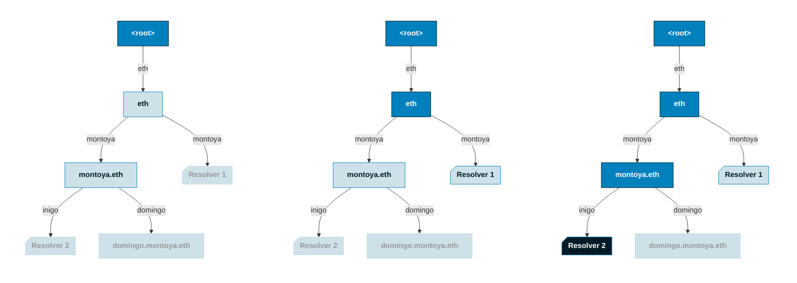
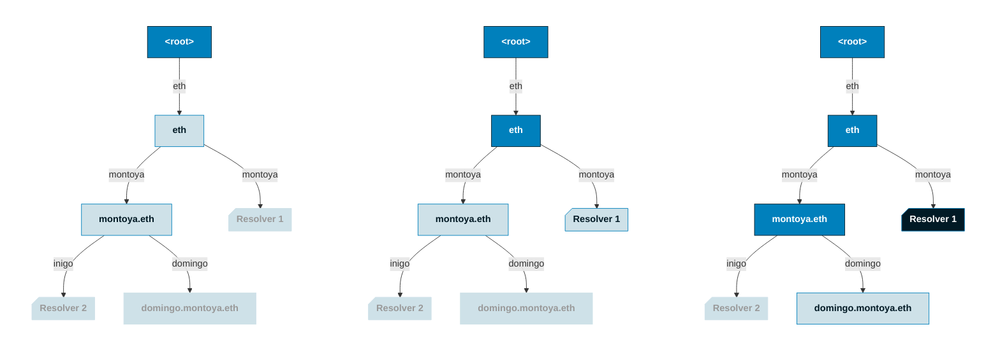

import { FrenCallout } from '../../../components/ensv2/FrenCallout'
import { ContractReference } from '../../../components/ensv2/ContractReference'
import { MonoDiagram } from '../../../components/ensv2/MonoDiagram'

# Universal Resolver V2

The Universal Resolver V2 is the primary public entry point for ENS name resolution. It resolves names by traversing the [hierarchical registry tree](/contracts/ensv2/registry-hierarchy), walking from the root registry down through subregistries to locate the correct resolver for any name. It also provides functions for navigating and verifying the registry hierarchy itself.

<FrenCallout fren="lili" variant="tip">
The contracts and interfaces described here are **not yet final** and may change prior to mainnet deployment.
</FrenCallout>

## Architecture

`UniversalResolverV2` extends `AbstractUniversalResolver`, a shared base contract that implements all resolution logic: forward resolution, reverse resolution, [CCIP-Read](/resolvers/ccip-read) gateway batching, and callback chaining. The only function the base leaves abstract is `findResolver()`, which each version overrides with its own registry traversal strategy:

- **URv1** walks a flat ENS registry
- **URv2** walks the hierarchical registry tree via `getSubregistry()` at each level

Because the walk passes through each parent registry, if a parent name expires or its subregistry is removed, the registry returns `address(0)` and all subnames stop resolving automatically.

`resolve()`, `reverse()`, and all CCIP-Read infrastructure work identically across both versions.

## Resolution

The Universal Resolver resolves names by walking down the registry tree from the root, looking for the **deepest resolver** along the path. At each level, it calls `getResolver(label)` on the current registry. If a resolver exists, it's remembered. Then it calls `getSubregistry(label)` to descend to the next level. The resolver that covers the longest matching suffix of the name wins.

`resolve()` and `reverse()` both call `findResolver` internally via `requireResolver`, which reverts if no suitable resolver is found.

Using the structure from the [registry hierarchy diagrams](/contracts/ensv2/registry-hierarchy#from-flat-to-hierarchical), here are two examples showing how `findResolver()` walks the tree:

### Example 1

Resolving `inigo.montoya.eth`: the walk descends from root, checking for resolvers at each level:



Resolver 1 is found at the .eth level, but Resolver 2 is found one level deeper at montoya.eth. **Resolver 2 wins** because it covers the longest matching suffix, in this case the full name `inigo.montoya.eth`.

### Example 2

Resolving `domingo.montoya.eth`: the walk follows the same path, but `domingo` has no resolver:



Resolver 1 is found at the .eth level, but `domingo` has no resolver set. **Resolver 1 wins** as the longest-suffix match, covering `montoya.eth`. Any subname of `montoya.eth` without its own resolver will fall back to Resolver 1 the same way.

### The Algorithm

`findResolver()` implements this longest-suffix match. It recursively descends from the root, and at each level:

1. Calls `getResolver(label)`. If non-zero, overwrites the previously remembered resolver.
2. Calls `getSubregistry(label)`. If non-zero, continues descending into the subregistry.

The final remembered resolver is the one used for the actual record query.

## Registry Navigation

ENSv2 provides functions for locating registries within the hierarchy and verifying their position. All functions described here are exposed on the `UniversalResolverV2` contract.

All navigation functions walk **down** from the root registry except `findCanonicalName`, which walks **up** via `getParent()`, and `findCanonicalRegistry`, which does both.

### findExactRegistry

Walks top-down from root, calling `getSubregistry()` at each label. Returns the subregistry that the target name points to, or `address(0)` if any link in the chain is missing.

For `nick.eth`:

<MonoDiagram content={`root\n└── getSubregistry("eth") → .eth registry\n    └── getSubregistry("nick") → nick.eth subregistry ← returned`} />

This is the registry where `nick.eth`'s subnames live. If `nick.eth` has no subregistry set, the final step returns `address(0)`.

Use `findExactRegistry` when you need to interact with a specific registry and trust the hierarchy (e.g., checking roles or reading name state). For security-sensitive contexts, use [`findCanonicalRegistry`](#findcanonicalregistry) instead.

### findParentRegistry

Walks top-down to find the registry that **contains** a name's entry, rather than the subregistry the name points to. It strips the first label and calls `findExactRegistry` on the parent suffix.

For `nick.eth`:

<MonoDiagram content={`root\n└── getSubregistry("eth") → .eth registry ← returned`} />

The `.eth` registry is where `nick` is an entry. Contrast with `findExactRegistry("nick.eth")`, which returns `nick.eth`'s own subregistry (one level deeper).

This is used internally by [`findOwner`](#findowner) to locate the registry that holds ownership information for a name.

### findRegistries

Walks top-down and builds the complete ancestry array for a name, from innermost to outermost. Each position in the array corresponds to one label in the name, with the root registry appended at the end.

```
findRegistries("")           → [<root>]
findRegistries("eth")        → [<eth>, <root>]
findRegistries("nick.eth")   → [<nick>, <eth>, <root>]
findRegistries("sub.nick.eth") → [address(0), <nick>, <eth>, <root>]
```

If a name has no subregistry at some level, that position in the array is `address(0)`. In the last example, `sub.nick.eth` has no subregistry, so the first element is zero, but its parent registries are all present.

### findCanonicalName

<FrenCallout fren="earl" variant="note" title="Definition – Canonical Name">
A registry's **canonical name** is the DNS-encoded name produced by `findCanonicalName`: it walks up the verified [parent pointer](/contracts/ensv2/permissioned-registry#parent-pointer) chain from the registry to root, reconstructing the name at each step.
</FrenCallout>

Because registries have no inherent concept of "their name" (a registry can be mounted at multiple positions via [namespace aliasing](/contracts/ensv2/registry-hierarchy#namespace-aliasing)), a canonical name only exists when both directions of the hierarchy agree: `setParent()` establishes the backward pointer, and `findCanonicalName` verifies at each step that the parent's forward pointer (`getSubregistry`) points back to the same registry.

For the `nick.eth` subregistry (walking upward):

<MonoDiagram content={`nick.eth subregistry\n├── getParent() → (.eth registry, "nick")\n│   └── verify: eth.getSubregistry("nick") == nick.eth subregistry ✓\n└── .eth registry\n    ├── getParent() → (root, "eth")\n    │   └── verify: root.getSubregistry("eth") == .eth registry ✓\n    └── root reached → canonical name: "nick.eth"`} />

Returns empty bytes if any link is broken: if a registry has no parent set, or if `parent.getSubregistry(label)` points to a different address.

### findCanonicalRegistry

<FrenCallout fren="earl" variant="note" title="Definition – Canonical Registry">
The **canonical registry** for a name is the registry at that position in the hierarchy whose [canonical name](#findcanonicalname) equals the name.
</FrenCallout>

`findCanonicalRegistry` verifies this by combining both directions:

For `nick.eth`:

<MonoDiagram content={`Down: findExactRegistry("nick.eth")\n└── root.getSubregistry("eth") → .eth registry\n    └── eth.getSubregistry("nick") → 0xABCD\n\nUp: findCanonicalName(0xABCD)\n├── 0xABCD.getParent() → (.eth registry, "nick")\n│   └── verify: eth.getSubregistry("nick") == 0xABCD ✓\n└── reconstructed name: "nick.eth" == input name ✓ → return 0xABCD`} />

The bidirectional check prevents aliasing attacks: a registry could be mounted at one position in the tree but claim (via `getParent()`) to be at another. This is the function to use when verifying a registry's legitimacy, for example in marketplaces or any context where a name is being purchased or trusted.

### findOwner

Finds the current owner of a name. `IOwnedRegistry` is a minimal interface that extends `IRegistry` with a single `findOwner(label)` function, returning the owner of a label. [PermissionedRegistry](/contracts/ensv2/permissioned-registry) implements it, but any custom registry with ownership can too.

For `nick.eth`:

<MonoDiagram content={`findParentRegistry("nick.eth") → .eth registry\n├── supports IOwnedRegistry? (ERC-165 check) ✓\n└── .eth.findOwner("nick") → 0x1234 ← returned`} />

Returns `address(0)` if the parent registry doesn't exist, doesn't implement `IOwnedRegistry`, or the label has no owner.

## Reference

### View Functions

<ContractReference functions={[
  {
    name: 'findResolver',
    description: 'Find the resolver for a name by walking down the registry hierarchy.',
    params: [
      { name: 'name', type: 'bytes', description: 'DNS-encoded name to search' },
    ],
    returns: [
      { name: 'resolver', type: 'address', description: 'Resolver covering the longest suffix, or address(0)' },
      { name: 'node', type: 'bytes32', description: 'Namehash of the full name' },
      { name: 'offset', type: 'uint256', description: 'Byte offset into the DNS-encoded name where the resolver was found. 0 means an exact match; non-zero means the resolver was found at a parent suffix. Used by requireResolver to enforce that non-wildcard resolvers only serve exact matches.' },
    ],
  },
  {
    name: 'findExactRegistry',
    description: "Find the registry at a name's position by walking down from root.",
    params: [
      { name: 'name', type: 'bytes', description: 'DNS-encoded name' },
    ],
    returns: [
      { name: 'registry', type: 'IRegistry', description: 'Registry at that position, or address(0) if not found' },
    ],
  },
  {
    name: 'findParentRegistry',
    description: "Find the parent registry for a name (the registry containing the name's entry).",
    params: [
      { name: 'name', type: 'bytes', description: 'DNS-encoded name' },
    ],
    returns: [
      { name: 'parentRegistry', type: 'IRegistry', description: 'Parent registry, or address(0) if not found' },
    ],
  },
  {
    name: 'findRegistries',
    description: "Return all registries in a name's ancestry, innermost first.",
    params: [
      { name: 'name', type: 'bytes', description: 'DNS-encoded name' },
    ],
    returns: [
      { name: 'registries', type: 'IRegistry[]', description: 'Array in label order, e.g. [<nick>, <eth>, <root>] for nick.eth' },
    ],
  },
  {
    name: 'findCanonicalName',
    description: "Reconstruct a registry's DNS-encoded name by walking up via getParent().",
    params: [
      { name: 'registry', type: 'IRegistry', description: 'The registry to name' },
    ],
    returns: [
      { name: 'name', type: 'bytes', description: 'DNS-encoded name, or empty if not canonical' },
    ],
  },
  {
    name: 'findCanonicalRegistry',
    description: 'Find the registry for a name, verified canonical via bidirectional walk.',
    params: [
      { name: 'name', type: 'bytes', description: 'DNS-encoded name' },
    ],
    returns: [
      { name: 'registry', type: 'IRegistry', description: 'Canonical registry, or address(0) if not found or not canonical' },
    ],
  },
  {
    name: 'findOwner',
    description: 'Find the current owner of a name.',
    params: [
      { name: 'name', type: 'bytes', description: 'DNS-encoded name' },
    ],
    returns: [
      { name: 'owner', type: 'address', description: 'Owner address, or address(0) if not found or registry does not implement IOwnedRegistry' },
    ],
  },
  {
    name: 'resolve',
    description: 'Forward-resolve a single record for a DNS-encoded name. For batch resolution, encode data as multicall(bytes[]).',
    params: [
      { name: 'name', type: 'bytes', description: 'DNS-encoded name to resolve' },
      { name: 'data', type: 'bytes', description: 'ABI-encoded resolver calldata' },
    ],
    returns: [
      { name: 'result', type: 'bytes', description: 'ABI-encoded response' },
      { name: 'resolver', type: 'address', description: 'The resolver that was used' },
    ],
  },
  {
    name: 'resolveWithGateways',
    description: 'Same as resolve, but with custom CCIP-Read gateway URLs.',
    params: [
      { name: 'name', type: 'bytes', description: 'DNS-encoded name to resolve' },
      { name: 'data', type: 'bytes', description: 'ABI-encoded resolver calldata' },
      { name: 'gateways', type: 'string[]', description: 'Custom CCIP-Read batch gateway URLs' },
    ],
    returns: [
      { name: 'result', type: 'bytes', description: 'ABI-encoded response' },
      { name: 'resolver', type: 'address', description: 'The resolver that was used' },
    ],
  },
  {
    name: 'resolveWithResolver',
    description: 'Resolve using a specific resolver address, bypassing the findResolver lookup.',
    params: [
      { name: 'resolver', type: 'address', description: 'Resolver address to use directly' },
      { name: 'name', type: 'bytes', description: 'DNS-encoded name' },
      { name: 'data', type: 'bytes', description: 'ABI-encoded resolver calldata' },
      { name: 'gateways', type: 'string[]', description: 'CCIP-Read batch gateway URLs' },
    ],
    returns: [
      { name: 'result', type: 'bytes', description: 'ABI-encoded response' },
    ],
  },
  {
    name: 'reverse',
    description: 'Reverse resolution per ENSIP-19: look up the primary name for an address, then verify via forward resolution.',
    params: [
      { name: 'lookupAddress', type: 'bytes', description: 'Byte-encoded address to look up' },
      { name: 'coinType', type: 'uint256', description: 'Coin type of the address (e.g. 60 for Ethereum)' },
    ],
    returns: [
      { name: 'primary', type: 'string', description: 'Verified primary name, or empty if not set' },
      { name: 'resolver', type: 'address', description: 'Forward resolver for the primary name' },
      { name: 'reverseResolver', type: 'address', description: 'Reverse resolver that provided the name' },
    ],
  },
  {
    name: 'reverseWithGateways',
    description: 'Same as reverse, but with custom CCIP-Read gateway URLs.',
    params: [
      { name: 'lookupAddress', type: 'bytes', description: 'Byte-encoded address to look up' },
      { name: 'coinType', type: 'uint256', description: 'Coin type of the address' },
      { name: 'gateways', type: 'string[]', description: 'Custom CCIP-Read batch gateway URLs' },
    ],
    returns: [
      { name: 'primary', type: 'string', description: 'Verified primary name, or empty if not set' },
      { name: 'resolver', type: 'address', description: 'Forward resolver for the primary name' },
      { name: 'reverseResolver', type: 'address', description: 'Reverse resolver that provided the name' },
    ],
  },
  {
    name: 'requireResolver',
    description: 'Same as findResolver, but reverts if no suitable resolver is found. Reverts with ResolverNotFound if: no resolver exists, or the resolver does not support IExtendedResolver and was found at a parent suffix (non-zero offset). Reverts with ResolverNotContract if the resolver was matched exactly (zero offset), does not support IExtendedResolver, and has no deployed code. Used internally by resolve() and reverse().',
    params: [
      { name: 'name', type: 'bytes', description: 'DNS-encoded name to search' },
    ],
    returns: [
      { name: 'info', type: 'ResolverInfo', description: 'Struct with name, offset, node, resolver address, and whether it supports IExtendedResolver' },
    ],
  },
]} />

### Constants

<ContractReference functions={[
  {
    name: 'ROOT_REGISTRY',
    description: 'The ENSv2 root registry. All hierarchy traversal starts from this address. Set once at deployment (immutable).',
  },
  {
    name: 'batchGatewayProvider',
    description: 'Default gateway provider for CCIP-Read batching. Set once at deployment (immutable).',
  },
]} />

### Errors

<ContractReference functions={[
  {
    name: 'ResolverNotFound',
    description: 'No resolver found for the name.',
    params: [
      { name: 'name', type: 'bytes', description: 'The DNS-encoded name that failed to resolve' },
    ],
  },
  {
    name: 'ResolverNotContract',
    description: 'Resolver address has no deployed code.',
    params: [
      { name: 'name', type: 'bytes', description: 'The DNS-encoded name' },
      { name: 'resolver', type: 'address', description: 'The resolver address that has no code' },
    ],
  },
  {
    name: 'UnsupportedResolverProfile',
    description: "Resolver doesn't support the requested function.",
    params: [
      { name: 'selector', type: 'bytes4', description: 'The unsupported function selector' },
    ],
  },
  {
    name: 'ResolverError',
    description: 'Resolver reverted during resolution.',
    params: [
      { name: 'errorData', type: 'bytes', description: 'The raw error data from the resolver' },
    ],
  },
  {
    name: 'ReverseAddressMismatch',
    description: "Forward resolution of the primary name doesn't match the original address.",
    params: [
      { name: 'primary', type: 'string', description: 'The primary name that was looked up' },
      { name: 'primaryAddress', type: 'bytes', description: 'The address the primary name resolved to' },
    ],
  },
  {
    name: 'HttpError',
    description: 'HTTP error from a CCIP-Read gateway.',
    params: [
      { name: 'status', type: 'uint16', description: 'HTTP status code' },
      { name: 'message', type: 'string', description: 'Error message from the gateway' },
    ],
  },
]} />
