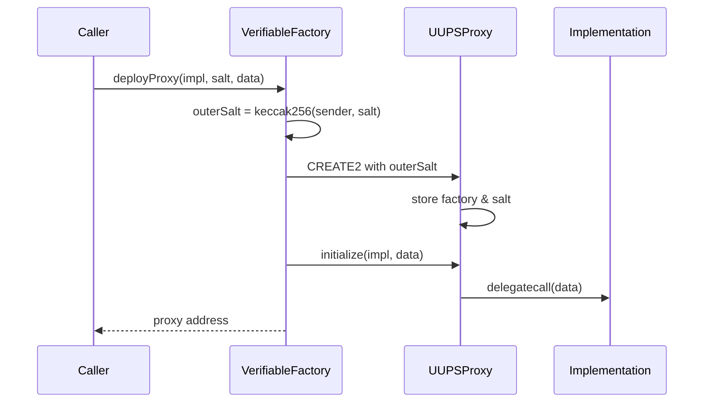

# Verifiable Factory

ENSv2 deploys per-name resolvers and per-name subname registries through a single shared factory. Each instance is a UUPS proxy with a deterministic CREATE2 address and an on-chain proof of provenance. This page covers the factory itself and how the protocol uses it.

:::note
The contracts and interfaces described here are **not yet final** and may change prior to mainnet deployment.
:::

## Why a Factory

ENSv2 chooses per-name instances over a single shared resolver or registry contract (see the "Contract Factories" point in the [Overview](/contracts/ensv2/overview#whats-new-in-ensv2)). Each instance is a UUPS proxy, so deployment is cheap and any single instance can be upgraded without touching the rest of the system. The factory makes every such deployment:

- **Deterministic**: the address is known before deployment.
- **Verifiable**: anyone can prove on-chain that an arbitrary address really came from this factory with a known proxy bytecode.
- **Cheap**: only the proxy is deployed; the implementation is shared.

## Deterministic Deployment

```solidity
function deployProxy(
    address implementation,
    uint256 salt,
    bytes memory data
) external returns (address proxy);
```

`deployProxy` uses CREATE2 to deploy a `UUPSProxy` with `outerSalt = keccak256(abi.encode(msg.sender, salt))`. After construction, the factory calls `proxy.initialize(implementation, data)` to point the proxy at the implementation and forward `data` as initialisation calldata.

Because `outerSalt` mixes in `msg.sender`, the same `salt` value submitted by two different deployers produces two different proxy addresses. There is no contention between callers and no need for global salt coordination.



## The UUPSProxy

Each proxy stores two pieces of provenance:

- An immutable `verifiableProxyFactory` address baked into the proxy bytecode at construction.
- A salt stored at the ERC-7201 namespaced slot `eth.ens.proxy.verifiable.salt`, exposed via `getVerifiableProxySalt()`.

`initialize(implementation, data)` runs once. It calls OpenZeppelin's `ERC1967Utils.upgradeToAndCall`, which sets the implementation slot and delegate-calls the implementation with `data` so it can run its own initializer.

## On-chain Verification

```solidity
function verifyContract(address proxy) external view returns (bool);
```

`verifyContract` asks the proxy for its salt, reconstructs the expected CREATE2 address from `(UUPSProxy creation code, factory, salt)`, and returns `true` if it matches `proxy`. This is the property that makes the factory **verifiable**: a smart contract can prove that an arbitrary address really is a UUPS proxy deployed by this factory, without trusting metadata or off-chain data.

## How ENSv2 Uses It

Three implementation contracts are deployed once and then proxied per-name through the factory:

| Implementation             | Salt scheme                                                                    | Where it's deployed                                           |
| -------------------------- | ------------------------------------------------------------------------------ | ------------------------------------------------------------- |
| `PermissionedResolverImpl` | `keccak256("OwnedResolver", owner, version)` — one resolver per owner          | On demand by users                                            |
| `UserRegistryImpl`         | `keccak256("UserRegistry", namehash, version)` — one subname registry per name | On demand by name owners                                      |
| `WrapperRegistryImpl`      | per-name                                                                       | Inside migration controllers when a locked v1 name is wrapped |

Salt schemes come from `contracts/script/setup.ts` in the ENSv2 repository; the same schemes let any client predict a deployment address before it exists.

## Upgrade Authorization

Each implementation overrides `_authorizeUpgrade`. In ENSv2 the check is uniform: only an account holding `ROLE_UPGRADE` on the proxy's `ROOT_RESOURCE` can upgrade the implementation:

```solidity
function _authorizeUpgrade(address newImplementation)
    internal
    override
    onlyRootRoles(ROLE_UPGRADE)
{}
```

Upgrades target a single proxy, not the shared implementation; an upgrade to one user's resolver or subname registry does not affect anyone else's.

## Computing Addresses Off-chain

Because the proxy address is fully determined by `(factory, deployer, salt, UUPSProxy bytecode)`, clients can compute it before any transaction is sent:

```ts
import { encodeAbiParameters, getCreate2Address, keccak256 } from 'viem'

function predictProxyAddress({
  factoryAddress,
  proxyBytecode,
  deployer,
  salt,
}: {
  factoryAddress: `0x${string}`
  proxyBytecode: `0x${string}`
  deployer: `0x${string}`
  salt: bigint
}) {
  const outerSalt = keccak256(
    encodeAbiParameters(
      [{ type: 'address' }, { type: 'uint256' }],
      [deployer, salt]
    )
  )
  const initCode = `${proxyBytecode}${encodeAbiParameters(
    [{ type: 'address' }, { type: 'bytes32' }],
    [factoryAddress, outerSalt]
  ).slice(2)}` as `0x${string}`
  return getCreate2Address({
    from: factoryAddress,
    salt: outerSalt,
    bytecodeHash: keccak256(initCode),
  })
}
```

This is the pattern used inside the ENSv2 deployment scripts (`computeVerifiableProxyAddress` in `setup.ts`); reuse it whenever you need a name's resolver or subname-registry address before the user actually creates it.
