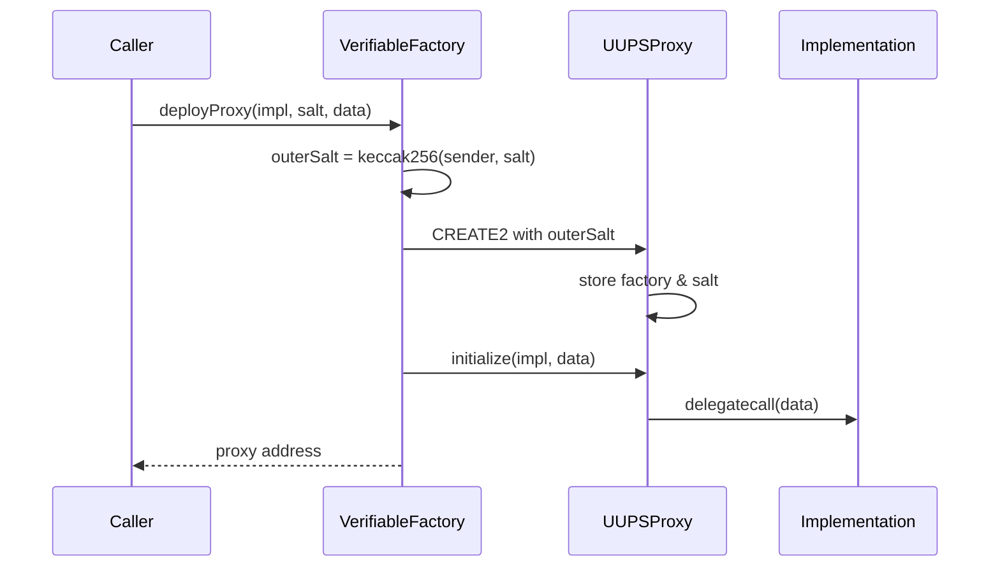

import { FrenCallout } from '../../../components/ensv2/FrenCallout'

# Verifiable Factory

ENSv2's default setup deploys per-account resolvers and per-name subname registries through a single shared factory, replacing the v1 Public Resolver with individual [Permissioned Resolver](/contracts/ensv2/permissioned-resolver) proxies per account. Each instance is a UUPS proxy with a deterministic CREATE2 address and an on-chain proof of provenance. The factory is maintained in a [separate repository](https://github.com/ensdomains/verifiable-factory). This page covers how the protocol uses it.

The factory is the **default** deployment mechanism, not a protocol requirement. Custom resolver contracts are fully supported: `setResolver()` on the [Permissioned Registry](/contracts/ensv2/permissioned-registry) accepts any address. You can deploy your own resolver implementing `IExtendedResolver` (or the standard resolver profiles) without using the factory.

<FrenCallout fren="lili" variant="tip">
The contracts and interfaces described here are **not yet final** and may change prior to mainnet deployment.
</FrenCallout>

## Why a Factory

ENSv2 chooses per-account resolver and per-name registry instances over a single shared contract (see [Overview](/contracts/ensv2/overview#whats-new-in-ensv2)). Each instance is a UUPS proxy, so deployment is cheap and any single instance can be upgraded without touching the rest of the system. The factory makes every such deployment:

- **Deterministic**: the address is known before deployment.
- **Verifiable**: anyone can prove on-chain that an arbitrary address really came from this factory with a known proxy bytecode.
- **Cheap**: only the proxy is deployed; the implementation is shared.

## Deterministic Deployment

```solidity
function deployProxy(
    address implementation,
    uint256 salt,
    bytes memory data
) external returns (address proxy);
```

`deployProxy` uses CREATE2 to deploy a `UUPSProxy` with `outerSalt = keccak256(abi.encode(msg.sender, salt))`. After construction, the factory calls `proxy.initialize(implementation, data)` to point the proxy at the implementation and forward `data` as initialisation calldata.

Because `outerSalt` mixes in `msg.sender`, the same `salt` value submitted by two different deployers produces two different proxy addresses. There is no contention between callers and no need for global salt coordination.



## The UUPSProxy

Each proxy stores two pieces of provenance:

- An immutable `verifiableProxyFactory` address baked into the proxy bytecode at construction.
- A salt appended to the proxy bytecode at construction, readable via `getVerifiableProxyData()` (which also returns the current implementation address from the ERC-1967 slot).

`initialize(implementation, data)` runs once. It calls OpenZeppelin's `ERC1967Utils.upgradeToAndCall`, which sets the implementation slot and delegate-calls the implementation with `data` so it can run its own initializer.

## On-chain Verification

```solidity
function verifyContract(address proxy, address expectedImplementation) external view returns (bool);
```

`verifyContract` calls `getVerifiableProxyData()` on the proxy to retrieve its stored salt and actual implementation address. It first checks that the implementation matches `expectedImplementation`, then reconstructs the expected CREATE2 address from `(UUPSProxy creation code, factory, salt)` and returns `true` if it matches `proxy`. This is the property that makes the factory **verifiable**: a smart contract can prove that an arbitrary address really is a UUPS proxy deployed by this factory with a known implementation, without trusting metadata or off-chain data.

## Available Implementations

Three implementation contracts are deployed once and then proxied through the factory:

| Implementation             | Salt scheme                                                                    | Where it's deployed                                           |
| -------------------------- | ------------------------------------------------------------------------------ | ------------------------------------------------------------- |
| `PermissionedResolverImpl` | `keccak256("OwnedResolver", owner, version)` — one resolver per owner          | On demand by users                                            |
| `UserRegistryImpl`         | `keccak256("UserRegistry", namehash, version)` — one subname registry per name | On demand by name owners                                      |
| `WrapperRegistryImpl`      | per-name                                                                       | Inside migration controllers when a locked v1 name is wrapped |

## Upgrade Authorization

Each implementation overrides `_authorizeUpgrade`. In ENSv2 the check is uniform: only an account holding `ROLE_UPGRADE` on the proxy's `ROOT_RESOURCE` can upgrade the implementation:

```solidity
function _authorizeUpgrade(address newImplementation)
    internal
    override
    onlyRootRoles(ROLE_UPGRADE)
{}
```

Upgrades target a single proxy, not the shared implementation; an upgrade to one user's resolver or subname registry does not affect anyone else's.

## Computing Addresses Off-chain

Because the proxy address is fully determined by `(factory, deployer, salt, UUPSProxy bytecode)`, clients can compute it before any transaction is sent:

```ts
import { encodeAbiParameters, getCreate2Address, keccak256 } from 'viem'

function predictProxyAddress({
  factoryAddress,
  proxyBytecode,
  deployer,
  salt,
}: {
  factoryAddress: `0x${string}`
  proxyBytecode: `0x${string}`
  deployer: `0x${string}`
  salt: bigint
}) {
  const outerSalt = keccak256(
    encodeAbiParameters(
      [{ type: 'address' }, { type: 'uint256' }],
      [deployer, salt]
    )
  )
  const initCode = `${proxyBytecode}${encodeAbiParameters(
    [{ type: 'address' }, { type: 'bytes32' }],
    [factoryAddress, outerSalt]
  ).slice(2)}` as `0x${string}`
  return getCreate2Address({
    from: factoryAddress,
    salt: outerSalt,
    bytecodeHash: keccak256(initCode),
  })
}
```

This is useful whenever you need a name's resolver or subname-registry address before the user actually creates it.

## Code Examples

Every proxy deployment follows the same steps: compute a salt, encode the implementation's `initialize` call as the `data` argument, and call `deployProxy` on the factory. The salt and initializer differ per implementation.

<FrenCallout fren="bittu" variant="tip">
The contract addresses used below (`VERIFIABLE_FACTORY`, `PERMISSIONED_RESOLVER_IMPL`, `USER_REGISTRY_IMPL`) are protocol-deployed contracts. Find them in the [Deployments](/contracts/ensv2/overview#deployments-sepolia) table.
</FrenCallout>

Both examples below share this setup:

```ts [Viem]
import {
  createPublicClient,
  createWalletClient,
  encodeAbiParameters,
  encodeFunctionData,
  http,
  keccak256,
  namehash,
  parseAbi,
  parseEventLogs,
  stringToHex,
} from 'viem'
import { mainnet } from 'viem/chains'

const client = createPublicClient({ chain: mainnet, transport: http() })
const wallet = createWalletClient({
  account,
  chain: mainnet,
  transport: http(),
})

const verifiableFactoryAbi = parseAbi([
  'function deployProxy(address implementation, uint256 salt, bytes data)',
  'event ProxyDeployed(address indexed sender, address indexed proxyAddress, uint256 salt, address implementation)',
])

// Grant all roles and their admin counterparts
const ALL_ROLES =
  0x1111111111111111111111111111111111111111111111111111111111111111n
```

### Deploying a Resolver Proxy

Deploy a per-account [Permissioned Resolver](/contracts/ensv2/permissioned-resolver). The salt is derived from the owner's address so that any client can predict the resolver address before it exists.

```ts [Viem]
const resolverInitAbi = parseAbi([
  'function initialize(address admin, uint256 roleBitmap, bytes[] setters)',
])

// Salt scheme: keccak256("OwnedResolver", owner, version)
const version = 0n
const resolverSalt = BigInt(
  keccak256(
    encodeAbiParameters(
      [{ type: 'bytes32' }, { type: 'address' }, { type: 'uint256' }],
      [keccak256(stringToHex('OwnedResolver')), account.address, version]
    )
  )
)

const resolverInitData = encodeFunctionData({
  abi: resolverInitAbi,
  functionName: 'initialize',
  args: [account.address, ALL_ROLES, []],
})

const resolverTx = await wallet.writeContract({
  address: VERIFIABLE_FACTORY,
  abi: verifiableFactoryAbi,
  functionName: 'deployProxy',
  args: [PERMISSIONED_RESOLVER_IMPL, resolverSalt, resolverInitData],
})

const resolverReceipt = await client.waitForTransactionReceipt({
  hash: resolverTx,
})
const [resolverLog] = parseEventLogs({
  abi: verifiableFactoryAbi,
  eventName: 'ProxyDeployed',
  logs: resolverReceipt.logs,
})
const resolverAddress = resolverLog.args.proxyAddress
```

The `resolverAddress` is now a fully initialized Permissioned Resolver proxy. Point a name to it via `setResolver` on the registry, then use it to [set records and delegate access](/contracts/ensv2/permissioned-resolver#code-examples).

### Deploying a Registry Proxy

Deploy a per-name [User Registry](/contracts/ensv2/permissioned-registry) for managing subnames. The salt is derived from the name's namehash.

```ts [Viem]
const registryInitAbi = parseAbi([
  'function initialize(address rootAccount, uint256 roleBitmap)',
])

// Salt scheme: keccak256("UserRegistry", namehash, version)
const version = 0n
const registrySalt = BigInt(
  keccak256(
    encodeAbiParameters(
      [{ type: 'bytes32' }, { type: 'bytes32' }, { type: 'uint256' }],
      [keccak256(stringToHex('UserRegistry')), namehash('alice.eth'), version]
    )
  )
)

const registryInitData = encodeFunctionData({
  abi: registryInitAbi,
  functionName: 'initialize',
  args: [account.address, ALL_ROLES],
})

const registryTx = await wallet.writeContract({
  address: VERIFIABLE_FACTORY,
  abi: verifiableFactoryAbi,
  functionName: 'deployProxy',
  args: [USER_REGISTRY_IMPL, registrySalt, registryInitData],
})

const registryReceipt = await client.waitForTransactionReceipt({
  hash: registryTx,
})
const [registryLog] = parseEventLogs({
  abi: verifiableFactoryAbi,
  eventName: 'ProxyDeployed',
  logs: registryReceipt.logs,
})
const registryAddress = registryLog.args.proxyAddress
```

The `registryAddress` is now a User Registry proxy. Set it as the subregistry for a name via `setSubregistry` on the parent registry, then use it to [manage subnames and roles](/contracts/ensv2/permissioned-registry#code-examples).
