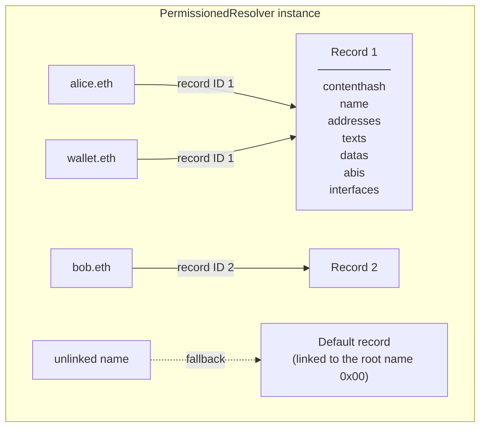

import { ContractReference } from '../../components/ensv2/ContractReference'
import { FrenCallout } from '../../components/ensv2/FrenCallout'
import { ResourceCalculator } from '../../components/ensv2/ResourceCalculator'
import { RoleBitmapComposer } from '../../components/ensv2/RoleBitmapComposer'
import { Card } from '../../components/ui/Card'

# Permissioned Resolver

In ENSv1, most names shared a single [Public Resolver](/resolvers/public) contract. In ENSv2, **each account gets its own resolver instance**, deployed as a UUPS-upgradeable proxy. All names owned by the same account share one resolver. Records are stored as numbered bundles that names link to, so several names can share one set of records, and permissions are managed per record type through fine-grained roles.

<FrenCallout fren="lili" variant="tip">
  The contracts and interfaces described here are **not yet final** and may
  change prior to mainnet deployment.
</FrenCallout>

## What Changed from ENSv1

| Feature         | ENSv1 Public Resolver             | ENSv2 Permissioned Resolver                                                 |
| --------------- | --------------------------------- | --------------------------------------------------------------------------- |
| Deployment      | Single shared contract by default | Per-account proxy instances by default                                      |
| Record storage  | One record set per name           | Numbered records, shareable between names via [links](#records-and-linking) |
| Write interface | Node-based setters                | Name-based setters                                                          |
| Permissions     | Owner controls all records        | Per-record-type roles via [EAC](/ensv2/enhanced-access-control)             |
| Record clearing | `clearRecords()` by owner         | Unlink the name and start a fresh record                                    |
| Upgradeability  | Not upgradeable                   | UUPS proxy pattern                                                          |

## Supported Record Types

The Permissioned Resolver supports the following record types:

| Record               | Read profile                            | Setter                                      | Standard                                          |
| -------------------- | --------------------------------------- | ------------------------------------------- | ------------------------------------------------- |
| Address (ETH)        | `addr(bytes32 node)`                    | `setAddress(bytes name, 60, addressBytes)`  | [ENSIP-1](/ensip/1)                               |
| Address (multichain) | `addr(bytes32 node, uint256 coinType)`  | `setAddress(bytes name, uint256, bytes)`    | [ENSIP-9](/ensip/9)                               |
| Address (default)    | fallback for EVM coin types             | `setAddress(bytes name, 0x80000000, bytes)` | [ENSIP-19](/ensip/19)                             |
| Address existence    | `hasAddr(bytes32 node, uint256)`        | (none)                                      |                                                   |
| Text                 | `text(bytes32 node, string key)`        | `setText(bytes name, string, string)`       | [ENSIP-5](/ensip/5)                               |
| Content hash         | `contenthash(bytes32 node)`             | `setContenthash(bytes name, bytes)`         | [ENSIP-7](/ensip/7)                               |
| Name (reverse)       | `name(bytes32 node)`                    | `setName(bytes name, string)`               | [EIP-181](https://eips.ethereum.org/EIPS/eip-181) |
| ABI                  | `ABI(bytes32 node, uint256)`            | `setABI(bytes name, uint256, bytes)`        | [EIP-205](https://eips.ethereum.org/EIPS/eip-205) |
| Interface            | `interfaceImplementer(bytes32, bytes4)` | `setInterface(bytes name, bytes4, address)` | [ENSIP-8](/ensip/8)                               |
| Data                 | `data(bytes32 node, string key)`        | `setData(bytes name, string, bytes)`        | [ENSIP-24](/ensip/24)                             |

<FrenCallout fren="bittu" variant="note">
  Resolution starts at the [Universal Resolver](/ensv2/universal-resolver-v2),
  which calls the resolver's `resolve(name, data)` function with the profile
  calldata shown in the Read column as `data`. The node argument inside it is
  ignored (the resolver derives the node from `name`), and the contract has no
  standalone getters for record values.
</FrenCallout>

Setters take the DNS-encoded name (`bytes`), not a namehash.

## Records and Linking

The resolver stores values in **records**: numbered bundles holding all of a name's addresses, text records, content hash, and other values. A name is associated with a record through a link from its namehash to a record ID:



In the diagram above, `alice.eth` and `wallet.eth` serve the same set of records because both names are linked to record 1. A write to a shared record changes the values served for every name linked to it. The records of `bob.eth` are not shared, since it is the only name linked to record 2. The unlinked name has no record of its own and falls back to the default record, which is the record linked to the root name `0x00`.

Records are created automatically: the first write to a name mints a new record (IDs start at 1), links the name to it, and emits `Linked(recordId, node, name)`. Every later write through that name mutates the same record.

### Linking Names

Two functions manage the links, both requiring `ROLE_LINK` on `ROOT_RESOURCE` (see [EAC Integration](#eac-integration)):

- `linkToNode(sourceName, targetNode)` makes `sourceName` use the record that `targetNode` currently uses. This is the way to make two names resolve identically without duplicating values.
- `linkToRecord(sourceName, recordId)` links `sourceName` to a record by number. Passing `0` unlinks the name.

Both end in the same effect, setting the name's record ID. They differ only in how the record is identified: by example of another name, or directly by number. Linking is bundle-level: a name serves either all of a record's values or none of them.

Records are never deleted: unlinking a name leaves the record in place for any other names still linked to it.

### The Default Record

A name with no record of its own serves the **default record**, the record linked to the root name `0x00` (namehash `bytes32(0)`). Writing records via the root name manages the defaults for every unlinked name on the resolver. The fallback is per name, not per value: once a name has its own record, missing values in it return empty results instead of the default record's values.

### Use Cases

- **Multiple names, same records**: point `wallet.eth`, `brand.eth`, and `company.eth` at the same resolver, then link them to one record so they share one set of values
- **Name migration**: link a new name to the old name's record, then unlink the old name. The record moves without copying a single value
- **Shared defaults**: set records on the root name once and let all subnames serve them until they get records of their own

Note that record linking at the resolver level is different from [namespace aliasing](/ensv2/registry-hierarchy#namespace-aliasing) at the registry level. Record links share record bundles; registry aliasing shares entire namespaces.

## EAC Integration

All permissions are managed through [Enhanced Access Control](/ensv2/enhanced-access-control).

### Roles

Each record type has its own role. A role is always held at a [resource](#resource-scheme): either `ROOT_RESOURCE`, which covers the whole resolver, or the resource of a setter argument such as a text key or coin type. The same role bit granted at different resources yields independent permissions, which is how a single `ROLE_SET_TEXT` bit can be restricted to one specific key.

There is no per-name scoping: a role holder can write the covered records on **every** name served by the resolver instance. For example, if the owner of `alice.eth` grants an account `ROLE_SET_TEXT` for the `description` text key, that account can modify the `description` record of every name served by the instance, including `alice.eth` itself.

| Role                   | Value      | Scope                | Purpose                                                                  |
| ---------------------- | ---------- | -------------------- | ------------------------------------------------------------------------ |
| `ROLE_SET_ADDRESS`     | `1 << 0`   | root or coin type    | Set address records                                                      |
| `ROLE_SET_TEXT`        | `1 << 4`   | root or text key     | Set text records                                                         |
| `ROLE_SET_CONTENTHASH` | `1 << 8`   | root                 | Set the content hash                                                     |
| `ROLE_SET_ABI`         | `1 << 12`  | root or content type | Set ABI records                                                          |
| `ROLE_SET_INTERFACE`   | `1 << 16`  | root or interface ID | Set interface records                                                    |
| `ROLE_SET_NAME`        | `1 << 20`  | root                 | Set the reverse name                                                     |
| `ROLE_SET_DATA`        | `1 << 24`  | root or data key     | Set data records                                                         |
| `ROLE_LINK`            | `1 << 28`  | root                 | Link and unlink records                                                  |
| `ROLE_CAN_NAME`        | `1 << 120` | root                 | Name this contract (see [Reverse Resolution](/ensv2/reverse-resolution)) |
| `ROLE_UPGRADE`         | `1 << 124` | root                 | Authorize proxy upgrades                                                 |

Each role has a corresponding admin role at `role << 128` (e.g., `ROLE_SET_TEXT_ADMIN = (1 << 4) << 128`). In TypeScript, use `1n << 4n` for the bigint equivalent.

<FrenCallout fren="earl" variant="note" title="Initialization">
  When deployed through the [Verifiable Factory](/ensv2/verifiable-factory),
  `initialize(grants, calls)` defines the initial permissions: each `Grant` is
  an account and a role bitmap, granted on `ROOT_RESOURCE` exactly as passed.
  The `calls` array is executed as a multicall during initialization, with role
  checks skipped, which allows setting initial records in the same transaction.
</FrenCallout>

### Role Bitmap Composer

<FrenCallout fren="peanut" variant="tip" title="Interactive Widget">
  Select roles to compose a bitmap value for use with `initialize` grants or
  `grantRootRoles`.
</FrenCallout>

<Card>
  <RoleBitmapComposer contract="resolver" />
</Card>

### Granting and Revoking Roles

Resolver-wide permissions are managed with `grantRootRoles()` / `revokeRootRoles()` inherited from [EAC](/ensv2/enhanced-access-control). The generic `grantRoles()` is disabled on the Permissioned Resolver and always reverts with `EACCannotGrantRoles`.

Argument-scoped permissions (a single text key, coin type, content type, or interface ID) are granted with `grantSetterRoles(setter, account)`: `setter` is ABI-encoded calldata of the setter to authorize, from which the resolver derives the argument, its EAC resource, and the matching role. Only the function selector and the argument in the calldata matter; the name and value parts are ignored.

| Grant                       | Function                              |
| --------------------------- | ------------------------------------- |
| Any role, resolver-wide     | `grantRootRoles(roleBitmap, account)` |
| One setter for one argument | `grantSetterRoles(setter, account)`   |

To revoke an argument-scoped role, call `revokeRoles(resource, roleBitmap, account)` with the argument's [resource](#resource-scheme). Revoking a root-scoped role uses `revokeRootRoles(roleBitmap, account)`.

When checking permissions, the resolver allows a write if the account holds the setter's role either at the argument's resource or at `ROOT_RESOURCE`, so a root grant is a superset of any argument-scoped grant.

### Resource Scheme

<FrenCallout fren="bittu" variant="tip" title="Developer tip">
  This section explains how [EAC
  resources](/ensv2/enhanced-access-control#resources) are computed internally.
  You don't need this for normal use. `grantSetterRoles` handles resource
  computation automatically.
</FrenCallout>

Unlike the registry's labelhash-based resources, resolver resources are derived from the **setter argument alone**. Names play no part in resource computation, and the [anyId polymorphism](/ensv2/mutable-token-ids#anyid-polymorphism) used in the registry does not apply here:

| Argument type                         | Resource computation                       |
| ------------------------------------- | ------------------------------------------ |
| Text or data key (`string`)           | `keccak256(bytes(key))`                    |
| Coin type or content type (`uint256`) | `keccak256(abi.encode(value))`             |
| Interface ID (`bytes4`)               | `keccak256(abi.encodePacked(interfaceId))` |

When a resource that currently has no role holders receives a grant through `grantSetterRoles`, the resolver emits `ResourceArgument(resource, arg)`, which lets indexers map opaque resources back to their arguments. The event can re-fire for the same resource after all of its roles were revoked.

### Resource Calculator

<FrenCallout fren="peanut" variant="tip" title="Interactive Widget">
  Compute the EAC resource for any setter argument.
</FrenCallout>

<Card>
  <ResourceCalculator />
</Card>

## Deploying a Permissioned Resolver

Each account deploys its own resolver instance through the [Verifiable Factory](/ensv2/verifiable-factory): a UUPS proxy with a deterministic address, pointing at the protocol-provided implementation contract from the [deployments table](/learn/deployments#sepolia-ensv2-beta). The deploy call runs `initialize(grants, calls)`, which defines the initial permissions and can set initial records in the same transaction (see [Roles](#roles)). Afterwards, point a name at the new instance via `setResolver` on the [registry that holds the name](/ensv2/permissioned-registry).

See [Deploying a Resolver Proxy](/ensv2/verifiable-factory#deploying-a-resolver-proxy) for the full code example.

Because every instance is a proxy, the deployment is cheap and upgradeable: the root-only `ROLE_UPGRADE` controls who can upgrade an individual instance's implementation.

## Code Examples

The examples below assume you already have a `resolverAddress`, deployed as [described above](#deploying-a-permissioned-resolver).

### Setting and Reading Records

Setters take the DNS-encoded name. Reading through viem's built-in ENS functions works unchanged, since resolution goes through the Universal Resolver:

```ts [Viem]
import { createPublicClient, createWalletClient, http, toHex } from 'viem'
import { mainnet } from 'viem/chains'
import { normalize, packetToBytes } from 'viem/ens'

const client = createPublicClient({ chain: mainnet, transport: http() })
const wallet = createWalletClient({ chain: mainnet, transport: http() })

const name = normalize('alice.eth')
const dnsName = toHex(packetToBytes(name))

// Set the ETH address (coin type 60, address as 20 bytes)
await wallet.writeContract({
  address: resolverAddress,
  abi: permissionedResolverAbi,
  functionName: 'setAddress',
  args: [dnsName, 60n, '0x1234...'],
})

// Set a text record
await wallet.writeContract({
  address: resolverAddress,
  abi: permissionedResolverAbi,
  functionName: 'setText',
  args: [dnsName, 'avatar', 'https://example.com/avatar.png'],
})

// Read them back using viem's built-in ENS functions
const ethAddr = await client.getEnsAddress({ name })
const avatar = await client.getEnsText({ name, key: 'avatar' })
```

### Sharing Records Between Names

Make `wallet.eth` serve the same record as `alice.eth`, then undo it:

```ts [Viem]
import { namehash, toHex } from 'viem'
import { packetToBytes } from 'viem/ens'

// Link wallet.eth to the record alice.eth currently uses
await wallet.writeContract({
  address: resolverAddress,
  abi: permissionedResolverAbi,
  functionName: 'linkToNode',
  args: [
    toHex(packetToBytes('wallet.eth')), // source: the name to link
    namehash('alice.eth'), // target: whose record to use
  ],
})

// Unlink wallet.eth again (it then serves the default record)
await wallet.writeContract({
  address: resolverAddress,
  abi: permissionedResolverAbi,
  functionName: 'linkToRecord',
  args: [toHex(packetToBytes('wallet.eth')), 0n],
})
```

`linkToNode` reverts with `InvalidRecord` if the target name has no record yet. Both functions require the root-only `ROLE_LINK`.

### Delegating a Single Text Key

A name owner can grant a dApp permission to set only a specific text record, for example allowing it to update the `avatar` key without giving access to any other records:

```ts [Viem]
import { encodeFunctionData, toHex } from 'viem'
import { packetToBytes } from 'viem/ens'

// Encode a setText call for the key to delegate.
// Only the selector and the key matter; name and value are ignored.
const setter = encodeFunctionData({
  abi: permissionedResolverAbi,
  functionName: 'setText',
  args: ['0x', 'avatar', ''],
})

// Grant the dApp permission to set the "avatar" text key
await wallet.writeContract({
  address: resolverAddress,
  abi: permissionedResolverAbi,
  functionName: 'grantSetterRoles',
  args: [setter, dappAddress],
})

// The dApp can now set the avatar record on names served by this resolver...
await dappWallet.writeContract({
  address: resolverAddress,
  abi: permissionedResolverAbi,
  functionName: 'setText',
  args: [
    toHex(packetToBytes('alice.eth')),
    'avatar',
    'https://example.com/avatar.png',
  ],
})

// ...but attempting to set any other key will revert
// setText(dnsName, 'description', '...') → reverts with EACUnauthorizedAccountRoles
```

<FrenCallout fren="earl" variant="warning">
  Argument-scoped grants apply to **every name** served by the resolver
  instance: the dApp above can set the `avatar` key on all of them. To give an
  account access to records of specific names only, serve those names from their
  own resolver instance.
</FrenCallout>

To grant access to all text keys instead of one, grant `ROLE_SET_TEXT` resolver-wide:

```ts [Viem]
const ROLE_SET_TEXT = 1n << 4n

await wallet.writeContract({
  address: resolverAddress,
  abi: permissionedResolverAbi,
  functionName: 'grantRootRoles',
  args: [ROLE_SET_TEXT, dappAddress],
})
```

### Revoking Permissions

Argument-scoped roles are revoked with `revokeRoles` on the argument's resource, root-scoped roles with `revokeRootRoles`:

```ts [Viem]
import { keccak256, toHex } from 'viem'

const ROLE_SET_TEXT = 1n << 4n

// Revoke the dApp's permission for the "avatar" text key.
// The resource of a string argument is keccak256 of its bytes.
const resource = BigInt(keccak256(toHex('avatar')))

await wallet.writeContract({
  address: resolverAddress,
  abi: permissionedResolverAbi,
  functionName: 'revokeRoles',
  args: [resource, ROLE_SET_TEXT, dappAddress],
})

// Revoke resolver-wide ROLE_SET_TEXT (all text keys)
await wallet.writeContract({
  address: resolverAddress,
  abi: permissionedResolverAbi,
  functionName: 'revokeRootRoles',
  args: [ROLE_SET_TEXT, dappAddress],
})
```

### Locking a Record Type Permanently

Because each role has a corresponding admin role, an owner can make a record type permanently immutable by revoking both the role and its admin. Without the admin role, nobody can grant the role back. Locking the setter alone does not freeze what a name serves: a `ROLE_LINK` holder could relink the name to a different record, and a `ROLE_UPGRADE` holder could replace the resolver implementation entirely. A full lock therefore revokes all three roles with their admins:

```ts [Viem]
import { toHex } from 'viem'
import { packetToBytes } from 'viem/ens'

const ROLE_SET_CONTENTHASH = 1n << 8n
const ROLE_LINK = 1n << 28n
const ROLE_UPGRADE = 1n << 124n

// Each role together with its admin counterpart (admin = role << 128)
const LOCK_ROLES =
  ROLE_SET_CONTENTHASH |
  (ROLE_SET_CONTENTHASH << 128n) |
  ROLE_LINK |
  (ROLE_LINK << 128n) |
  ROLE_UPGRADE |
  (ROLE_UPGRADE << 128n)

// Set the content hash one final time
await wallet.writeContract({
  address: resolverAddress,
  abi: permissionedResolverAbi,
  functionName: 'setContenthash',
  args: [toHex(packetToBytes('alice.eth')), contenthashBytes], // your encoded content hash
})

// Permanently lock: revoke the setter, link, and upgrade roles with their admins
await wallet.writeContract({
  address: resolverAddress,
  abi: permissionedResolverAbi,
  functionName: 'revokeRootRoles',
  args: [LOCK_ROLES, ownerAddress], // your address
})
// No one can set a content hash, relink names, or upgrade this resolver anymore
```

<FrenCallout fren="earl" variant="warning">
  This is irreversible. Once a role and its admin are revoked, there is no way
  to restore the ability to use that role. Roles are revoked per account: the
  lock is only complete once no other account holds the revoked roles or their
  admins.
</FrenCallout>

### Resetting a Name

To give a name a clean slate, unlink it. The next write mints a fresh empty record for it:

```ts [Viem]
const dnsName = toHex(packetToBytes('alice.eth'))

// Unlink: alice.eth now serves the default record
await wallet.writeContract({
  address: resolverAddress,
  abi: permissionedResolverAbi,
  functionName: 'linkToRecord',
  args: [dnsName, 0n],
})

// The first write after unlinking creates a new empty record
await wallet.writeContract({
  address: resolverAddress,
  abi: permissionedResolverAbi,
  functionName: 'setText',
  args: [dnsName, 'avatar', 'https://example.com/new-avatar.png'],
})
```

The old record is untouched by this: any other names linked to it keep serving its values.

## Reference

### Write Functions

<ContractReference
  functions={[
    {
      name: 'initialize',
      description:
        'Initialize the resolver proxy. Grants each Grant on ROOT_RESOURCE exactly as passed and executes the calls as a multicall with role checks skipped.',
      params: [
        {
          name: 'grants',
          type: 'Grant[]',
          description:
            'Accounts and role bitmaps granted on ROOT_RESOURCE (Grant = { account, roleBitmap })',
        },
        {
          name: 'calls',
          type: 'bytes[]',
          description: 'Encoded calls to execute during initialization',
        },
      ],
    },
    {
      name: 'setAddress',
      description:
        'Set an address record. Requires ROLE_SET_ADDRESS on the coin type resource or root. Reverts with InvalidEVMAddress if an EVM coin type gets an address that is not 0 or 20 bytes.',
      params: [
        { name: 'name', type: 'bytes', description: 'The DNS-encoded name' },
        {
          name: 'coinType',
          type: 'uint256',
          description: 'The coin type (e.g. 60 for Ethereum)',
        },
        {
          name: 'addressBytes',
          type: 'bytes',
          description: 'The encoded address',
        },
      ],
    },
    {
      name: 'setText',
      description:
        'Set a text record. Requires ROLE_SET_TEXT on the key resource or root.',
      params: [
        { name: 'name', type: 'bytes', description: 'The DNS-encoded name' },
        { name: 'key', type: 'string', description: 'The text record key' },
        { name: 'value', type: 'string', description: 'The text record value' },
      ],
    },
    {
      name: 'setData',
      description:
        'Set a data record. Requires ROLE_SET_DATA on the key resource or root.',
      params: [
        { name: 'name', type: 'bytes', description: 'The DNS-encoded name' },
        { name: 'key', type: 'string', description: 'The data key' },
        { name: 'value', type: 'bytes', description: 'The data value' },
      ],
    },
    {
      name: 'setContenthash',
      description:
        'Set the content hash. Requires ROLE_SET_CONTENTHASH on root.',
      params: [
        { name: 'name', type: 'bytes', description: 'The DNS-encoded name' },
        { name: 'hash', type: 'bytes', description: 'The content hash' },
      ],
    },
    {
      name: 'setName',
      description: 'Set the reverse name. Requires ROLE_SET_NAME on root.',
      params: [
        { name: 'name', type: 'bytes', description: 'The DNS-encoded name' },
        {
          name: 'primaryName',
          type: 'string',
          description: 'The primary name',
        },
      ],
    },
    {
      name: 'setABI',
      description:
        'Set an ABI record. Requires ROLE_SET_ABI on the content type resource or root. Reverts with InvalidContentType unless contentType is a single bit.',
      params: [
        { name: 'name', type: 'bytes', description: 'The DNS-encoded name' },
        {
          name: 'contentType',
          type: 'uint256',
          description: 'ABI content type (must be a power of 2)',
        },
        { name: 'data', type: 'bytes', description: 'The ABI data' },
      ],
    },
    {
      name: 'setInterface',
      description:
        'Set an interface implementer record. Requires ROLE_SET_INTERFACE on the interface ID resource or root.',
      params: [
        { name: 'name', type: 'bytes', description: 'The DNS-encoded name' },
        {
          name: 'interfaceId',
          type: 'bytes4',
          description: 'The EIP-165 interface ID',
        },
        {
          name: 'implementer',
          type: 'address',
          description: 'Contract implementing the interface',
        },
      ],
    },
    {
      name: 'linkToNode',
      description:
        'Link a name to the record another node currently uses. Requires ROLE_LINK on root. Reverts with InvalidRecord if the target has no record.',
      params: [
        {
          name: 'sourceName',
          type: 'bytes',
          description: 'The DNS-encoded name to link',
        },
        {
          name: 'targetNode',
          type: 'bytes32',
          description: 'The namehash whose record to use',
        },
      ],
    },
    {
      name: 'linkToRecord',
      description:
        'Link a name to a record by ID, or unlink it with ID 0. Requires ROLE_LINK on root. Reverts with InvalidRecord if the record does not exist yet.',
      params: [
        {
          name: 'sourceName',
          type: 'bytes',
          description: 'The DNS-encoded name to link',
        },
        {
          name: 'recordId',
          type: 'uint256',
          description: 'The record ID, or 0 to unlink',
        },
      ],
    },
    {
      name: 'grantSetterRoles',
      description:
        'Grant the argument-scoped role encoded in a setter call. The caller must hold the corresponding admin role.',
      params: [
        {
          name: 'setter',
          type: 'bytes',
          description:
            'ABI-encoded setter calldata identifying the setter and its argument',
        },
        {
          name: 'account',
          type: 'address',
          description: 'Account to grant the role to',
        },
      ],
      returns: [
        {
          name: 'success',
          type: 'bool',
          description: 'True if an authorization was changed',
        },
      ],
    },
    {
      name: 'multicall',
      description:
        "Execute multiple write operations in a single transaction. Reverts with the first failing call's error.",
      params: [
        {
          name: 'calls',
          type: 'bytes[]',
          description: 'Array of encoded function calls',
        },
      ],
      returns: [
        {
          name: 'results',
          type: 'bytes[]',
          description: 'Array of return data from each call',
        },
      ],
    },
    {
      name: 'multicallWithNodeCheck',
      description:
        'Same as multicall. The node parameter is ignored and exists for interface compatibility.',
      params: [
        { name: 'node', type: 'bytes32', description: 'Ignored' },
        {
          name: 'calls',
          type: 'bytes[]',
          description: 'Array of encoded function calls',
        },
      ],
      returns: [
        {
          name: 'results',
          type: 'bytes[]',
          description: 'Array of return data from each call',
        },
      ],
    },
  ]}
/>

### View Functions

Record values are read through `resolve()` with the profile calldata from the [Supported Record Types](#supported-record-types) table. The contract exposes no standalone getters for record values.

<ContractReference
  functions={[
    {
      name: 'resolve',
      description:
        'Resolve a name by dispatching to the requested resolver profile. Implements IExtendedResolver. The node argument inside the profile calldata is ignored; the node is derived from the name. A multicall as profile calldata resolves each inner call.',
      params: [
        {
          name: 'name',
          type: 'bytes',
          description: 'DNS-encoded name to resolve',
        },
        {
          name: 'data',
          type: 'bytes',
          description: 'Encoded resolver profile call (e.g. addr, text)',
        },
      ],
      returns: [
        {
          name: 'result',
          type: 'bytes',
          description: 'Encoded result of the profile call',
        },
      ],
    },
    {
      name: 'getRecordId',
      description: 'Get the record a node is linked to.',
      params: [
        {
          name: 'node',
          type: 'bytes32',
          description: 'The namehash to look up',
        },
      ],
      returns: [
        {
          name: 'recordId',
          type: 'uint256',
          description: 'The record ID, or 0 if the node is not linked',
        },
      ],
    },
    {
      name: 'getRecordCount',
      description: 'Get the number of records created on this resolver.',
      returns: [
        {
          name: 'count',
          type: 'uint256',
          description: 'Number of created records',
        },
      ],
    },
    {
      name: 'decodeSetter',
      description:
        "Decode setter calldata into its argument, the argument's EAC resource, and the corresponding role. Reverts with UnsupportedResolverProfile for selectors without argument scoping.",
      params: [
        {
          name: 'setter',
          type: 'bytes',
          description: 'ABI-encoded setter calldata',
        },
      ],
      returns: [
        { name: 'arg', type: 'bytes', description: 'The setter argument' },
        { name: 'resource', type: 'uint256', description: 'The EAC resource' },
        {
          name: 'roleBitmap',
          type: 'uint256',
          description: 'The corresponding role bit',
        },
      ],
    },
    {
      name: 'isContractNamer',
      description:
        'Whether an account is authorized to name this contract (holds ROLE_CAN_NAME on root).',
      params: [
        { name: 'namer', type: 'address', description: 'The account to check' },
      ],
      returns: [
        {
          name: 'allowed',
          type: 'bool',
          description: 'True if the account holds ROLE_CAN_NAME',
        },
      ],
    },
  ]}
/>

### Events

<ContractReference
  functions={[
    {
      name: 'ResolverCreated',
      description: 'The resolver was created or initialized.',
      params: [],
    },
    {
      name: 'Linked',
      description:
        'A name was linked to a record, either explicitly or by a first write. Record ID 0 means the name was unlinked.',
      params: [
        {
          name: 'recordId',
          type: 'uint256',
          indexed: true,
          description: 'The record ID',
        },
        {
          name: 'node',
          type: 'bytes32',
          indexed: true,
          description: 'The namehash of the name',
        },
        { name: 'name', type: 'bytes', description: 'The DNS-encoded name' },
      ],
    },
    {
      name: 'AddressUpdated',
      description: 'An address record changed.',
      params: [
        {
          name: 'recordId',
          type: 'uint256',
          indexed: true,
          description: 'The record ID',
        },
        { name: 'coinType', type: 'uint256', description: 'The coin type' },
        {
          name: 'addressBytes',
          type: 'bytes',
          description: 'The encoded address',
        },
      ],
    },
    {
      name: 'TextUpdated',
      description: 'A text record changed.',
      params: [
        {
          name: 'recordId',
          type: 'uint256',
          indexed: true,
          description: 'The record ID',
        },
        {
          name: 'keyHash',
          type: 'string',
          indexed: true,
          description:
            'The key, hashed in the topic (indexed strings are stored as their keccak256 hash)',
        },
        { name: 'key', type: 'string', description: 'The text key' },
        { name: 'value', type: 'string', description: 'The text value' },
      ],
    },
    {
      name: 'DataUpdated',
      description: 'A data record changed.',
      params: [
        {
          name: 'recordId',
          type: 'uint256',
          indexed: true,
          description: 'The record ID',
        },
        {
          name: 'keyHash',
          type: 'string',
          indexed: true,
          description:
            'The key, hashed in the topic (indexed strings are stored as their keccak256 hash)',
        },
        { name: 'key', type: 'string', description: 'The data key' },
        { name: 'value', type: 'bytes', description: 'The data value' },
      ],
    },
    {
      name: 'ContenthashUpdated',
      description: 'The content hash changed.',
      params: [
        {
          name: 'recordId',
          type: 'uint256',
          indexed: true,
          description: 'The record ID',
        },
        { name: 'hash', type: 'bytes', description: 'The content hash' },
      ],
    },
    {
      name: 'NameUpdated',
      description: 'The reverse name changed.',
      params: [
        {
          name: 'recordId',
          type: 'uint256',
          indexed: true,
          description: 'The record ID',
        },
        {
          name: 'primaryName',
          type: 'string',
          description: 'The primary name',
        },
      ],
    },
    {
      name: 'ABIUpdated',
      description: 'An ABI record changed.',
      params: [
        {
          name: 'recordId',
          type: 'uint256',
          indexed: true,
          description: 'The record ID',
        },
        {
          name: 'contentType',
          type: 'uint256',
          indexed: true,
          description: 'The content type',
        },
      ],
    },
    {
      name: 'InterfaceUpdated',
      description: 'An interface implementer record changed.',
      params: [
        {
          name: 'recordId',
          type: 'uint256',
          indexed: true,
          description: 'The record ID',
        },
        {
          name: 'interfaceId',
          type: 'bytes4',
          indexed: true,
          description: 'The interface ID',
        },
        {
          name: 'implementer',
          type: 'address',
          description: 'The implementer address',
        },
      ],
    },
    {
      name: 'ResourceArgument',
      description:
        'A resource with no current role holders received a grant through grantSetterRoles. Associates the resource with its setter argument. Can re-fire after full revocation.',
      params: [
        {
          name: 'resource',
          type: 'uint256',
          indexed: true,
          description: 'The EAC resource',
        },
        { name: 'arg', type: 'bytes', description: 'The setter argument' },
      ],
    },
  ]}
/>
