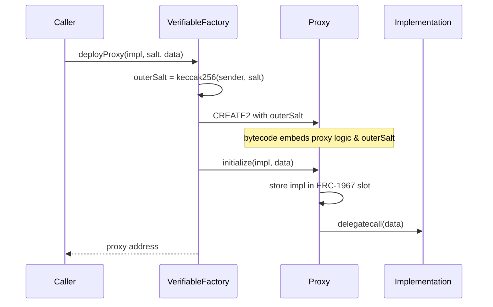

import { FrenCallout } from '../../components/ensv2/FrenCallout'

# Verifiable Factory

ENSv2's default setup deploys per-account resolvers and per-name subname registries through a single shared factory, replacing the v1 Public Resolver with individual [Permissioned Resolver](/ensv2/permissioned-resolver) proxies per account. Each instance is a UUPS proxy with a deterministic CREATE2 address and an on-chain proof of provenance. The factory is maintained in a [separate repository](https://github.com/ensdomains/verifiable-factory). This page covers how the protocol uses it.

The factory is the **default** deployment mechanism, not a protocol requirement. Custom resolver contracts are fully supported: `setResolver()` on the [Permissioned Registry](/ensv2/permissioned-registry) accepts any address. You can deploy your own resolver implementing `IExtendedResolver` (or the standard resolver profiles) without using the factory.

<FrenCallout fren="lili" variant="tip">
  The contracts and interfaces described here are **not yet final** and may
  change prior to mainnet deployment.
</FrenCallout>

## Why a Factory

ENSv2 chooses per-account resolver and per-name registry instances over a single shared contract (see [Overview](/ensv2/overview#whats-new-in-ensv2)). Each instance is an upgradeable proxy, so deployment is cheap and any single instance can be upgraded without touching the rest of the system. The factory makes every such deployment:

- **Deterministic**: the address is known before deployment.
- **Verifiable**: anyone can prove on-chain that an arbitrary address really came from this factory with a known proxy bytecode.
- **Cheap**: each deployment writes only 77 bytes of proxy code. The proxy logic and the implementation are shared.

## Deterministic Deployment

```solidity
function deployProxy(
    address implementation,
    uint256 salt,
    bytes memory data
) external returns (address proxy);
```

`deployProxy` uses CREATE2 to deploy a proxy, with the salt derived from the caller:

```solidity
outerSalt = keccak256(abi.encode(msg.sender, salt))
```

After construction, the factory calls `proxy.initialize(implementation, data)`, which stores the implementation and forwards `data` as initialisation calldata.

Because `outerSalt` mixes in `msg.sender`, the same `salt` value submitted by two different deployers produces two different proxy addresses. There is no contention between callers and no need for global salt coordination.



## The Proxy

Each deployed proxy is a [minimal proxy (EIP-1167)](https://eips.ethereum.org/EIPS/eip-1167) that delegates all calls to a single shared `UUPSProxyLogic` contract, deployed once in the factory's constructor and readable via `proxyLogic()`. The proxy's runtime bytecode is 77 bytes: the standard 45-byte minimal proxy pointing at `UUPSProxyLogic`, followed by the CREATE2 `outerSalt` as the last 32 bytes. The appended salt is what makes the proxy verifiable later.

Every call to the proxy first lands in `UUPSProxyLogic`, which handles the proxy functions itself and forwards everything else to the implementation stored in the proxy's [ERC-1967](https://eips.ethereum.org/EIPS/eip-1967) implementation slot:

- `initialize(implementation, data)` runs once (it reverts `AlreadyInitialized` afterwards). It stores the implementation in the ERC-1967 slot and delegate-calls the implementation with `data` so it can run its own initializer.
- `getVerifiableProxyData()` returns the salt (read from the proxy's own bytecode) and the current implementation address.
- `verifiableProxyFactory()` returns the factory address.
- `upgradeToAndCall(newImplementation, data)` performs upgrades (see [Upgrade Authorization](#upgrade-authorization)).

## On-chain Verification

```solidity
function verifyContract(address proxy) external view returns (address implementation);
```

`verifyContract` proves that `proxy` was deployed by this factory and returns the proxy's current implementation. It retrieves the proxy's stored salt via `getVerifiableProxyData()`, reconstructs the expected CREATE2 address from `(proxy creation code, factory, salt)`, and reverts with `VerificationFailed(proxy)` on any mismatch, including when `proxy` has no code or does not respond to `getVerifiableProxyData()`. A caller that requires a specific implementation compares the returned address itself.

This is the property that makes the factory **verifiable**: a smart contract can prove that an arbitrary address really is a proxy deployed by this factory, and learn which implementation it currently runs, without trusting metadata or off-chain data.

## Available Implementations

Three implementation contracts are deployed once and then proxied through the factory. Their addresses are listed in the [Deployments](/learn/deployments#sepolia-ensv2-beta) table, and you need them to deploy your own instance: `deployProxy` takes the implementation address as its first argument.

| Implementation             | Salt scheme                                                                    | Where it's deployed                                           |
| -------------------------- | ------------------------------------------------------------------------------ | ------------------------------------------------------------- |
| `PermissionedResolverImpl` | `keccak256("OwnedResolver", owner, version)`, one resolver per owner          | On demand by users                                            |
| `UserRegistryImpl`         | `keccak256("UserRegistry", namehash, version)`, one subname registry per name | On demand by name owners                                      |
| `WrapperRegistryImpl`      | per-name                                                                       | Inside migration controllers when a locked v1 name is wrapped |

## Upgrade Authorization

Each proxy's implementation can be upgraded individually via `upgradeToAndCall(newImplementation, data)` on that proxy. The factory itself is not upgradeable. Who may upgrade is decided by the current implementation's `_authorizeUpgrade` override. In ENSv2 the check is uniform: only an account holding `ROLE_UPGRADE` on the proxy's `ROOT_RESOURCE` can upgrade the implementation:

```solidity
function _authorizeUpgrade(address newImplementation)
    internal
    override
    onlyRootRoles(ROLE_UPGRADE)
{}
```

Upgrades target a single proxy, not the shared implementation. An upgrade to one user's resolver or subname registry does not affect anyone else's.

## Computing Addresses Off-chain

Because the proxy address is fully determined by `(factory, proxy logic address, deployer, salt)`, clients can compute it before any transaction is sent. The proxy creation code is the EIP-1167 template with the shared logic address in the implementation slot and the salt appended, so it can be assembled directly (`proxyLogic` is read once from the factory's `proxyLogic()` getter):

```ts
import { concat, encodeAbiParameters, getCreate2Address, keccak256 } from 'viem'

function predictProxyAddress({
  factoryAddress,
  proxyLogic,
  deployer,
  salt,
}: {
  factoryAddress: `0x${string}`
  proxyLogic: `0x${string}`
  deployer: `0x${string}`
  salt: bigint
}) {
  const outerSalt = keccak256(
    encodeAbiParameters(
      [{ type: 'address' }, { type: 'uint256' }],
      [deployer, salt]
    )
  )
  const initCode = concat([
    '0x3d604d80600a3d3981f3363d3d373d3d3d363d73',
    proxyLogic,
    '0x5af43d82803e903d91602b57fd5bf3',
    outerSalt,
  ])
  return getCreate2Address({
    from: factoryAddress,
    salt: outerSalt,
    bytecodeHash: keccak256(initCode),
  })
}
```

This is useful whenever you need a name's resolver or subname-registry address before the user actually creates it.

## Code Examples

Every proxy deployment follows the same steps: compute a salt, encode the implementation's `initialize` call as the `data` argument, and call `deployProxy` on the factory. The salt and initializer differ per implementation.

<FrenCallout fren="bittu" variant="tip">
  The contract addresses used below (`VERIFIABLE_FACTORY`,
  `PERMISSIONED_RESOLVER_IMPL`, `USER_REGISTRY_IMPL`) are protocol-deployed
  contracts. Find them in the
  [Deployments](/learn/deployments#sepolia-ensv2-beta) table.
</FrenCallout>

Both examples below share this setup:

```ts [Viem]
import {
  createPublicClient,
  createWalletClient,
  encodeAbiParameters,
  encodeFunctionData,
  http,
  keccak256,
  namehash,
  parseAbi,
  parseEventLogs,
  stringToHex,
} from 'viem'
import { mainnet } from 'viem/chains'

const client = createPublicClient({ chain: mainnet, transport: http() })
const wallet = createWalletClient({
  account,
  chain: mainnet,
  transport: http(),
})

const verifiableFactoryAbi = parseAbi([
  'function deployProxy(address implementation, uint256 salt, bytes data)',
  'event ProxyDeployed(address indexed sender, address indexed proxyAddress, uint256 salt, address implementation)',
])

// Grant all roles and their admin counterparts
const ALL_ROLES =
  0x1111111111111111111111111111111111111111111111111111111111111111n
```

### Deploying a Resolver Proxy

Deploy a per-account [Permissioned Resolver](/ensv2/permissioned-resolver). The salt is derived from the owner's address so that any client can predict the resolver address before it exists.

```ts [Viem]
const resolverInitAbi = parseAbi([
  'function initialize((address account, uint256 roleBitmap)[] grants, bytes[] calls)',
])

// Salt scheme: keccak256("OwnedResolver", owner, version)
const version = 0n
const resolverSalt = BigInt(
  keccak256(
    encodeAbiParameters(
      [{ type: 'bytes32' }, { type: 'address' }, { type: 'uint256' }],
      [keccak256(stringToHex('OwnedResolver')), account.address, version]
    )
  )
)

const resolverInitData = encodeFunctionData({
  abi: resolverInitAbi,
  functionName: 'initialize',
  args: [[{ account: account.address, roleBitmap: ALL_ROLES }], []],
})

const resolverTx = await wallet.writeContract({
  address: VERIFIABLE_FACTORY,
  abi: verifiableFactoryAbi,
  functionName: 'deployProxy',
  args: [PERMISSIONED_RESOLVER_IMPL, resolverSalt, resolverInitData],
})

const resolverReceipt = await client.waitForTransactionReceipt({
  hash: resolverTx,
})
const [resolverLog] = parseEventLogs({
  abi: verifiableFactoryAbi,
  eventName: 'ProxyDeployed',
  logs: resolverReceipt.logs,
})
const resolverAddress = resolverLog.args.proxyAddress
```

The `resolverAddress` is now a fully initialized Permissioned Resolver proxy. Point a name to it via `setResolver` on the registry, then use it to [set records and delegate access](/ensv2/permissioned-resolver#code-examples).

### Deploying a Registry Proxy

Deploy a per-name [User Registry](/ensv2/permissioned-registry) for managing subnames. The salt is derived from the name's namehash.

```ts [Viem]
const registryInitAbi = parseAbi([
  'function initialize((address account, uint256 roleBitmap)[] grants)',
])

// Salt scheme: keccak256("UserRegistry", namehash, version)
const version = 0n
const registrySalt = BigInt(
  keccak256(
    encodeAbiParameters(
      [{ type: 'bytes32' }, { type: 'bytes32' }, { type: 'uint256' }],
      [keccak256(stringToHex('UserRegistry')), namehash('alice.eth'), version]
    )
  )
)

const registryInitData = encodeFunctionData({
  abi: registryInitAbi,
  functionName: 'initialize',
  args: [[{ account: account.address, roleBitmap: ALL_ROLES }]],
})

const registryTx = await wallet.writeContract({
  address: VERIFIABLE_FACTORY,
  abi: verifiableFactoryAbi,
  functionName: 'deployProxy',
  args: [USER_REGISTRY_IMPL, registrySalt, registryInitData],
})

const registryReceipt = await client.waitForTransactionReceipt({
  hash: registryTx,
})
const [registryLog] = parseEventLogs({
  abi: verifiableFactoryAbi,
  eventName: 'ProxyDeployed',
  logs: registryReceipt.logs,
})
const registryAddress = registryLog.args.proxyAddress
```

The `registryAddress` is now a User Registry proxy. Set it as the subregistry for a name via `setSubregistry` on the parent registry, then use it to [manage subnames and roles](/ensv2/permissioned-registry#code-examples).
