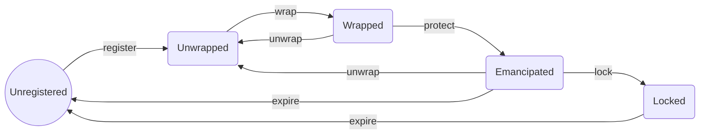

# Wrapped States

Taking the Name Wrapper into account, an ENS name can be in one of these possible states:

### Unregistered

The name has not even been registered/created yet, or it has expired.

### Unwrapped

The name exists and has not expired (in the case of .eth second-level names). The Name Wrapper contract does not have ownership over the name. You own the name in the registry and/or .eth registrar.

### Wrapped

The Name Wrapper contract has ownership of the name (in the registry/registrar). You are issued an ERC-1155 NFT in return, which proves that you are the actual owner.

You can unwrap the name at any time, which burns the ERC-1155 NFT, and returns ownership in the registry/registrar back to you.

If your name is a subname like `sub.name.eth`, then the owner of `name.eth` can technically replace the subname and transfer it to a different owner.

In addition, the parent owner can burn parent-controlled fuses on your name.

### Emancipated

The owner of the parent name is no longer able to replace this name, or burn any additional fuses on it. All .eth second-level names (like `name.eth`) are automatically put into the Emancipated state when they are wrapped.

The name can still be unwrapped and rewrapped by the owner.

### Locked

The name can no longer be unwrapped. The owner can now burn owner-controlled fuses on the name. Fuses for subnames of this name can now be burned as well.
